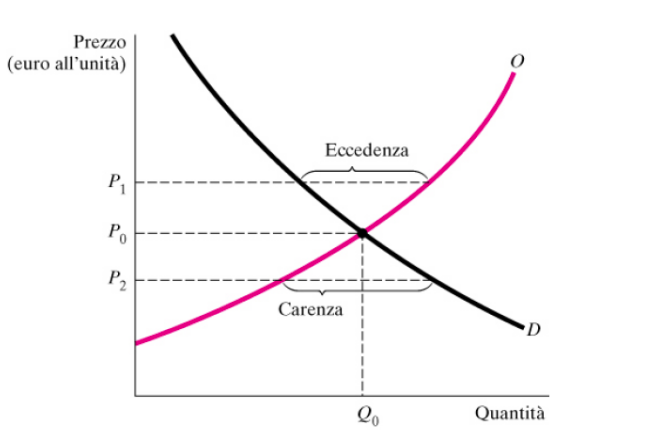
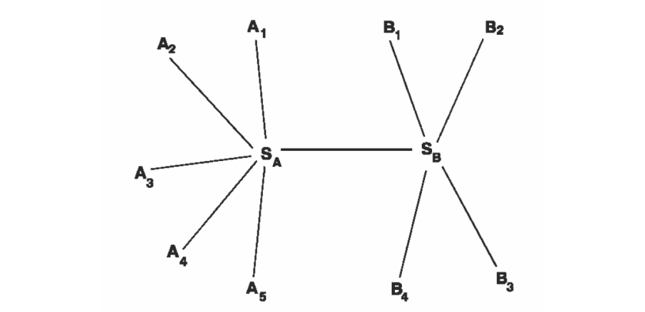

# Economia dei Beni Digitali

## Rivoluzione digitale

La rivoluzione digitale ad oggi è una realtà affermata per quanto la sua spinta allo sviluppo non sia certamente compiuta, essa ha la caratteristica di trasformarsi continuamente, di espandersi progressivamente in aree diverse e di incrementare la produttività in un'ampia varietà di settori ed industrie, dalle comunicazioni fino alle più avanzate intelligenze artificiali. 

I principali fattoti che differenziano l’attuale sviluppo economico rispetto al passato sono spesso identificati come : 

- **iperconnettività**
- **apprendimento automatico**
- **aumento esponenziale dei dati**

Ma c’è un fattore molto importante che non va dimenticato, che è più una conseguenza di quelli precedenti, ovvero che **cambiano i modelli di business**.

## Digitale

Le tecnologie digitali sono essenzialmente strumenti di astrazione delle nostre risorse concettuali.

A differenza di oggetti fisici un oggetto digitale può essere distinto dalle su proprietà ed inoltre può essere composto e ricomposto.

Le principali caratteristiche che distinguono un oggetto digitale da uno fisico sono:

- La **duplicazione** delle informazioni 
- Il **trasferimento**
- La possibilità di **adattattamento** a molteplici canali 
- Il **collegamento** con altri contesti

Tutto questo ha impatto sul sistema degli scambi, quindi sulla società e sui modelli di business che funzionano in essa.

## Equilibrio domanda offerta

Un mercato raggiunge l'equilibrio quando la quantità domandata in corrispondenza di un certo prezzo è uguale all'offerta per quello stesso prezzo `( Q0; P0 )`. In condizioni di equilibrio tutte le persone che desiderano acquistare un dato bene o servizio a un particolare prezzo sono soddisfatte. 

- **P > P0**: il prezzo è superiore al prezzo di equilibrio, **eccedenza**. A questo prezzo la quantità offerta supera la quantità domandata I venditori si troveranno con merce invenduta e, per liberare i magazzini, cominceranno a praticare sconti ed a diminuire gli ordini. Il prezzo scende a causa di un eccesso di offerta.
- **P < P0**: il prezzo è inferiore al prezzo di equilibrio, **carenza**. I compratori chiedono maggiori quantità di quelle disponibili. I venditori si rendono conto che anche alzando il prezzo non riescono a tener dietro alla domanda. Il prezzo sale a causa di una carenza di offerta (o eccesso di domanda).

## Prezzi positivi 

Tra le strategie per ottenere profitti positivi possiamo trovare le **Barriere**, elementi che ostacolano la concorrenza in un mercato, esse possono avere diverse origini:

- **Lock-in naturale**, solo alcuni possono o hanno accesso alle risorse.
  *ex: monopolio(estremo), comunicazioni broadcast*
- **Lock-in tecnologico** le aziende che vogliono interfacciarsi su quel tipo di mercato sono impossibilitate a dotarsi delle tecnologie necessarie. 
  *ex: brevetti*
- **Lock-in normativo** regolamenti e norme che impediscono oppure ostacolano l'ingresso nel mercato da parte delle nuove imprese. 
  *ex: concessioni autostradali*

Oltre a queste troviamo la **fidelizzazione** e la **differenziazione del prodotto** ovvero:

- **Branding** processo effettuato dalle imprese per differenziare la propria offerta da altre analoghe
- **Versioning** più versioni dello stesso prodotto differenziate da diversi gradi di completezza
- **Binding** accessori inseriti alla vendita 
  *ex: Internet Explorer inserito all'interno di prodotti microsoft*

## Beni digitali

Nell’economia normale il costo di ri-produzione costituisce un lock-in che non esiste nell’economia della informazione

Le tecnologie digitali facilitano la differenziazione del prodotto facilitano la differenziazione di canali di offerta facilitano il tracciamento dei consumatori

Rimangono valide strategie di rafforzamento del prodotto attraverso l’integrazione con altri valori, materiali o immateriali

Esiste invece un **valore esternare della rete** che può creare lock-in per alcuni prodotti (formati) oppure fornire l’opportunità per il binding di nuovi prodotti

## Esternalità della rete

In alcuni mercati la rete incrementa il valore di un servizio, la rete ha quindi un **valore esternale**, esso può essere: 

- **Positivo**, quando il valore di un bene per un individuo aumenta all'aumentare delle persone che posseggono lo stesso bene (esternalità di rete dirette), o all'aumentare dei prodotti complementari (esternalità di rete indirette). Gli standard sono strumenti per creare esternalità di rete positive. 
- **Negativo**, quando l'utilità di una infrastruttura diminuisce all'aumentare dell'utilizzo che se ne fa, ad esempio a causa di fenomeni di congestione. 

Questo effetto influenza in maniera determinante la coordinazione di un mercato:

- Decisioni sull’adozione di tecnologie (quali tecnologie serviranno?) 
- Decisioni sulla selezione del prodotto (perché il cliente compra questo e non quello?)
- Decisioni sull’adozione di procedure di compatibilità (quali produttori si rendono compatibili con il prodotto di maggior successo?)
- Ha un lato negativo (aumento dei costi, riduzione dell’innovazione) nel caso in cui i prodotti collegati siano dello stesso produttore (lock-in o monopolio)

## Regolamentazione dei mercati

La **perfetta contendibilità** richiede che l’impresa potenziale entrante:

-  abbia la **stessa tecnologia**, la stessa informazione e la stessa possibilità di produzione dell’impresa presente nel mercato
-  abbia **costi non recuperabili pari a zero**, così che l’uscita dal mercato sia senza costi, e non esistano barriere all’uscita
-  possa entrare effettivamente prima che l’impresa già operante sia in grado di abbassare i prezzi

## La notazione di standard

Uno **standard è una norma accettata o un modello di riferimento** a cui ci si uniforma per semplificare un processo.

In italiano si può tradurre come convenzione oppure norma, in informatica si preferisce utilizzare il termine inglese.

Con questo termine ci si riferisce sia a documenti tecnici che codificano una norma, sia a comportamenti e convenzioni non esplicitamente normati che si affermano in un ambiente attraverso un processo emergente.

Gli standard si affermano sempre attraverso dei processi complessi che vedono contrapporsi visioni ed interessi differenti

Le tecnologie (e i valori che sono in grado di sostenere) sono in continua evoluzione

## Evoluzione Storica

Il grado di complessità e internazionalizzazione del mercato influisce sulla rilevanza degli standard 

Storicamente si osservano **diverse fasi**, con una differenza tra approccia anglosassone **più liberale** e approccio continentale **più statalista**.

Fine del XIX secolo - metà del XX secolo: legittimazione di monopoli acquisiti o definizione per legge di monopoli

Seconda metà del XX secolo: liberalizzazione dei mercati

XXI secolo: massimizzazione della convergenza tecnologica

## Standardizzazione

Si possono distinguere diversi tipi di standard :

- **Proprietari** vs. **non** **proprietari** (aperti)
- **Prescrittivi** vs. **descrittivi**
- **De** **Jure** (legge) vs. **de** **Facto** (uso comune)

Ci sono diverse modalità con le quali viene creato uno standard:

- Intervento governativo
- Processo formale all’interno di organizzazioni
- Accettazione del mercato di una specifica in competizione

## Impatto degli standard

L’impatto degli standard nelle Tecnologie dell’Informazione coinvolge:

- **Interoperabilità**: fare in modo che i sistemi lavorino insieme
  (*ex:* permettere che software diversi accedano agli stessi dati)
- **Portabilità**: permettere che il software funzioni su architetture diverse
  (*ex:* un linguaggio di programmazione comune)

Sul piano dell'adozione della tecnologia:

- Aumentano il valore della tecnologia agli occhi degli utenti
- Riducono i rischi che i consumatori fronteggiano quando adottano una nuova tecnologia, diminuendo la confusione
- Spostano la concorrenza dai sistemi alle componenti

## Fasi del processo di standardizzazione

Ogni ente di standardizzazione stabilisce proprie norme

Secondo il **modello** proposto dall’***ISO50***, ogni processo si sviluppa in linea di massima secondo tre grandi fasi:

1. **segnalazione** e **valutazione** della necessità dello standard
2. **ricerca** e **consolidamento** del consenso sulle caratteristiche dello standard
3. **approvazione** formale e **pubblicazione** del documento

## Organismi di standardizzazione

**SDO** (Standard Development Organization), sono enti ufficiali di Standard: più lenti ma più prestigiosi

Nazionali:

- **UNI** (Ente Nazionale Italiano di Unificazione)
- **DIN** (Deutsche Institut für Normung)
- **ANSI** (AmericanNational Standard Institute)

Internazionali:

- **ISO** (International Organization for Standardization)
- **IEC** (International Electrotechnical Commission)
- **ITU** (International Telecommunication Union)

Enti non ufficiali e Consorzi:

- **W3C** (World Wide Web Consortium)
- **OASIS** (Organization for the Advancement of Structured Information Standards)
- **OMG** (Object Management Group)

## Evoluzione di uno standard

> C’è una guerra per lo standard quando due tecnologie incompatibili lottano per definire lo standard

I requisiti per l’affermarsi di uno standard sono:

1. Capacità di **innovare**, aumento del valore del prodotto
2. **Accettazione** degli utenti
3. **Controllo** sulla base installata di utenti
4. **Diritti** sulla proprietà intellettuale
5. Vantaggi della **prima mossa**
6. Forza nei **mercati** dei prodotti complementari
7. **Brand** riconosciuto e reputazione

## Co-opetition

L’esternalità della rete può essere attivata anche in un sistema di concorrenti: il fenomeno è detto di co-opetition:

- Si può collaborare nella costruzione di un mercato per poi competere al suo interno

- Gli standard tecnologici sono classici elementi di cooperazione tra competitor perché permettono l’ampliarsi di un mercato

