# Flussi di Gestione Documentale
*Paolo Ceravolo*
*paolo.ceravolo@unimi.it*
*Editoria Digitale*
## GESTIONE DOCUMENTALE
- Nella produzione editoriale possono esistere diversi flussi di 
creazione e gestione dei documenti
- Differiscono in base a
	- Flusso di lavoro
		- Qualità contenuti
		- Qualità formati, es. citazioni
	- Tecnologie 
		- Creazione
		- Condivisione 
		- Produzione

# Metadati

## METADATI
- I metadati sono ovunque, a volte invisibili ma presenti
	- Questa lezione ha un titolo, un docente, una durata, dei CdL
	- Un video su YouTube 
		- Titolo, autore, data, durata,categorie e licenze
		- Metadati generati dall’autore, scelti da una lista limitata, i commenti creati da altri, metadati generati automaticamente dal sistema
	- Una risorsa di archivio
		- Il principe, Nicolò Machiavelli
		- https://archive.org/details/ilprincipe04machgoog

<!---->
<br />

- Alcuni descrittori sono comuni a diverse categorie di oggetti.
	- Autore, titolo, data
- Altri sono specifiche del tipo dell’oggetto. 
	- Durata di un video, il numero delle pagine di un libro
- Alcuni sono stabili nel tempo altri variano
	- Autore, soggetto vs commenti, voci correlate 
- Alcuni valgono per ogni tipo di interazione altri dipendono dall’interazione
	- Titolo del corso vs CdL 
- Alcuni dipendono dal processo di raccolta
	- Tabulati telefonici 

## IL CASO DEI TABULATI TELEFONICI
- Nei tabulati telefonici non si raccoglie il contenuto delle 
telefonate
- Si raccolgono i metadati di queste telefonate
	- Il numero da cui parte la telefonata
	- Il numero cui si telefona
	- Il ripetitore che trasmette la telefonata e che consente di definire l’area geografica
	- L’ora e la durata della telefonata

​	

**Unique in the crowd: the privacy bounds of human mobility
http://www.nature.com/articles/srep01376**

## METADATI SONO DATI
- Metadati sono dati sui dati
	- Metadati sono descrizioni di un oggetto
	- Le descrizioni sono affermazioni su un oggetto, informazioni sull’oggetto
	- Siccome possiamo collegare oggetti a risorse informative che li descrivono e identificano possiamo dire che i metadati possono riferirsi a qualsiasi oggetto
		- Questa risorsa è un libro
		- Questo libro ha un autore
		- Questo autore ha un nome

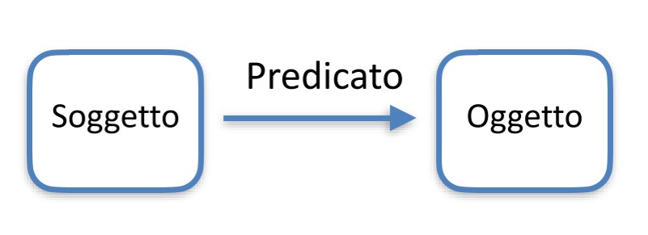​	
<!-- -->

- Metadati sono dati sui dati
	- Metadati sono descrizioni di un oggetto
	- Le descrizioni sono affermazioni su un oggetto, informazioni sull'oggetto
	- Siccome possiamo collegare oggetti a risorse informative che li descrivono e identificano possiamo dire che i metadati possono riferirsi a qualsiasi oggetto

​	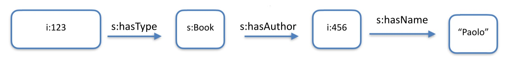

## COSA SONO I DATI E COSA I METADATI? 
- Il censimento raccoglie metadati descrittivi sulla famiglia
	- Queste info rese pubbliche diventano dati
		- I metadati sono diventati dati
	- Conclusione: cosa siano i dati e cosa siano i metadati dipende dal punto di vista

​	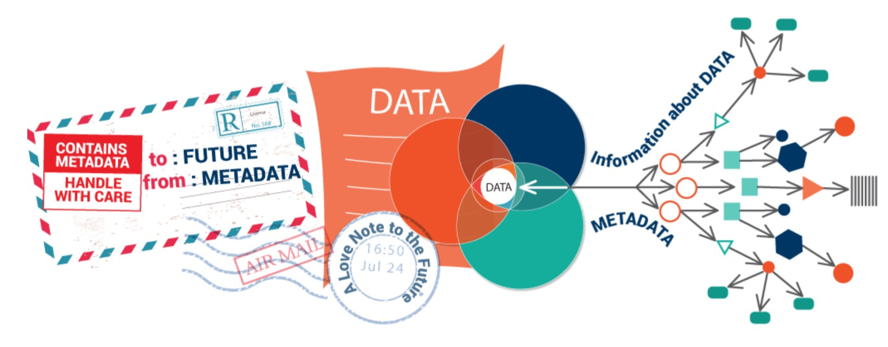

## PERCHÉ I METADATI
- Per potere catalogare e concettualizzare i dati
	- Necessità di punti di accesso per ritrovare i dati
	- Necessità di un vocabolario condiviso per rendere interoperabile lo scambio di informazioni e per attivare processi di automazione
	https://www.crossref.org/documentation/
- Per potere disporre l’uso dei dati
	- Necessità di gestire il ciclo di vita di un dato: revisioni, versioning, autorizzazioni, diritti d’uso
	- Necessità di strumenti di validazione per verificare l’integrità del dato, la sua compatibilità con altri dati, l’autenticità

## TIPI DI METADATI
- Ci sono diverse tipologie di metadati
	- Descrittivi
	- Strutturali 
	- Amministrativi
	- Tecnici
	- Utilizzo
  
​	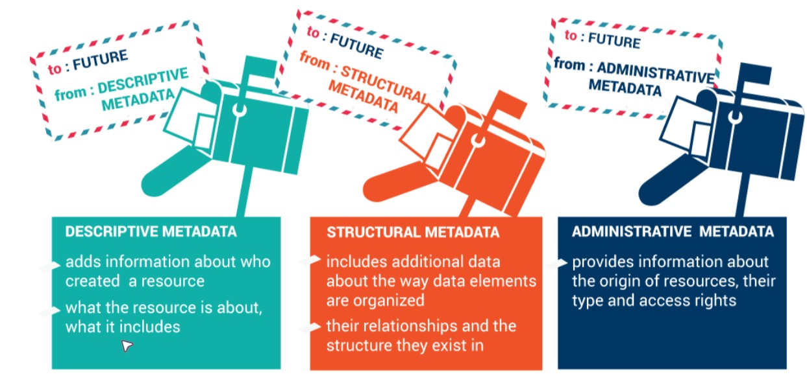
[Esempi](https://www.getty.edu/publications/intrometadata/setting-the-stage/)

## OGGETTO VS COLLEZIONE
- Una distinzione importante nella descrizione
	- Item è un singolo oggetto
	- Collezione è una raccolta di oggetti
- Un articolo vs il giornale
	- http://firstmonday.org/ojs/index.php/fm/index
- Una fotografia vs l’intera esibizione
	- http://exhibitions.europeana.eu/exhibits/show/europe-america-e

## CLASSIFICAZIONI MULTIPLE

- Ogni oggetto può essere classificato da diversi punti di vista e quindi essere descritto con diversi vocabolari controllati
  - Un monumento classificato dal punto di vista della locazione geografica, dello stile architettonico, dell’uso, dei materiali usati...
  - Un esempio di classificazione multipla è data dall’Art & Architecture Thesaurus del Paul Getty Institute che si trova online:
  http://www.getty.edu/vow/AATHierarchy

## STANDARD PER METADATI

|   |   |
|---|---|
| __Standard di strutturazione dei dati__ | MARC (Machine-Readable Cataloging) Format, Encoded Archival Description (EAD), BIBFRAME (Bibliographic Framework), Dublin Core Metadata Element Set, Categories for the Description of Works of Art, VRA Core |
| __Standard di valori dei dati (vocabolari controllati, thesauri, liste controllate)__ | Library of Congress Subject Headings, Name Authority File, and Thesaurus for Graphic Materials; Getty Art & Architecture Thesaurus, Union List of Artist Names (ULAN), and Thesaurus of Geographic Names; ICONCLASS; Medical |
| __Standard di organizzazione sintattica dei dati (regole e codici di__ | Anglo-American Cataloguing Rules, Resource Description and Access, International Standard Bibliographic Description, Cataloging Cultural Objects, Describing Archives: A Content Standard |
| __Formato dei dati/standard tecnici di interscambio__ | Resource Description Framework, MARC21, MARCXML, EAD XML DTD, METS, BIBFRAME, LIDO XML, Simple Dublin Core XML, Qualified Dublin Core XML, VRA Core 4.0 XML |

## STANDARD MARC

- Un formato di catalogazione introdotto negli anni ‘60 dal US Library of Congress
- Divenuto standard internazionale negli anni ’70
- Evoluto in una famiglia di standard: http://www.loc.gov/marc/umb/
- Una tipica scheda include:
  - La descrizione dell’oggetto
  - I campi principali, access point
  - Le parole chiave per soggetto
  - La classificazione e il numero di catalogazione 
  - Molte altre informazioni

​	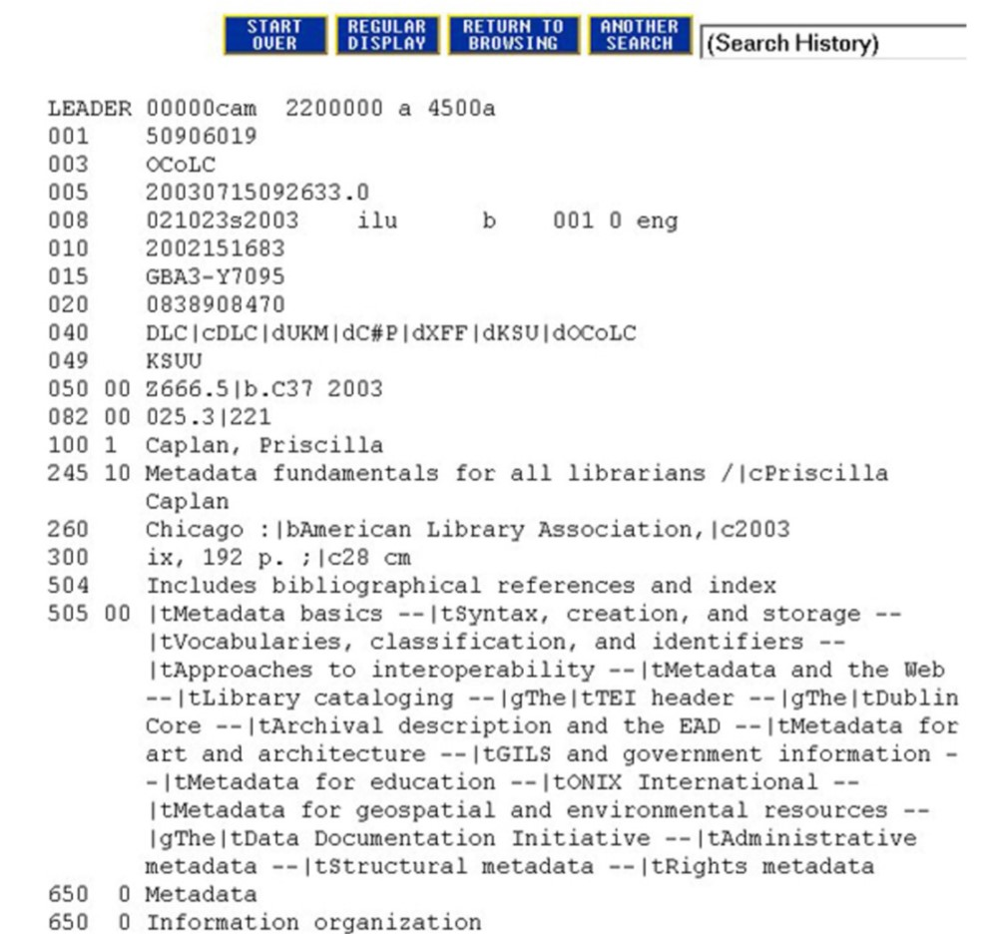

## LO STANDARD DUBLIN CORE

- Dublin, Ohio; quartier generale di OCLC – Online Computer Library Center
  - Non profit org., proprietari del sistema decimale Dewey; 
  FirstSearch e WorldCat, portali a diversi cataloghi
  - Workshop, marzo 1995. Come descrivere, organizzare e dare accesso all’informazione attraverso la rete
  - Mosaic, 1993: quindi il contesto web era poco conosciuto
- Definire uno standard per descrivere oggetti su scala web: a livello core cioè il minimo insieme di descrittori necessario per descrivere qualunque risorsa in rete

## SCOPO DEL DUBLIN CORE

- Semplicità
  - Basso costo di adozione tanto da non avere scuse
  - Basso costo per implementarla in applicativi di ricerca che la usano
  - Solo 15 elementi di metadati
- Semantica condivisa
  - Generalista e di conseguenza con perdita di specializzazione ma incremento di usabilità
- Estendibile
  - Anche per ovviare alla perdita di specializzazione
- Internazionale
  - Con possibilità di traduzione in più lingue, ma per lo più sviluppata in lingua inglese

## GLI ELEMENTI DI DUBLIN CORE

- Contributor
- Publisher
- Coverage
- Relation
- Creator
- Rights
- Date
- Source
- Description
- Subject
- Format
- Title
- Identifier
- Type
- Language

https://www.dublincore.org/specifications/dublin-core/dces/

## ELEMENTI, VALORI, RECORDS 
- Quando si descrive qualcosa si formula una frase. Uno schema di metadati controlla il tipo di frasi che si possono formulare e come
- Un vocabolario controllato per controllare i termini che si possono usare nella frase
  - Elemento
    - La categoria di frase che si può usare in uno schema di metadati per descrivere un oggetto
    - DC usa solo 15 elementi per formulare frasi ben formate
  - Valore
    - Le informazioni, i parametri che si passano all’elemento
    - DC spesso suggerisce di usare specifici vocabolari controllati
  - Record 
    - L’insieme delle coppie Elemento/Valore, cioè le frasi che si possono usare per descrivere le risorsa

## ESEMPIO

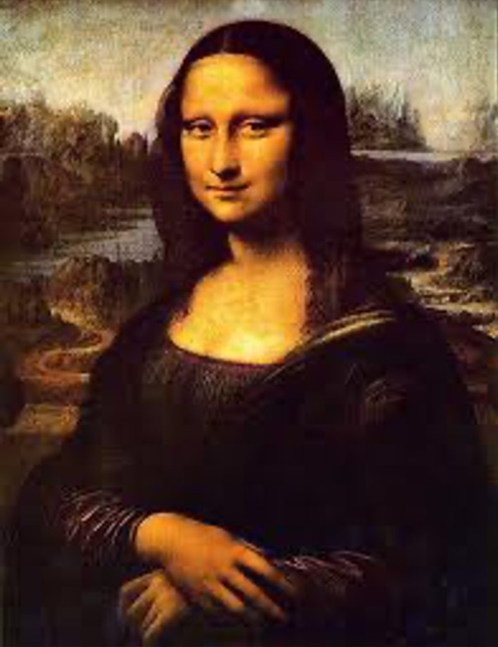

Title: Monna Lisa
Creator: Leonardo da Vinci
Subject: Lisa del Giocondo
Description: ritratto di donna
Date: c. 1503-1506
....
....
*Le coppie elemento/valore sono ripetibili e in qualunque ordine*

## PRINCIPI DI RILEVANZA
- Includere solo informazioni rilevanti – semplificare (principio 
dumb-down )
	- Subject non è rilevante per la descrizione di uno spartito? 
Language non è rilevante per descrivere un dipinto?     
Tralasciamo...
- Per ogni risorsa ci deve essere uno e un solo record che la descrive
	- No allo stesso record per due risorse
	- No a due record per la stessa risorsa

## ESEMPIO

Title: Monna Lisa
Creator: Leonardo da Vinci
Subject: Lisa del Giocondo
Description: ritratto di donna
Publisher:
Contributor:
Date: c. 1503-1506
Type:
Format: olio su legno di pioppo
Identifier:
Source:
Language:
Relation:
Coverage:
Rights: Musée du Louvre

## DC IN HTML

```<html>
 <head>
 <title>Record del dipinto di Leonardo</title>
 <meta name=“DC.creator” content=“Leonardo, da Vinci, 
  1452-1519”>
 <meta name=DC.title” content=“Monna Lisa”>
 <meta name=“DC.subject” content=“Lisa del Giocondo”>
 <meta name=“DC.date” content=“c. 1503-1506”>
 <meta name=“DC.format” content=“olio su legno”>
 </head>
 <body> contenuto della pagina web </body>
</html>
```

## ESEMPIO

Title: Monna Lisa
Creator: Leonardo da Vinci
Subject: Lisa del Giocondo
Description: ritratto di donna
Date: c. 1503-1506
Format: olio su legno di pioppo
Rights: Musée du Louvre

</br></br>


Title: Monna Lisa
Creator: chi ha creato img digitale
Subject: Lisa del Giocondo
Description: ritratto di donna
Contributor: Leonardo da Vinci
Publisher: Musée du Louvre
Type: image
Date: 2014
Format: JPEG
Identifier: URI dell’immagine
Relation: URI ad altra risorsa
Rights: Musée du Louvre

**Un record per l’originale, un record per l’immagine digitale e la relazione tra i due. L’immagine digitale è una rappresentazione dell’original**

## SCHEMA.ORG
- Diversi motori di ricerca come Google, Bing, Yahoo sono in grado di interpretare le descrizioni di alcune tipologie di contenuti se seguono lo schema definito da schema.org
- Queste descrizioni possono essere associate ad una pagina HTML 
usando diversi formati, il più diffuso sta diventando JSON-LD
https://developers.google.com/search/docs/guides/intro-structured-data
https://json-ld.org/playground/
- In questo modo i motori di ricerca possono costruire strutture 
dati più significative come Breadcrumbs, Sitelinks Search Box, 
Rich Card, Rich Snippets o (Google Knowledge Graph)

## VOCABOLARI NON CONTROLLATI 
- Ogni parola e ogni frase può essere usata per classificare
	- Al contrario dei vocabolari controllati in cui le parole usate per 
descrivere sono limitate 
  - I tag delle reti sociali sono un esempio di vocabolario non 
controllato:
		- YouTube non limita nell’uso di parole chiave
		- FaceBook limita a termini che devono già essere stati coniati 
nell’universo FB
		- Twitter usa gli hashtag, non tutti i tag sono descrittivi. A metà 
strada tra contenuto e metadato
		- Flicker usa tag completamente liberi

## TESAURO O VOCABOLARIO CONTROLLATO 
- Definisce le entità dell’universo che trattiamo e indica le parole che dobbiamo usare per parlarne
- LCSH fornisce la struttura di parole per definire i soggetti, che può essere modificata ed estesa, mediante un vocabolario controllato e strutturato
- Un elenco strutturato di parole, raggruppate per semantica, con alcune relazioni
  - BT – broader term, il termine più generale
  - NT – narrower term, il termine più specifico
  - RT – related term, un termine associato
  - USE – rimando a un termine da usarsi
  - UF – use for, rimando a un termine da non usarsi

## IL VOCABOLARIO CONTROLLATO LCSH 
- LCSH dal 1898 il prototipo di un sistema di metadati per la catalogazione del materiale librario
  - Da non confondere con la classificazione per collocare gli oggetti sugli scaffali, Library of Congress Classification
  - fornisce l’identificativo alfa-numerico, call number, o collocazione, che viene posto sul dorso dei libri per poterli ritrovare negli scaffali
- Definito da Putnam nel 1897

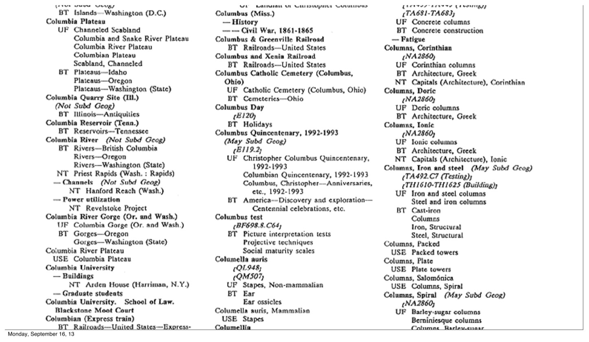


## ONTOLOGIE
- Nell’ingegneria della conoscenza, la rappresentazione formale di un insieme di concetti in un determinato ambito
  - Un insieme di termini di relazioni più complesse di quelle nei vocabolari controllati
    - Sussunzione: super- o sub-class
    - Meronimia: part-of
    - Istanziazione: type-of
    - Relazioni: simmetria, transitivi, riflessività
- Ontologia della birra
  - http://www.cs.umd.edu/projects/plus/SHOE/onts/beer1.0.html
- Ontologia per descrivere le persone che usa inferenze per stabilire fatti nuovi implicati da quelli noti
  - http://www.cs.umd.edu/projects/plus/SHOE/onts/personal1.0.html

## TESAURI VS ONTOLOGIE
- Le ontologie sono tesauri con relazioni formali: esprimono sottoinsiemi della logica del primo ordine
  - Nelle ontologie entità, relazioni e inferenze consentono di dedurre fatti non esplicitamente asseriti
- Le ontologie possono quindi essere usate in algoritmi, alcuni linguaggi
  - OWL https://www.w3.org/TR/owl-ref/
  - SWRL https://www.w3.org/Submission/SWRL/
- Alcuni formati di sterilizzazione:
  - RDF https://www.w3.org/TR/rdf11-concepts/
  - Turtle https://www.w3.org/TR/turtle/

## ESEMPIO DI CONCETTUALIZZAZIONE


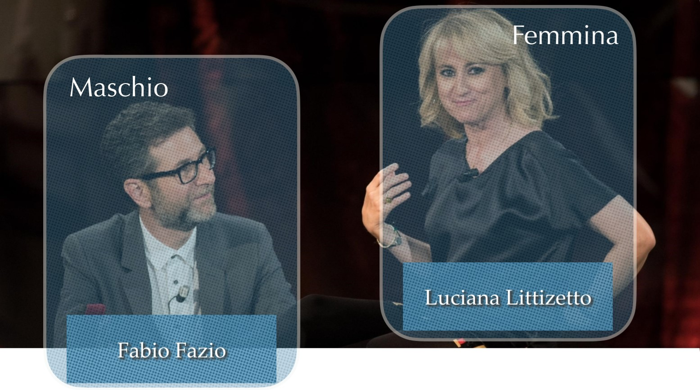
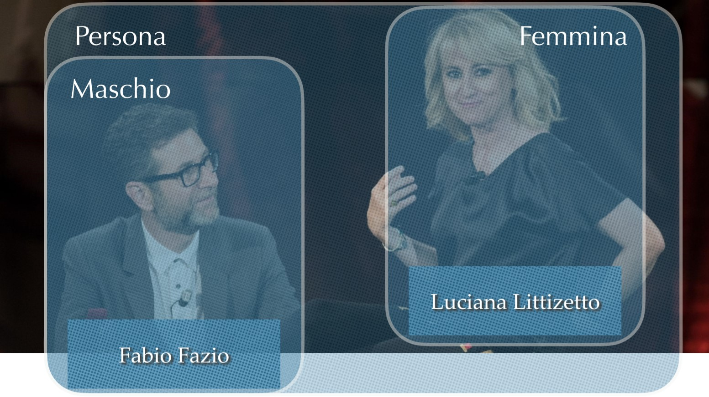
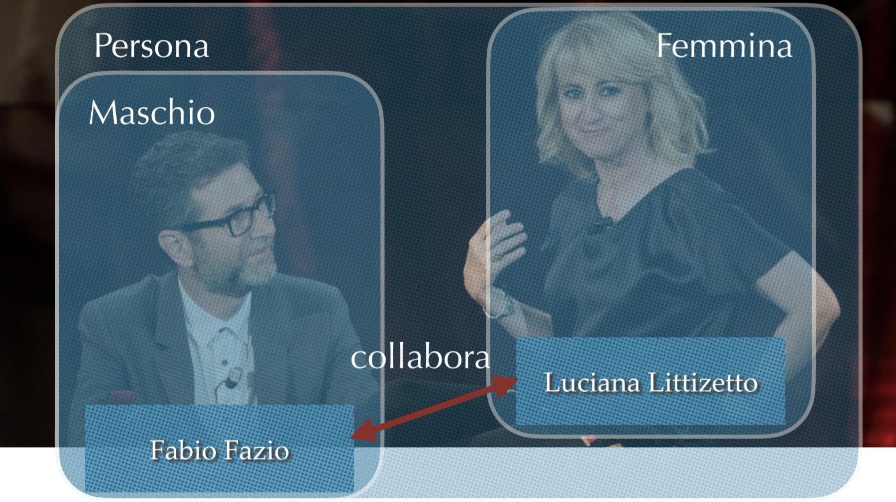
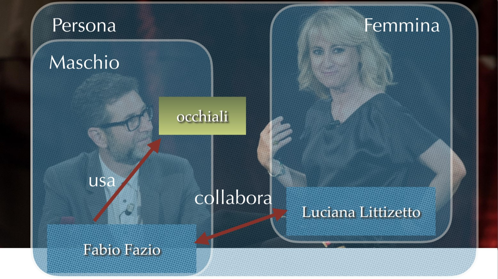

## IDENTIFICARE
- Identificare un oggetto: 
  - https://it.wikipedia.org/wiki/Fabio_Fazio
  - https://it.wikipedia.org/wiki/Luciana_Littizzetto
- Si tratta di associare un oggetto o risorsa ad un identificatore che potrà essere utilizzato in modo univoco all’interno del vocabolario

<!---->
<br />

- Si tratta di associare un oggetto o una risorsa ad un identificatore che potrà essere utilizzato in modo univoco all’interno del vocabolario
  - Molti sono i criteri che si possono usare per decidere cosa considerare individuo: 
    - un oggetto indivisible
    - un’unità che non ammette riduzioni nel sistema di riferimento
    - un oggetto che ha una condizione di identità
    - un oggetto che è associato ad un identificatore
- Solitamente si considera individuo qualche cosa che permane (che identifichiamo all’interno di uno sfondo mutevole, o irrilevante, o composto da altri oggetti identificati)

<!---->
<br />

- Classificare un oggetto: 
  - https://it.wikipedia.org/wiki/Fabio_Fazio **type** https://it.wikipedia.org/wiki/Maschio
  - https://it.wikipedia.org/wiki/Luciana_Littizzetto **type**
  https://it.wikipedia.org/wiki/Femmina
- Si tratta di affermare che un oggetto appartiene ad una classe di oggetti: ovvero **condivide con altri oggetti uno stesso insieme di proprietà**

<!---->
<br />

- Si tratta di affermare che un oggetto appartiene ad una classe di oggetti: ovvero condivide con altri oggetti uno stesso insieme di proprietà
  - In una **buona classificazione** l’insieme di proprietà definito dalle classi dovrebbe essere:
    - reciprocamente esclusivo
    - congiuntamente esaustivo
    - pertinente
  - In realtà quasi tutti i vocabolari includono diverse criteri di classificazione, diverse dimensioni o punti di osservazioni, quindi ammettono intersezioni tra le classi che appartengono a dimensioni diverse