# Produzione Editoriale

Il processo di produzione editoriale è il complesso insieme di attività coinvolte nella ideazione, sviluppo, e distribuzione di materiali editoriali come libri, riviste, giornali, manuali, …

La sfida è fare in modo che l’opera passi dal concepimento alla sua disponibilità per il pubblico
Il processo può variare, tradizionalmente le fasi chiave sono:

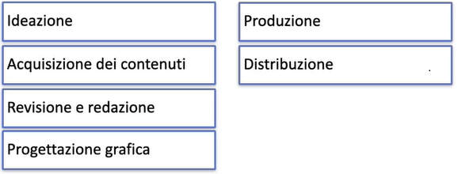

## Multicanalità

Nell’attuale contesto economico e tecnologico la multicanalità è un concetto chiave

- <u>Consente di raggiungere diversi segmenti di mercato</u>
  
  Il consumatore si differenzia per bisogni, cultura, predisposizione alla spesa
  
- <u>Consente di tenere in considerazione le diverse forme di espressione</u>
  
  Contenuti diversi hanno diverso grado di fruibilità su diversi canali e sulla base del contesto di fruizione
  


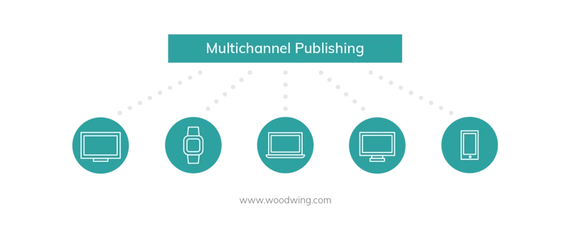
## Portabilità

Un requisito tecnico che facilità la multicaniltà e la portabilità dei formati adottati
nei contenuti.
La portabilità si riferisce alla capacità di un dispositivo, di un'applicazione software o di dati di essere facilmente spostati o trasferiti da un sistema, piattaforma o posizione all'altra senza significativi problemi di compatibilità o usabilità.

- Questo è importante tanto nella fase di fruizione del contenuto da parte dell’utente quanto nella fase di produzione del contenuto
  
- Permette di ottenere un processo di produzione più resiliente e meno dipendente dai lock-in realizzati dagli attori tecnologici
  
- Permette di sfruttare al massimo i processi basati sulla esternalità della rete
  
- <u>Riduce i costi di produzione e allarga la capacità di penetrazione del mercato</u>

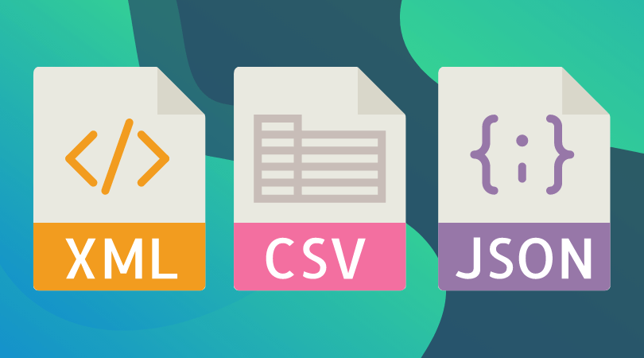

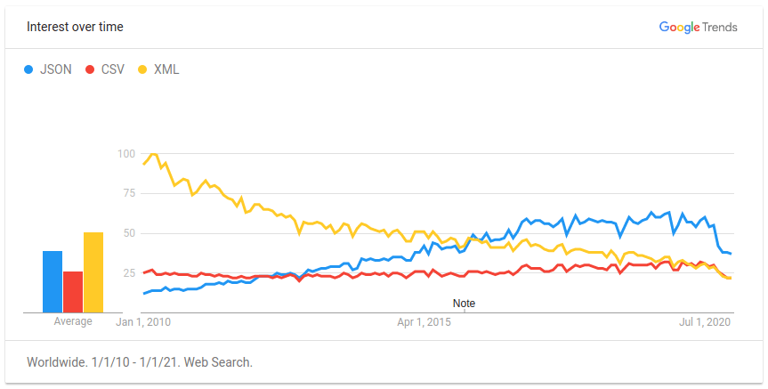

Per valutare la portabilità di una tecnologia bisogna considerare sia **aspetti sincronici**
che **diacronici**

### Aspetti Sincronici

- **Standard e compatibilità**. Gli standard tecnici e la compatibilità con altre tecnologie esistenti sono aspetti critici della portabilità attuale di una tecnologia. Una tecnologia che si adatta facilmente a norme e protocolli esistenti è più portatile
  
- **Usabilità e risorse**. La facilità d’uso influenza l’adozione di una tecnologia. La quantità di risorse necessarie per far funzionare una tecnologia, come hardware, software, potenza di calcolo, connettività, ecc., è rilevante per la sua portabilità
  
- **Condizioni di mercato**. Le condizioni di mercato, comprese le esigenze dei clienti e le tendenze del settore, possono influenzare la portabilità di una tecnologia in un dato momento
  
- **Normative e leggi**. Le leggi e le normative locali e internazionali possono influenzare la portabilità di una tecnologia, ad esempio, per quanto riguarda la privacy dei dati o la sicurezza
  

### Aspetti Diacronici

- **Sviluppo tecnologico**. L'evoluzione della tecnologia nel corso del tempo è un aspetto importante.
  
  *Esempio*: il passaggio da dispositivi desktop a dispositivi mobili, da
  rappresentazioni 2D a rappresentazioni 3D dei contenuti visuali
  
- **Condizioni di mercato**. Capire quali attori del mercato possono trarre vantaggi dallo sviluppo di una tecnologia è fondamentale per capire quali sinergie si potranno produrre nel mercato.
  
  *Esempio*: lo sviluppo dei podcast porta ad un aumento del bisogno di servizi di manipolazione di contenuti audio
  
- **Cambiamenti culturali e sociali.** I cambiamenti nella cultura e nella società influenzano come una tecnologia è percepita e utilizzata.
  
  *Esempio*: i social inizialmente percepiti come strumenti di arricchimento culturale oggi sono spesso ritenuti fonte di omologazione
  
- **Evoluzione delle normative**. Prevedere le evoluzioni normative può essere molto
  importante.
  
  *Esempio:* AI Act della UE potrebbe vietare l’uso di applicazioni AI in certi contesti
  

## Automazione

Nella produzione editoriale possono esistere diversi flussi di creazione e gestione dei documenti.
Differiscono in base a:

- Flusso di lavoro
  
  - Qualità contenuti    
  - Qualità formati (*Esempio*: citazioni)
    
- Tecnologie
  
  - Creazione
  - Condivisione
  - Produzione
    
Qualità richiesta e tecnologia adottata influiscono in modo inversamente proporzionale sul tempo di gestione documentale.

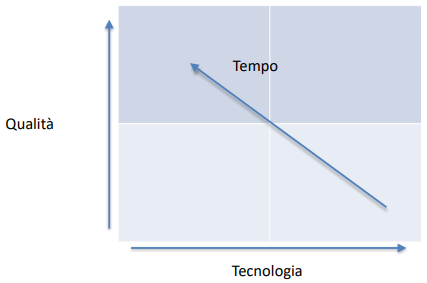

## Buone pratiche
- Definire la struttura prima dello stile
- Utilizzare formati portabili
- Non dipendere da software proprietari
- Gestire il versioning
- Contenuto: testo, audio, grafica, video, AR
- Tipografica, stile e identità visuale
- Bibliografia, metadati, catalogazione
- Diritti d’autore

## Definire il flusso
Il processo può variare, tradizionalmente le fasi chiave sono:
- Ideazione
- Acquisizione dei contenuti
- Revisione e redazione
- Progettazione grafica
- Produzione
- Distribuzione
Ognuna di queste fasi può richiedere un flusso di lavoro che coinvolge competenze professionali diverse.

Ad _esempio_ i contenuti devono essere 
1. di qualità,
2. impaginati e organizzati graficamente
3. valutati per agli aspetti del diritto d’autore

Inoltre, un prodotto può essere il risultato di contenuti di diversa natura: testo, audio, grafica, AR ...

Ogni contenuto può richiedere un suo flusso di produzione in parte indipendente ed in parte coordinato con gli altri flussi di produzione.

### BPMN
Lo standard più diffuso per la definizione di flussi di esecuzione è BPMN (_Business Process Modeling Notation_) 2.0 di OMG
Ad esempio, come editor si può usare https://bpmn.io

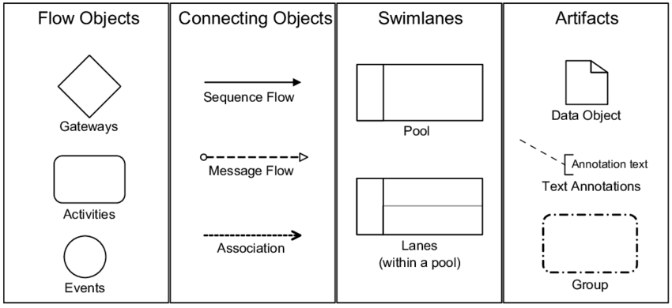

### Flusso di pubblicazione scientifica
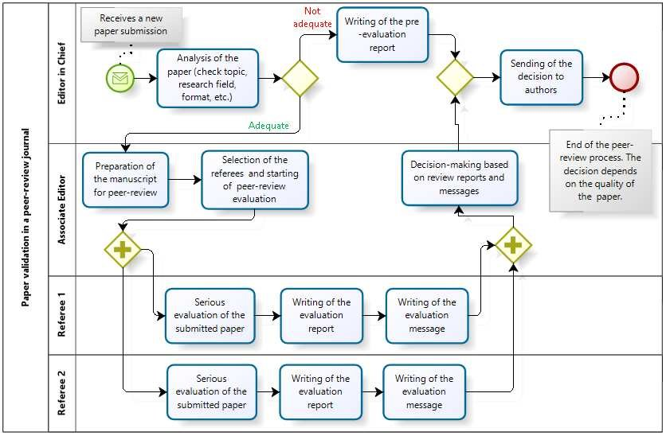


### Gestione del versioning
La piattaforma che ha meglio interpretato le funzioni di gestione del versioning di documenti è GiHub.

Lo scopo principale di GitHub.com è quello di facilitare il controllo di versione e il tracciamento di issue nello sviluppo del software.

Per il controllo delle versioni consente di effettuare richieste di pull per proporre modifiche al codice sorgente. Gli utenti che hanno la possibilità di rivedere le modifiche proposte possono vedere una diff delle modifiche richieste e approvarle.

Nella terminologia di Git, l’azione di registrazione delle modifiche apportate a un file è chiamata _commit_, conferma, e una sua istanza è un _commit_. 
La cronologia di tutti i _commit_ viene conservata e può essere visualizzata in un secondo momento.

Un manuale completo è [Pro Git Book](https://git-scm.com/doc)

<figure>
  
  <figcaption>
    <i> Memorizzazione dei dati come cambiamenti di ogni file da una versione di base </i>
  </figcaption>
</figure>

<br/><br/><br/>

<figure>
  
  <figcaption>
    <i> Memorizzazione dei dati come snapshot del progetto nel tempo </i>
  </figcaption>
</figure>


#### Gestire gli aggiornamenti
Working directory o workspace:
spazio di lavoro locale
- **Staging o directory di cache**: spazio che contiene i file pronti per essere committati
- **Stash**: spazio in cui salvare le modifiche mentre si lavoro ad altro
- **Local repository**: spazio che contiene tutti i file comitati e le informazioni sui branch. Il main è un repository usato per collegare le diverse branch
- **Remote**: spazio che contiene tutte le versioni del progetto

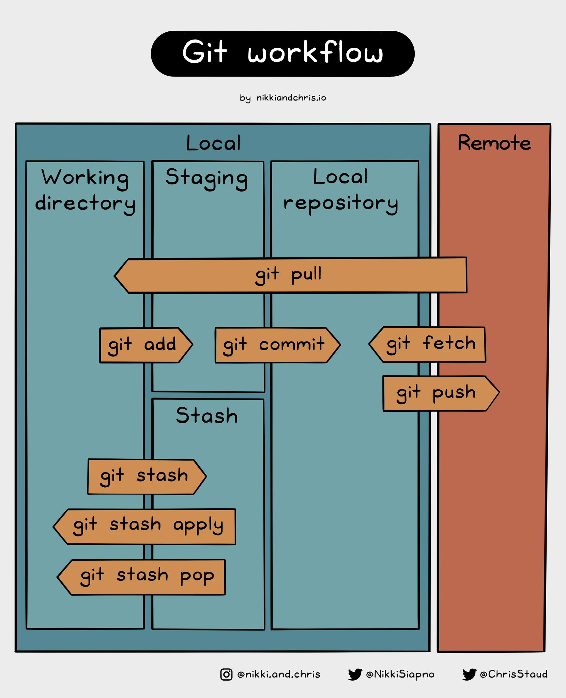

Le operazioni essenziali per gestire un progetto di versioning sono:
- Creare e utilizzare un repository
- Avviare e gestire un nuovo branch
- Apportare modifiche a un file e inviarle a GitHub come commit
- Aprire e unire una richiesta di pull

#### Creazione di un repository
Un repository viene solitamente utilizzato per organizzare un singolo progetto.
- I repository possono contenere cartelle e file, immagini, video, fogli di calcolo e insiemi di dati: tutto ciò di cui il progetto ha bisogno
- Spesso, i repository includono un file README, un file con informazioni sul progetto. I file README sono scritti nel linguaggio Markdown
- Creando il progetto è anche possibile impostarlo come progetto pubblico o privato e scegliere la licenza da applicare


#### Collegare una directory locale
È possibile collegare una directory locale ad un repository
- Una volta nella directory digitare per inizializzarla
``` $ git init -b main ```
- Aggiungere i file della directory in una lista di elementi che potremo salvare attraverso commit
```$ git add *```
- Salvare le modifiche nel repository locale
```$ git commit -m "First commit”```
- Collegare il repository locale al repository remoto
```
$ git remote add origin <REMOTE_URL>
# Sets the new remote
$ git remote -v
# Verifies the new remote URL
```
- Inviare le modifiche del repository locale al repository remoto
```$ git push -u origin main```

#### Gestire gli aggiornamenti
Il più semplice workflow di gestione delle modifiche si limita a caricare le
modifiche locali nel repository remoto
```
$ git status
$ git add *
$ git commit -m "my comment"
$ git push
```
- Per clonare un repository
```
$ git clone <REMOTE_URL>
$ git init
$ git remote add origin <REMOTE_URL>
```
- Per ridefinire la struttura dei file, ad esempio quando si fa copia e incolla
```$ git clean -f```

#### Creare un branch
Per lavorare su una nuova versione di un documento e decidere in seguito se integrare le modifiche è possibile creare dei branch
- Se ci è stato assegnato il ruolo di collaboratore ci si può semplicemente spostare dal master e creare un branch
```
$ git checkout -b revcap1
$ git pull
```
- A questo punto è possibile fare modifiche al documento
```
$ git add .
$ git commit -a -m ‘Revising section 3 of cap1’
$ git push origin revcap1
```
- A questo punto è possibile fare una pull request
  - Visitare il repository originale su GitHub. Dovrebbe apparire un messaggio che indica che è stato recentemente creato un nuovo ramo. Fare clic sul pulsante "Compare & pull request”. Dopo aver creato la richiesta di pull, è possibile rivedere le modifiche e discuterle con i manutentori del progetto. Se tutto sembra a posto, cliccare di nuovo sul pulsante "Create pull request" per inviare la richiesta
- I manutentori del progetto esamineranno la pull request e potranno richiedere modifiche o accettarla

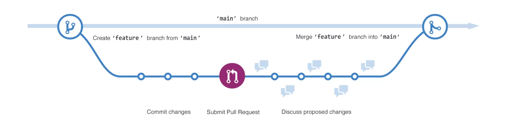

#### Creare un fork
Se non si possiede il ruolo di collaboratore è possibile creare un fork del progetto.
**Fork del Repository**: sulla pagina del repository GitHub a cui si desidera contribuire, cliccare sul pulsante "_Fork_" nell'angolo in alto a destra della pagina. Questo creerà una copia del repository nel tuo account GitHub.
- A questo punto è possibile clonare il Fork in un repository locale: copiando l'URL del fork dalla barra degli indirizzi del browser, poi attraverso il terminale:
``` $ git clone <URL del repository> ```
- Si può poi creare un nuovo branch per gestire le modifiche:
``` $ git checkout -b feature/duo-nome-feature ```
- Si possono a questo punto effettuare le modifiche:
```
$ git add .
$ git commit -a -m ‘Revising feature’
$ git push origin feature/tuo-nome-feature
```
- Si può a questo punto creare una pull request:
  - Visitare la pagina del fork su GitHub. Dovrebbe apparire un messaggio che indica che è stato aggiornato un branch. Si può ora cliccare sul pulsante "Confronta e crea richiesta di pull”. Aggiungere un titolo e una descrizione dettagliata per la tua richiesta di pull. Si può a questo punto inviare la Pull request
- I manutentori del progetto esamineranno la pull request e decideranno se accettarla


## Ideazione e acquisizione dei contenuti

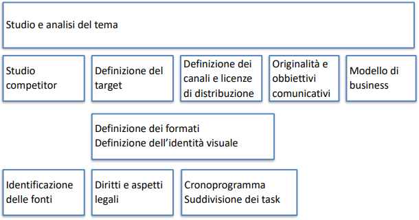

### Studio e analisi del tema

Per analizzare il tema è utile osservare come questo viene trattato nelle comunità di riferimento:

- Ricerca avanzata
  
  - [Ricerca Avanzata Google](https://www.google.com/advanced_search)
  - [Lista completa degli operatori di ricerca Google](https://ahrefs.com/blog/it/operatori-ricerca-avanzata-google/)
  - [Ricerca avanzata Twitter](https://twitter.com/search-advanced)
    
- Tool di monitoraggio

  - [Answer the public](https://answerthepublic.com/) : Statistiche su quello che le persone chiedono a Google, Youtube e Bing
  - [Socialbearing](https://socialbearing.com/) : Approfondimenti e analisi per tweet e timeline
  - [Twitonomy](https://www.twitonomy.com/) : Analytics di Twitter
  - [Followerwonk](https://followerwonk.com/) : Analytics per follower di Twitter
  - [Semrush](https://www.semrush.com/) : Strumenti per SEO, content marketing, ricerca sulla concorrenza, pubblicità online e social media marketing
    

In questo modo possiamo identificare i competitor, il target, le comunità di riferimento e il customer journey

### Definizione delle personas
Le personas sono personaggi di fantasia, creati per rappresentare i diversi tipi di utenti che potrebbero utilizzare un prodotto.

La creazione di personas aiuta il progettista a capire le esigenze, le esperienze, i comportamenti e gli obiettivi degli utenti.

La creazione di personas aiuta a identificare le diverse esigenze degli utenti e supporta la progettazione fornendo dei punti di riferimento alle diverse fasi della progettazione.

La creazione di personas può avvenire attraverso diversi strumenti:
- Raccolta di dati di comportamento degli utenti
- Raccolta di dati attraverso interviste e focus groups
- Creazione sulla base della sensibilità del progettista


Lo scopo di lavorare con le personas è quello di poter sviluppare soluzioni, prodotti e servizi basati sulle esigenze e sugli obiettivi degli utenti

- Andrebbero descritti includendo dettagli sull'istruzione, lo stile di vita, gli interessi, i valori, gli obiettivi, i bisogni, i limiti, i desideri, gli atteggiamenti e i modelli di comportamento dell'utente.
- Aggiungete alcuni dettagli personali di fantasia per rendere la persona un personaggio realistico
- Date un nome a ciascuna delle vostre personas
- Create 1-2 pagine di descrizioni per ogni persona

Preparate situazioni o scenari per le personas

La definizione di uno scenario può aiutare meglio la comprensione delle soluzioni,
- A questo scopo, dovreste descrivere una serie di situazioni specifiche che potrebbero innescare l'uso del prodotto o del servizio che state progettando
- Gli scenari di solito iniziano collocando la persona in un contesto specifico con un problema che vuole o deve risolvere

## Gestione documentale


## Progettazione grafica e produzione

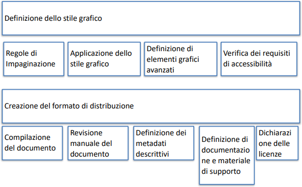

## Distribuzione

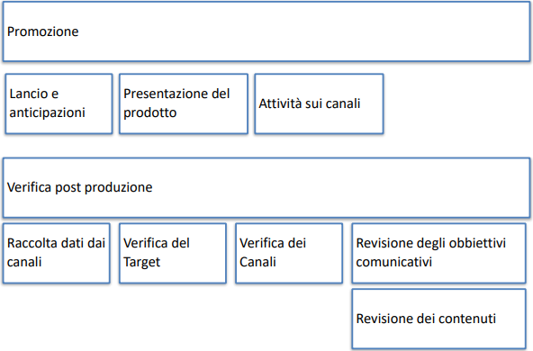
