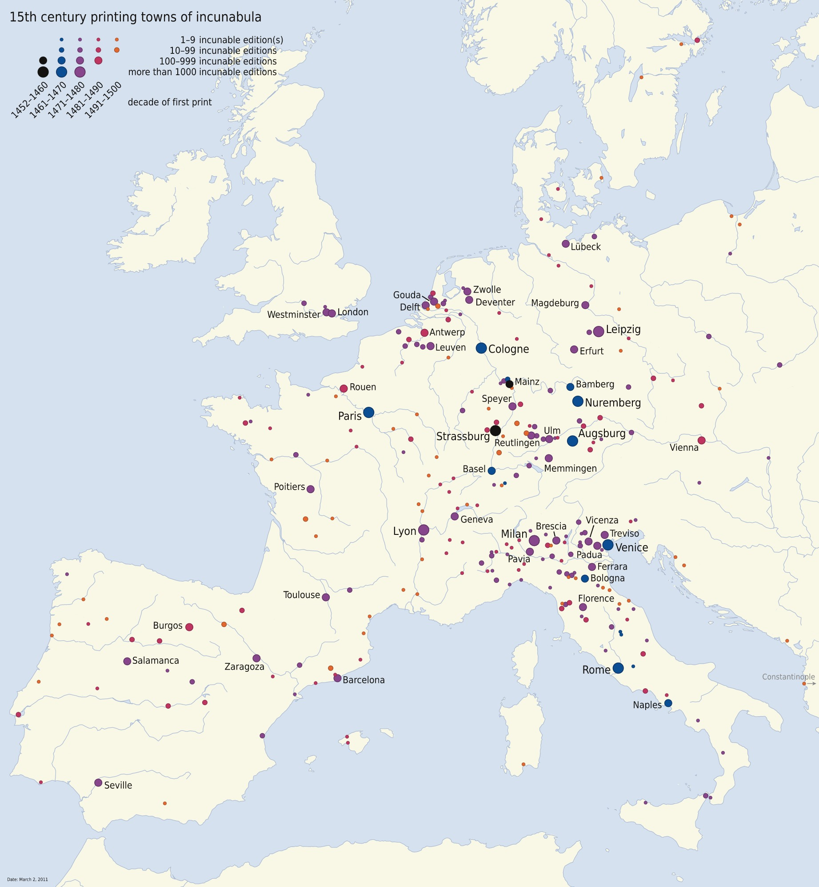
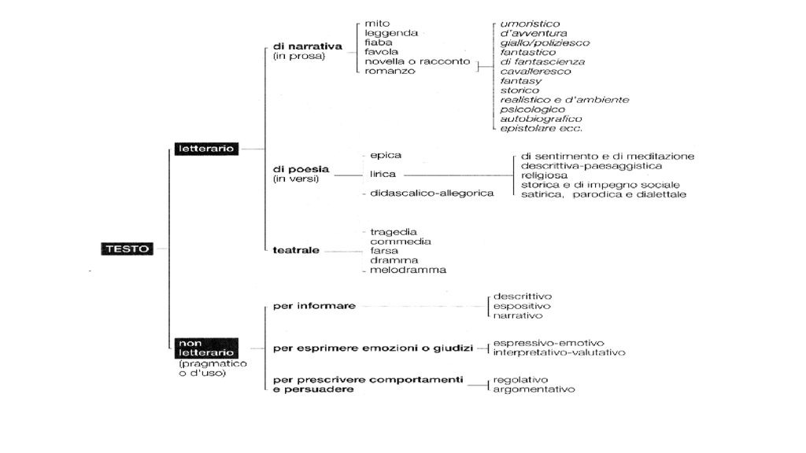
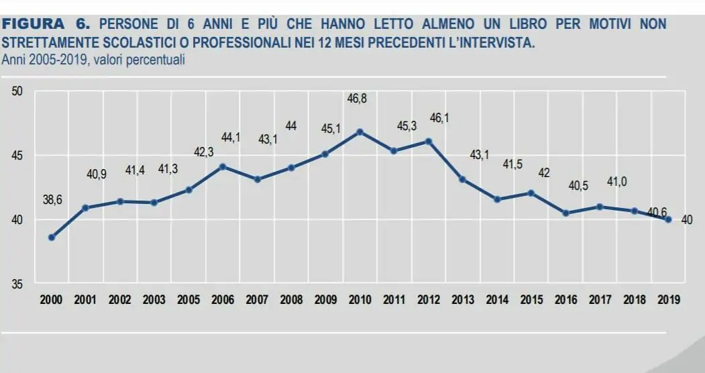
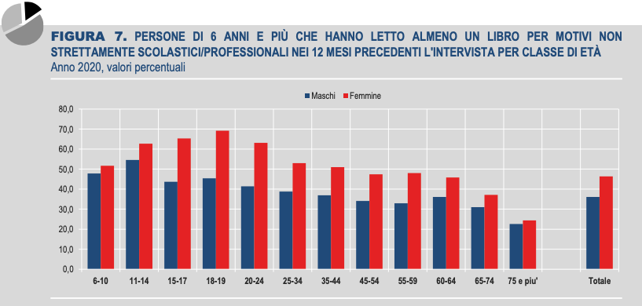
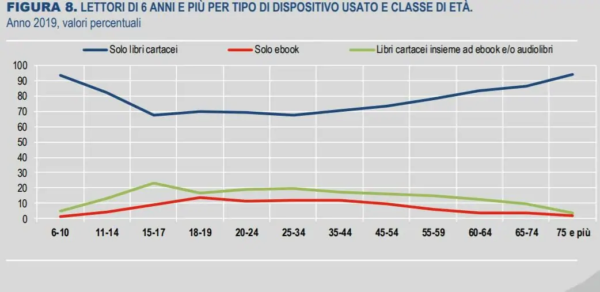
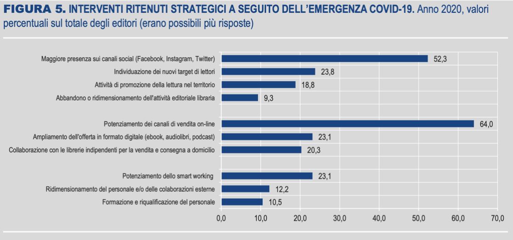

# Storia dell'Editoria

## Nascita dell'Industria Editoriale 

Nel 1455 Johannes Gutenberg inventò la **stampa a caratteri mobili**, un vero e proprio processo industriale.
Le caratteristiche principali di questa invenzione furono:

- i caratteri mobili, forgiati in metallo tenero e fondibile

- l'inchiostro utilizzato, non più ad acqua, ma ad l'olio

- l'utilizzo del torchio tipografico, modellato sul torchio da vino, il quale permetteva di applicare efficacemente e con pressione uniforme l'inchiostro sulla pagina.

Grazie a queste caratteristiche la sua tecnica in breve tempo si diffuse in tutta Europa.

L'Italia ebbe un compito importante nella diffusione dell'industria dell'editoria, in particolare **Venezia**,  che viene considerata la **prima capitale dell’industria editoriale**.
Questo fu possibile grazie alle sue  numerose rotte commerciali, la presenza di grossi capitali, di varie comunità nazionali e l’assenza di censura.

- Nel ‘500 a Venezia si stampava la metà dei libri pubblicati in tutta Europa.

- A Venezia fu pubblicato il primo libro greco (1486), il primo libro armeno (1512), il primo libro in cirillico bosniaco (1512), il primo Talmud (1524) e il primo Corano in arabo (1538) della storia.

Tra la fine del ‘400 e la prima metà del ‘500 a Venezia furono attivi centinaia di stampatori, il più noto di essi fu **Aldo Manuzio**, considerato uno degli ideatori dell’idea stessa di editoria.

- Ha un progetto editoriale, pubblicare i classici greci e latini
- Intesse rapporti con gli intellettuali dell’epoca, es. Erasmo da Rotterdam, Pietro Bembo, seleziona i contributi più significativi della sua epoca e ne promuove la pubblicazione
- Innova i processi produttivi e distributivi:
  - Sistematizza la punteggiatura secondo criteri ancora oggi in uso
  - Invenzione del corsivo, *italicus*
  - Invenzione del formato in ottavo, precursore del tascabile
  - Il primo o proporre un catalogo delle opere edite dalla sua casa

​	

Nella seconda metà del ‘500 la leadership nella pubblicazione di libri passò per un certo periodo ai Paesi Bassi.
Ad esempio la serie di testi a duodecimo (di piccolo formato) dei classici latini che gli Elzeviri (casa fondata nel 1593) iniziarono a pubblicare nel 1629 era più che all'altezza delle precedenti edizioni Aldine in termini di qualità ma era proposta a un prezzo più contenuto.

Anche la Francia si affermò come sede di importanti case di stampa, soprattutto a Parigi in collegamento con la Sorbona, la preferenza per i caratteri romanici e l’immaginazione Aldina della scuola francese contribuì all’affermazione di questo modello nei confronti dello stile gotico sviluppatosi nelle zone di influenza tedesca.

In Spagna invece la stampa arriva tramite la Germania, attraverso la compagnai Ravensburg che aveva una base a Valencia, si diffonde poi a Madrid, a Seviglia, Barcellona, Saragozza e Salamanca.

In Inghilterra questa nuova industria è inizialmente marginale, i caratteri e la carta per le stamperia verranno importati dal continente fino al 1567.

Quasi immediato fu l’intervento legislativo per governare questo nuovo fenomeno, dapprima soprattutto a scopi di censura in seguito per regolarne i diritti economici.

## Era Moderna

L’era moderna si caratterizza per un continuo rafforzamento della distribuzione del libro.
Vi è un grosso aumento della domanda grazie a: 

- Commerci
- Istruzione
- Intrattenimento

L’Illuminismo è periodo di grande fermento

Il Romanticismo rafforza il valore dell’opera e dell’autore come strumenti di costruzione dello spirito nazionale. 

Il novecento inizierà a mettere in discussione questi valori, pur continuando a praticarli. 

Il **romanzo**, come tutte le cose, non nasce all’improvviso, la sua storia è lunga: epica antica e medievale, *La storia vera* di Luciano di Samosata, II Sec., novelle medievali - *Il Decameron* 1353, *Garagantua e Pantagruel* di Rablais 1532, *Don Chisciotte della Mancia* 1615

Il **romanzo moderno** è espressione dell’illuminismo e delle sue evoluzioni culturali: ascesa della borghesia, inizio della forme costituzionali di governo, diffusione della scolarità

- Le avventure di Robison Crusoe di Defoe 1719
- I viaggi di Gulliver di Swift 1734
- Candido di Voltaire 1759
- I dolori del giovane Werther Goethe 1774
- Le ultime lettere di Jacopo Ortis di Foscolo 1798

## Valore Storico dell'Editoria

Queste evoluzioni hanno portato l’editoria a essere un elemento cardine della società moderna e contemporanea in quanto ha influenzato i processi di costruzione e diffusione delle idee.

Alcuni importanti riflessi sono:

- La nozione di diritto d’autore
- La nozione di opera
- La nozione di autore
- La nozione di catalogo, archivio, collezione

## Copyright e Diritto d'Autore

L’editoria è un’industria orientata alla creazione e commercializzazione di prodotti ma non segue del tutto le regole del mercato perché al prodotto culturale è **attribuito un valore sociale**, ad esempio il prezzo è fissato per tutti i punti di vendita, l’IVA è agevolata.

Questo tipo di produzione deve inoltre inserirsi all’interno di un quadro normativo particolare: **il diritto d’autore.**

Prime leggi sul diritto d’autore sono del 1710 in Inghilterra, in molti paesi europei arriverà a inizio o fine’800

- Stati Uniti -1790
- Francia - 1793
- Germania - 1839
- Convenzione tra il Regno di Sardegna e l'Impero Austriaco - 1840
- Regno d’Italia - 1865 - 1882 - 1925
- Convenzione di Berna per la protezione delle opere letterarie e artistiche (CUB) - 1886

La normativa vigente in Italia è del 22 aprile 1941 ma ha subito diverse revisioni anche perché a livello di UE sono stati fatti interventi di armonizzazione delle normative degli stati membri nel 1993.

Convenzione internazionale sul diritto d’autore - trattato OMPI - è in vigore dal 2002.

La legge protegge qualsiasi opera dell’ingegno: testi, software, immagini, opere musicali e fornisce due tipologie di protezione: **diritto morale** e  **patrimoniale**:

- il **diritto morale** indica il diritto di riconoscimento della paternità, tutela dell’integrità dell’opera, il diritto al ritiro di opere non autorizzate.

- il **diritto patrimoniale** indica il diritto allo sfruttamento economico derivato dall’opera. In Italia questo diritto è inalienabile, non può essere ceduto se non temporaneamente, dopo 20 anni automaticamente si esaurisce, indipendentemente da quanto sia stabilito nel contratto.

L’UE ha stabilito che lo sfruttamento economico è valido per 70 dopo la morte dell’autore, poi l’opera diventa di pubblico dominio. Le opere visuali sono soggette anche al diritto di possesso, ovvero diritto di rendere accessibile e riprodurre l’opera.

La direttiva UE del 17 aprile 2019 aggiorna la norma al mercato digitale. Per quanto riguarda le piattaforme di condivisione di contenuti online. In linea di principio, dovranno ottenere una licenza per le opere protette dal diritto d’autore e devono garantire ai titolari dei diritti di intervenire. Al tempo stesso, la direttiva consente agli utenti di generare e caricare liberamente contenuti per finalità di citazione, critica, rassegna, caricatura o parodia.

Anche gli editori devono rispettare il GDPR. Raccogliere dati personali attraverso il consenso e rispettare il diritto all’oblio Il fruitore ha il diritto alla cancellazione dei propri dati personali, quindi i titolari hanno l’obbligo di informare della richiesta di cancellazione anche altre realtà che ne hanno fatto uso.

## L'Opera

Il termine testo (dal latino textus "intreccio, tessuto") sta ad indicare un insieme di parole strutturate in base alle norme di una certa lingua per comunicare un messaggio in modo *comprensibile*, *completo* e *coerente*.

- Il testo deve essere espresso in un codice linguistico noto a chi lo legge o lo ascolta.
- Il testo non può mancare degli elementi fondamentale del messaggio che intende trasmettere.
- Il testo deve possedere coerenza, cioè il suo contenuto deve essere strutturato secondo un’organizzazione logica di pensiero.

Per lungo tempo l’opera è tale se è riconosciuta da degli esperti come tale, se rispetta certi canoni, se ha un valore culturale definito e condiviso.

## Crisi della Nozione di Opera

**M. McLuhan in *La galassia Gutenberg* 1962**

Parte da osservazione semplice: ogni media rivede il bilanciamento dei sensi coinvolti nei processi percettivi e interpretativi: *il medium è il messaggio*.

I media non vanno studiati solo per quanto riguarda i contenuti ma per la forma di trasmissione dei contenuti. Sottolinea anche che ogni media portando all’estremo le sue potenzialità inverte le sue caratteristiche. I media caldi diventano freddi

**U. Eco *Opera Aperta* 1962**

Il contenuto di un opera non è pienamente espresso nell’opera stessa, perché sia espresso richiede la d’operazione del lettore che deve riempire gli spazi di non detto attraverso la sua conoscenza enciclopedica e la sua interpretazione.

**M. Bolter *Lo spazio dello scrivere* 1991**

Attraverso il digitale è possibile di fornire ordini di lettura dei dati che non siano necessariamente legati all'ordine di archiviazione.

Nei mezzi di comunicazione precedenti come il libro a stampa, il riferimento dei segni a altri segni era solo potenziale. Il computer lo rende esplicito.

**P. Levy *Cybercultura 1997***

La messa in sinergia delle competenze, delle risorse e dei progetti, la costituzione e la conservazione dinamica delle memorie comuni, l'attivazione di modi di cooperazione flessibili e trasversali, la distribuzione coordinata di centri decisionali.

Il cyberspazio, dispositivo di interazione interattivo e comunitario, si presta proprio come uno degli strumenti privilegiati della intelligenza collettiva

## Stato dell'Editoria

**ISTAT PRODUZIONE E LETTURA DI LIBRI IN ITALIA | ANNO 2020**

Nel 2020 sono in diminuzione sia i titoli pubblicati (-2,6% sul 2019) sia le tirature (-7,2%).

Resta sostanzialmente stabile il prezzo medio di copertina mentre aumenta la distribuzione mediante i canali on-line.

Il 41,4% della popolazione di 6 anni e più ha letto almeno un libro nell’ultimo anno, dato in lieve aumento rispetto al 2019 (+3%). Il 73,6% dei lettori legge solo libri cartacei, il 9,4% solo e-book o libri on line mentre lo 0,3% ascolta solo audiolibri. Il 16,6% utilizza più di un supporto per la lettura (libro cartaceo, digitale, audiolibro).

Il livello di istruzione si conferma l’elemento determinante: legge libri il 72,8% dei laureati (75,0% nel 2015), il 49,1% dei diplomati e solo il 26,8% di chi possiede al più la licenza elementare.

L’abitudine alla lettura continua ad essere più diffusa nelle regioni del Nord: ha letto almeno un libro il 48,2% delle persone residenti nel Nord-ovest, il 48,5% di quelle del Nord-est, il 44,3% delle regioni del Centro e il 29,2% dei residenti al Sud.

## Sfide dell'Editoria nell'Era Digitale

Si ridefinisce il processo di selezione delle opere:

- selezione dal basso
- auto-promozione

Si allarga il campo dell’offerta

- più canali e forme
- più attori

Si definiscono nuovi modelli di business

- economia dei beni digitali

Si definiscono nuovi quadri normativi

- revisione al diritto d’autore

Le strategie per affrontare questo sfide sono:

- **Multicanalità**
- **Coda lunga**
- **Analisi dei dati**

