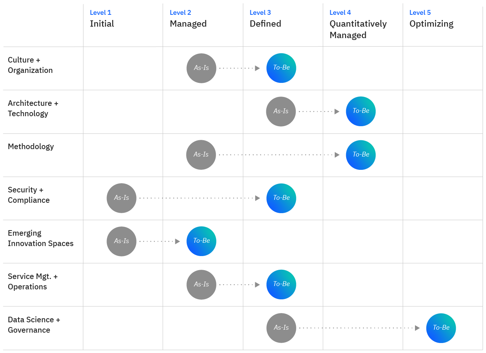
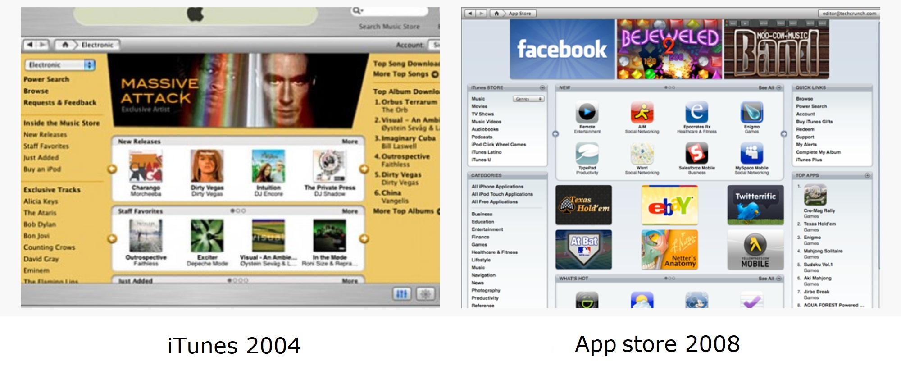
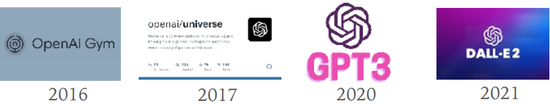

# Accettazione della tecnologia

Chi progetta tecnologia deve porsi il problema della sua accettazione e diffusione.

Si tratta di aspetti che richiedono un approccio multidisciplinare (ci sono molti modi per osservare il fenomeno)

- Conoscenza dei riferimenti culturali di una comunità
- Sperimentazione degli effetti di un trattamento
- Conoscenza della tecnologia e dei suoi trend di sviluppo
- Misurazione delle proprietà di un sistema
  

## Fattori del TAM

- **Utilità percepita**
  
  - **Status symbol** - Riguarda il desiderio dell'utente di associarsi a una tecnologia considerata
    all'avanguardia o di prestigio 
  - **Accesso al mercato** - La disponibilità della tecnologia sul mercato o la possibilità di accedere ad un
    mercato attraverso la tecnologia sono fattori che influenzano notevolmente l'adozione
  - **Qualità del risultato** - La qualità dei risultati ottenuti dall'uso della tecnologia è un importante
    determinante dell'adozione
  - **Costi e tempi** - I costi associati all'adozione della tecnologia e il tempo necessario per apprenderne l'uso
    sono fattori critici
    
- **Facilità d’uso**
  
  - **Riconoscibilità** - Gli utenti sono più propensi a adottare una tecnologia che è simile a qualcosa che è
    per loro familiare
  - **Usabilità** - Si riferisce alla possibilità di utilizzare la tecnologia senza sforzo, in modo efficace ed
    efficiente
  - **Curva di apprendimento** - Si riferisce al tempo e all’impegno necessario per apprendere come utilizzare
    una tecnologia
  - **Portabilità** - Si riferisce alla capacità di utilizzare la tecnologia su diverse piattaforme o dispositivi
    

## Roll Out di un processo di accettazione

Nel momento in cui si decide in introdurre una nuova tecnologia è necessario definire chiedersi se ci sono le condizioni di accettazione.
Se le condizioni non sono sufficientemente solide serve studiare un piano che possa permettere l’implementazione e la distribuzione graduale delle nuove funzionalità che si intendono proporre.

Questo piano è spesso definito **piano di Roll Out**, il suo obbiettivo è far crescere in modo graduale i fattori di accettazione.
Per definire questi passaggi le organizzazioni si aiutano spesso attraverso dei **Maturity Model**, dei benchmark che definiscono criteri per classificare il livello di maturità di una tecnologia, una metodologia di lavoro, un processo o un’organizzazione.

## Maturity model

Tutti i modelli di maturità presentano diversi livelli crescenti di avanzamento che possono essere assegnati a diversi elementi del sistema.
Uno dei più noti è il Capability Maturity Model Integration (CMMI), che prevede cinque livelli.

Source: [Use an IT maturity model by Antonella Bertoletti IBM, Cloud Adoption Leader, IBM](https://www.ibm.com/garage/method/practices/think/it-maturity-model/)

### *Esempi storici*

#### iPod -> Apple Store -> iPhone

Prima di lanciare iPhone e le sue app, Apple ha introdotto gradualmente agli utenti le nuove interfacce fino ad arrivare all'iPod Touch, il quale è molto somigliante al primo iPhone.

Man mano hanno persino reso simile iTunes al primo App Store in modo che gli utenti si abituassero ad utilizzarlo

#### OpenAI

