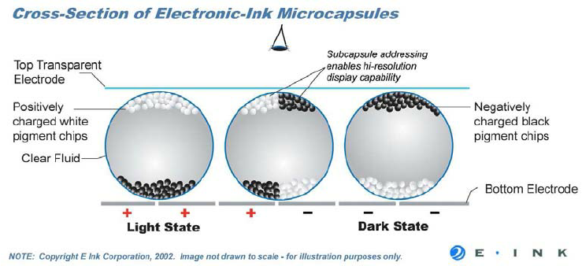
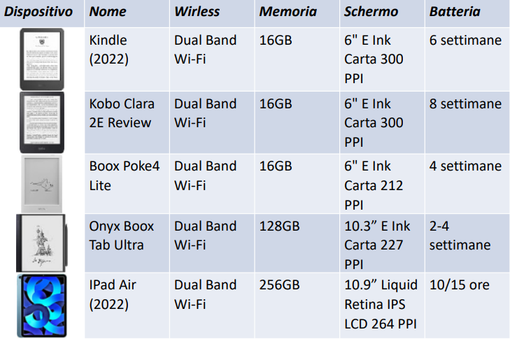
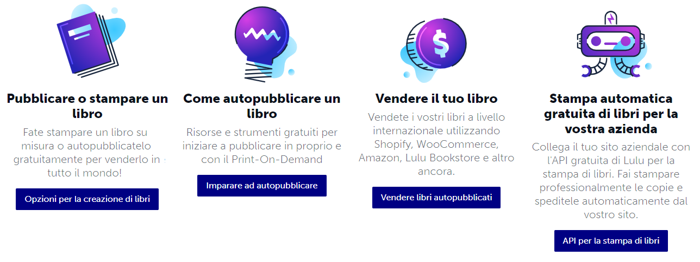
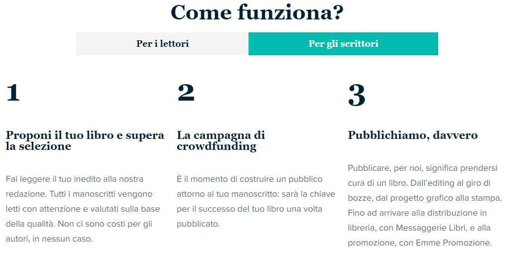

# Libro Elettronico
Il libro elettronico è un *documento digitale* per la lettura.

Il formato principale prende il nome di **ePUB** ed è stato definito dal **W3C**, anche Kindle conosciuto come **MOBI** o **AZW3** è comunque importante.

Questi documenti vengono distribuiti principalmente attraverso piattaforme chiuse accessibili mediante PC, dispositivi mobili o dispositivi dedicati.

Questi formati competono con altre soluzioni che hanno maggiori vantaggi in termini di manutenibilità e interoperabilità, come i documenti collaborativi o i webbook.

## Modalità di lettura
Ci sono diversi modelli di lettura che possono influenzare la percezione dell'utente e la fruibilità del contenuto di un testo.

### Lettura sequenziale
È il modello di lettura più tradizionale, in cui gli utenti seguono un flusso lineare di contenuti da una pagina o schermata all'altra.

Questo modello è tipico per i libri stampati e molti ebook digitali. È adatto soprattutto alla narrativa o alla saggistica divulgativa.

### Lettura non lineare
In questo modello, gli utenti possono accedere ai contenuti in modo non sequenziale. Questo si realizza attraverso strumenti di ipertestualità, collegamenti interni o menu di navigazione che consentono agli utenti di saltare direttamente a sezioni specifiche del contenuto.
Questo modello è comune in documenti tecnici, manuali online e contenuti educativi interattivi.

### Lettura visuale
Questo modello pone un'enfasi particolare sull'aspetto visuale del contenuto. Può coinvolgere l'uso di immagini, grafici, diagrammi e layout visivamente accattivanti per migliorare l'esperienza di lettura.

Questo è spesso importante per le riviste, i fumetti, i libri illustrati e i materiali didattici che richiedono una componente visiva significativa.

### Lettura testuale
In questo modello, l'attenzione si concentra principalmente sul testo, eliminando altri elementi per ottenere maggiore semplicità e chiarezza.

Gli ebook tradizionali e molti documenti di testo online seguono questo modello.

La documentazione di una libreria, una API o un software è forse un intermedio tra visuale e testuale, si privilegia la semplicità ma è importante formattare il codice in modo da semplificare la lettura visiva, alcuni diagrammi posso aiutare il lettore a orientarsi.

### Lettura collaborativa
Alcune piattaforme offrono modelli di lettura che incorporano elementi collaborativi. Ad esempio, la possibilità di condividere annotazioni, commenti o discussioni direttamente nel contesto del testo.

Questo modello può promuovere l'interazione tra gli utenti e arricchire l'esperienza di lettura.

### Lettura interattiva
Questi modelli spesso integrano elementi interattivi per coinvolgere gli utenti e migliorare l'esperienza di apprendimento. 

Piattaforme di apprendimento online, ebook interattivi e risorse educative digitali spesso adottano questi modelli di lettura interattivi per migliorare l'engagement e facilitare l'apprendimento attivo. 

L'obiettivo è offrire un'esperienza di apprendimento più coinvolgente e personalizzata rispetto alla tradizionale lettura sequenziale.

### Lettura adattiva

Questo modello coinvolge l'adattamento del contenuto in base al comportamento o alle preferenze dell'utente.

Ad esempio, la personalizzazione della formattazione del testo, la dimensione del carattere o la modalità di visualizzazione notturna in base alle preferenze dell’utente.

### Lettura ludica

Esistono esperienze di lettura che si intersecano con il gioco. Questi libri offrono ai lettori una narrazione interattiva in cui possono prendere decisioni chiave che influenzano il corso della
storia. Gli elementi di gioco, come le scelte multiple, i punteggi e i rami narrativi, sono incorporati nel tessuto stesso del libro.

Oltre ai tradizionali librogame, i giochi di enigmi e rompicapi oggi possono esistere strumenti basati sulla realtà aumentata o la realtà virtuale.

## Interfaccia

Le informazioni contenute all'interno del testo vengono proposte attraverso un'interfaccia che ha l'obbiettivo di replicare l'esperienza di lettura di un testo su carta.

Alcune funzionalità riprodotte sono:

- Sfogliare le pagine
- Posizionare un segnalibro
- Accesso random al contenuto
- Annotazioni

Vengono anche introdotte nuove funzionalità come:

- Ipertestualità
- Multimedialità
- Integrazione con dizionari e tesauri

## Ideazione

Nei racconti e nei film troviamo diverse anticipazioni delle invenzioni tecnologiche:

- *Il cadetto dello spazio,* 1948 di Robert Heinlein: racconto in cui troviamo telefoni cellulari e un sistema che proietta i testi sui banchi di scuola
- *Chissà come si divertivano!*, 1951 di Isaac Asimov: un racconto ambientato nel 2157 in cui si parla del ritrovamento di un antico libro a stampa
- *Ritorno dall’universo*, 1961 di Stanislaw Lem: racconto in cui si descrivono lettori con sintesi vocali (optoni e lectoni) e librerie digitali
- *2001: Odissea nello spazio*, 1968 romanzo di Arthur Clarke e film di Stanley Kubrick: il newspad
- *Star Trek*, serie TV del 1966 e film 2009: i PADD
- *Cyberbooks*, 1989 di Ben Bova: romanzo in cui è centrale l’idea di libro elettronico
- *Minority Report*, 2002 di Spielberg: quotidiano elettronico

Nelle tappe di avvicinamento all’e-book troviamo lavori pionieristici e intuizioni da fantascienza:

- Nel 1930 Bob Brown, sul giornale di avanguardia *Transition* propone l’idea di una macchina portatile in grado di leggere testi di diverse dimensioni
- Nel 1949 Angela Ruiz Robles, una maestra spagnola realizza il primo lettore automatizzato. Piccole quantità di testo sono stampate su bobine e azionate da aria compressa che vengono.
- Memex, anni ‘40 di Vannevar Bush: dispositivo di lettura di testi conservati su microfilm, per semplificare ritrovamento e organizzazione dei testi. Più vicino all’idea di ipertesto che al libro


> Prototipo dell'Enciclopedia Mecánica di Angela Ruiz Robles del Museo Nazionale della Scienza e della Tecnologia di A Coruña

Studio delle interfacce di lettura e digitalizzazione elettronica dei testi:
- Alan Kay, anni ‘70, al PARC della Xerox, quando i computer erano grandi
  mainframe lavora all’idea di una informatica personale e di strumenti
  portatili. Dynabook strumento personale multifunzionale
- Michael Hart, anni ‘70, contributo fondamentale all’idea della
  digitalizzazione dei testi, iniziatore del Progetto Gutenberg, strumento
  per valorizzare il ruolo delle tecnologie e la rete per la di usione del libro


> The Dynabook's original illustration in Alan C. Kay's 1972 paper

L'ebook necessita anche di un punto di accesso, uno store:

- Nel 1993 BiblioBytes lancia il primo sito web che propone eBook
- Nel 1994 nasce Amazon, nel 1995 la prima libreria online
- Nel 1999, la casa editrice Simon & Schuster crea "ibooks" una iniziativa per pubblicare contemporaneamente titoli in formato eBook e cartaceo. La Oxford University Press ha offerto alcuni dei suoi libri attraverso un sistema chiamato netLibrary su Internet
- Il 1998 ha segnato il futuro degli eBook: sono stati lanciati i primi lettori di eBook, gli eBook hanno ottenuto l'ISBN, le biblioteche statunitensi hanno iniziato a fornire eBook gratuiti al pubblico
- Sony lancia il suo primo e-reader nel 2004
- Il mercatoNello stesso anno il lancio e il successo di iPhone dimostra il potenziale dei dispositivi digitali mobili
- Kobo (anagramma della parola book) dal 2010
- In Italia accordo con Mondadori e IBS.it per Pocketbook, Leggo

## Dispositivi

**eReader** : dispositivi per la lettura di testi
- Basato su tecnologia per la visualizzazione dei caratteri, E-Ink, che non emette luce come un normale display dello schermo ma riflette la luce ambientale come un foglio di carta.
- Tecnologia inventata da Jacobson, 1996, fondatore di E-Ink
- Adottata da quasi tutti i dispositivi eReader, generalmente a 16 tonalità di grigio





## Formati

Distinguiamo tra **formati immagine** e **formati di testo**:

### Formati d'immagine
I formati di immagine hanno layout fissi, il che significa che il testo e le immagini sono posizionati in modo specifico sulla pagina. 

Alcuni elementi di adattamento sono dati da:
- zoom, rotazione, salvataggio, esportazione, stampa
- separazione del testo dallo sfondo e anche la ricerca su tutto il testo, se l’immagine è stata trattata con un sistema di riconoscimento ottico dei caratteri

*Esempi*
- PDF: formato PDF è ampiamente utilizzato e supportato su molte piattaforme
- DjVu: formato immagine compresso che rappresenta l’immagine a livelli, usato per testi con alto contenuto grafico
- CBZ (Comic Book Zip): questo formato è essenzialmente un file ZIP che contiene immagini in sequenza, solitamente in formato JPEG o PNG.
- CBR (Comic Book RAR): simile al formato CBZ, ma utilizza il formato di compressione RAR

### Formati di testo
- I formati di testo sono composti da:
  - file che descrivono la struttura del documento (di solito un le XML chiamato FictionBook 2.0)
  - file di testo che includono il contenuto
  - file multimediali inclusi nel documento
  - file di gestione del *DRM* (Digital Rights Management)

*Esempi*
- ePUB: è uno dei formati più diffusi per gli ebook
- MOBI e AZW3 (Kindle Format): formato specifico per i dispositivi Kindle di Amazon
- HTML: può essere utilizzato per la creazione di ebook, specialmente quando si tratta di ebook interattivi o basati sul web. L'uso di HTML nei libri digitali offre la possibilità di incorporare elementi multimediali, collegamenti ipertestuali, formattazione avanzata e interattività. L’uso di una piattaforma distribuita aperta facilita i processi collaborativi e gestionali 

### Formati aperti:
- *OeBPS*, il contenuto del libro è codi cato in le XHTML, legati tra loro per mezzo di un le XML, detto package le, e salvato con l’estensione .opf
- *ePUB* si tratta di un formato basato su XML e composto da tre speci che aperte ideate per favorire la compatibilità potenziale con diversi dispositivi
### Formati proprietari
- *LIT*, Il formato deriva dall’OeBPS, a cui aggiunge sistemi di protezione del contenuto di vario livello
- *Mobipocket*, si basa sullo standard OeBPS, utilizzando documenti in XHTML e permettendo anche l’inclusione di JavaScript e interrogazioni SQL
- *Kindle*, Il formato AZW è sostanzialmente il formato Mobipocket con uno schema di erente per la generazione del numero seriale, inoltre i file sono protetti da uno speciale sistema DRM
- *Multi-Touch* (.iBooks), si caratterizza per l’interazione con elementi multimediali quali gallerie fotogra che, video, diagrammi interattivi, oggetti 3D, quiz. Usato per prodotti con un grado avanzato di interazione come libri di testo, libri di cucina, libri di storia e libri illustrati

### EPUB
*ePUB* è uno standard aperto, un'aggregazione di tecnologie diverse e già esistenti.

Il suo nome completo è **Electronic Publication** ed è definito da *International Digital Publishing Forum*

La sua estensione è .epub

Il generico nome *Publication* sottolinea che ePub è un formato per documento generici e non per uno specifico tipo: Libri, riviste, giornali, documenti vari e in generale qualsiasi documento di testo distribuibile in formato digitale.

Un documento EPUB è un contenitore di contenuti, un contenitore in grado di addattarsi ai diversi dispositivi di lettura.

- ePUB è promosso dal International Digital Publishing Forum
- Consorzio di aziende che supportano lo sviluppo del formato ePUB, include editori, distributori, sviluppatori di lettori
- Sviluppa e mantiene il formato EPUB® per libri e documenti digitali a usso variabile per adattarsi a mezzi di lettura diversi
- Favorisce la comunicazione tra gli attori del mercato editoriale digitale
- Dal 2017, IDPF si è fuso con il Consorzio W3C

EPUB usa sostanzialmente solo 3 tecnologie:
- XHTML per definire i file di contenuto
- CSS per definire le specifiche di visualizzazione
- ZIP per compattare in un unico file

Come se fosse una pagina web visibile offline e distribuita come una singola entità, seppur formata da più file come una pagina web

#### Struttura logica
- Content: testo e immagini che compongono l’ebook. 
<br/>  Collezione di file html (uno per capitolo di solito) immagini e css
- Package: informazioni sul contenuto di content, lista dei files e metadati descrittivi
- Container: un modo per impacchettare tutto in un unico file da distribuire, si usa il formato ZIP

La cartella è così strutturata:
- Il file mimetype con la dichiarazione del formato
  - *application/epub+zip*
- La cartella META-INF obbligatoria contenente
  - Il file *container.xml* obbligatorio, scritto in XML
  - la cartella *META-INF* può contenere altri file non obbligatori, come la firma digitale o il manager dei diritti, DRM
- La cartella OEBPS obbligatoria contenente
  - Il file *content.opf*
  - Il file *toc.ncx*
  - le cartelle *Images Styles Text*

### MOBI, AZW, KF8
Formato proprietario mobipocket. Estensione .mobi
- Acquisito da Amazon per i device Kindle che leggono il formato .azw derivato da mobi
- Evolve in KF8, Kindle Format 8, dal 2011 con l’uscita di Kindle Fire
- Supporta HTML5 e CSS3
- Un sistema proprietario di protezione dei diritti DRM
- Vincola il file all’id dello strumento registrato su Amazon: no a 6 sullo stesso account per condivisioni familiari e personali su più device
- Se i device di lettura vengono dismessi occorre de-registrarsi

### Enhanced eBook
eBook più tradizionali sono ancora ottenuti con formati ePub e mobi

Enhanced ebook richiedono
- Formattazione complessa, illustrazioni, audio, video interazioni
- Sfruttano a pieno i formati avanzati ePub3 e KF8

Rimane la concorrenza di altri formati
- PDF: interactive pdf con video ecc.
- Apps: pubblicare un libro come se fosse una App: layout sso: per facilitare la parte grafica. Usato per i libri per bambini, libri di ricette da cucina, fumetti. Sono più complicati e costosi da realizzare
- Web app: rimuove il vincolo di produrre diverse versioni compatibili con i formati degli store. Base HTML, javascript e CSS3

### DRM - Digital Rights Management
I più comuni usati con eBook sono
- Apple Fairplay DRM
- Amazon DRM
- Adobe ADEPT DRM

#### Effetti del DRM
- Limitare il numero di device in cui un utente può caricare i suoi eBook
- Accesso a tempo limitato
- Limitare stampa e copy-and-paste
- Limitare il trasferimento

#### Compatibilità
- Un eBook comprato su iBookstore, non lo posso leggere su un Kobo
- Il formato Kindle di Amazon è supportato da molti ma se vi applico il DRM di Amazon, allora solo i device Amazon e le sue app potranno leggerlo

Nel caso di Adobe DRM c’è una più ampia compatibilità

Si può realizzare una forma di social DRM applicando strumenti di digital watermarking.

Ad *esempio*, con l'aggiunta di informazioni visibili o invisibili per scoraggiare la copia e la circolazione.

## Fattori di successo
- Sviluppati per la lettura su dispositive mobile. Serve lo stesso confort e libertà del libro di carta
- *Testo che si adatta* (**re-owable**). Mantenere la leggibilità su qualunque schermo
- *Lettura sia online che offline*. HTML sta solo ora (versione 5) aprendosi alla leggibilità o ine che è il vantaggio tradizionale degli eBook
- *Compattezza*. Per poter essere salvati anche su dispositive modesti aumentando l’audience potenziale
- *Tecnologie aperte e standard*. Attualmente si basano su HTML aprendo ad una platea vasta di persone con le competenze giuste per contribuire
- *Produzione economicamente non dispendiosa*. Sia la conversion dal cartaceo che la produzione di per sé
- *Distribuzione diffusa*. Negozio di eBook globali. Facili da procurare

## Fattori critici

- Il concetto di re-owable ha fatto perdere il controllo al designer del libro, che quindi l’ha sempli cato all’osso.
- La promessa è nel responsive layout generato dinamicamente a seconda delle esigenze
- Non abbiamo ancora un singolo standard per gli ebook
- Incompatibilità con i device: dipende da come fanno il rendering
- DRM (Digital Rights Management) per evitare la copia illegali complica ancora di più i problem di compatibilità
- Ogni store cerca di favorire il suo ecosistema

## Fluid Framework
Microsoft ha reso disponibile in forma di preview la prima build di Fluid Framework, che permette:
- Creazione di documenti online interattivi.
- Web collaboration e dei servizi interattivi.
- Attualmente rilasciato
- Dividere il documento in più blocchi collaborativi, per poi
  analizzarli e modi cati da più App in tempo reale
- Documenti tradotti contemporaneamente in più lingue
- Fluid potrà interfacciarsi con Cortana o con altri servizi di intelligenza artifciale, così da offrire immagini, video o altri dati basati sui contenuti scritti nel documento

### Video DEMO
[](https://www.youtube.com/watch?v=RMzXmkrlFNg)

## InDesign CC
InDesign Creative Cloud di Adobe
- leader mondiale nel mercato del Desktop publishing
- Strumenti per l’impaginazione e stampa su carta e creazione di documenti e libri digitali
- Importare i prodotti con InDesign o Word
- Applicare gli stili in InDesign, molto importante per l’ottimizzazione del codice
- Definire la sequenza degli elementi
- Esportare nel formato .ePUB o KF8 per Kindle
- Utilizza un formato proprietario .folio
  - Permette di produrre materiale ricco di elementi multimediali e con layout complesso
  - Convertire in App e pubblicare su Apps store
- Usato principalmente per Magazine e periodici, ma utile anche per enhanced eBook

[](https://www.youtube.com/watch?v=FaJG3buRh2Y)

## iBooks Author

- Applicativo Apple per creare eBook
- Formato proprietario di Apple: Multi-touch (iBooks2)
  - Basato su ePUB3
  - Se si vuole vendere un eBook prodotto è obbligatorio transitare da iBookstore
- Dal 2020 dismesso e sostituito da Apple Pages
- Il flusso di produzione è solo in uscita, non è possibile editare le esistenti

## Libre Office / Open Office
Suite di produttività individuale, Open Source, sviluppato da The Document Foundation e da Apache Software Foundation.

Contengono:
  - Writer:: elaboratore testi 
  - Calc: foglio elettronico
  - Impress: editor di presentazioni
  - Draw: editor grafco
  - Base: front-end per database compatibile con MySQL, PostgreSQL o Microsoft Access e altre fonti di dati    
  - Math: editor di equazioni
    
## Writer2ePub
Estensione per LibreOffice o OpenOffice per convertire in eBook in formato ePub documenti di testo
- Scaricabile al link: http://writer2epub.softonic.it/

## Sigil
Un ePub editor multipiattaforma libero, open source 
- un editor ePub wysiwyg ma anche via codice
- un editor TOC Table Of Content  
- un ePub Validator e un editor per HTML  
- Importa file html e testo TXT  
- Supporta ePUB2 e alcune speci che di ePUB3
  - Audio e video

- Sito: https://code.google.com/p/sigil/
- Repository: https://github.com/user-none/Sigil
  

## Kindle Direct Publishing
- Amazon Direct Publishing fornisce funzionalità per la stampa su carta e in digitale
- Lanciato nel 2007. Esistono diversi altri siti per il self publishing, autoedizione
  

## LULU

- Lulu è una casa editrice on demand. Nasce nel 2002 in Canada per iniziativa di Bob Young, fondatore anche di Red Hat
- Lulu fornisce agli autori un sistema automatizzato per la produzione editoriale, dalla creazione della copertina al formato del libro, ma si possono creare anche ebook, calendari e album fotografici
- Nel 2006 Lulu ha allargato la propria attività all'Europa


## BookABook

- Vengono pubblicati i libri che raggiungono certi obiettivi in una campagna di crowdfunding nella quale i lettori possono preordinare il libro
- Nata nel 2014 a Milano, ha ricevuto premi e riconoscimenti internazionali
- https://bookabook.it
 


## You Can Print IT
Piattaforma italiana di self-publishing che fornisce servizi editoriali
- Leggete l’intervista sulle [prospettive dell’autopubblicazione](http://www.viverediscrittura.it/10-domande-sul-self-publishing-intervista-a-youcanprint/)

L’auto produzione si distingue sia dalla normale edizione sia dall'edizione a spese dell'autore
- Nel primo caso tutte le spese sono a carico dell'editore, che si incarica di realizzare e distribuire l'opera, promettendo una remunerazione del diritto d'autore in genere in forma percentuale
- Nel secondo caso, quello dell'editoria a pagamento, esiste sempre la figura dell'editore, ma le spese sono sopportate in tutto o in parte dall'autore o da chi lo sponsorizza
- Nel caso di autoedizione l'autore, invece, si incarica di seguire tutte le fasi della realizzazione dell'opera, avvalendosi eventualmente di qualche figura professionale esterna
  
## Applicazioni eReader
Esistono numerose applicazioni per leggere e valutare un prodotto
- Adobe Digital Edition 4.5
- Cool Reader, Firefox con estensione EPUBReader
- Readium, plugin di Firefox, in sviluppo SDK per ePub3!!
- Kitabu per Mac della Sixty Four, compatibile ePub2 e 3
- Kindle, Nook, Azardi

## AZARDI, IGP
AZARDI, 43.1 del 2016, InfoGrid Pacific
- ePUB3 reader per desktop
- Per tutti i sistemi operativi Linux, Mac e Windows
- Supporta ePub3 ed ePub a layout sso, JavaScript e SMIL, HTML5, XHTML5, audio mp3, video mp4
- Per ottimare il codice applicare gli stili nei le che importate, e definire la sequenza degli elementi
- Esportare nel formato .epub o KF8 per Kindle

## CALIBRE

Calibre, Open Source, strumento multipiattaforma di gestione di e-book:
- Consente di creare e di leggere eBook
- Supporta ePUB e Kindle MOBI
- Consente la conversione tra formati (incluso il formato AZW3)
- Consente la gestione dei metadati e l’organizzazione di collezioni e librerie
- Supporta diversi e-book reader sincronizzando le librerie relative (Kindle, Sony, Nook…)
- Consente ricerche in diversi negozi
- Fornisce una funzione per raccogliere news da giornali online e trasformarle in eBooks

### Manuali di Calibre
Editing eBooks : https://manual.calibre-ebook.com/edit.html

Video tutorial per diverse funzionalità (Grand Tour) e per editing: 
https://calibre-ebook.com/demo#tutorials

### Conversione di formati in Calibre
- Molto difficile la conversione da PDF a ePUB
- Meglio la conversione da RTF o HTML a ePUB
- Si può anche redarre il le ePUB partendo da le TXT
  - Maggiore lavoro per la definizione degli elementi del testo e della sua struttura
- In input: ePUB, HTML, RTF, ODT, MOBI, TXT …
- In output: ePUB, LIT, MOBI, AZW (visibile poi solo su kindle)

#### Consigli per la conversione
Per facilitare la conversione in formato ePUB occorre:
- Non inserire formattazione inutile. Usare pochi semplici stili ed essere coerenti
- Non lasciare spazi tra i paragrafi
- Inserire immagini alla ne del paragrafo se possibile
- Eliminare la numerazione automatica delle pagine
- Eventuali note solo a fine capitolo o fine libro
- Evitare tabelle, riquadri o box di espansione

## Conversione da .doc a eBook
Salvare in formato rtf e con Calibre esportare in ePUB
 
- con OpenOffice o LibreOffice convertire in .ePUB tramite l’estensione Writer2ePub scaricabile da [lukesblog.it](https://lukesblog.it/)
- salvare in HTML e intervenire sul codice aggiungendo stili con CSS
- salvare in txt e intervenire molto pesantemente sul codice e
  sugli stili
- con Pandoc si può partire da Markdown per avere un semplice HTML o .doc

## Le immagini in eBook
Gli schermi dei device hanno dimensioni molto diverse  
- È opportuno che le immagini siano JPEG o PNG di circa 100/150 kb
- Dimensioni delle immagini 600x800 px per schermi di 5/6”
  
Applicare con rigore e coerenza gli stili che vengono poi convertiti in codice CSS durante la fase di esportazione in ePUB
  
- Questa attenzione rende il codice ePUB più semplice e pulito
- Definire la struttura del testo, tenendo conto dei diversi elementi (titolo, crediti, prefazione, capitoli o sezioni, indice…)
- Importare i file dei media
- Esportazione in ePUB
- Conversione eventuale in altri formati (Kindle)
  
## Lettura attraverso Browser
Per superare i limiti delle piattaforme di distribuzione chiuse e per abbassare il costo di fruizione degli e-book si può pensare di usare il browser come lettore.

Esistono diversi plug-in per i diversi browser
- Chrome: EPUBReader, Readium, ePUB Reader
- Si tratta comunque di una soluzione che richiede un’azione dell’utente e offre un contesto di fruizione frammentato.

Per attivare le potenzialità di condivisione che il web permette, ad esempio per annotazioni condivise o per logging delle azioni degli utenti serve una soluzione serverside fruibile con qualsiasi browser.

[EPUB.js](https://github.com/futurepress/epub.js/) offre questa soluzione per pagina web ospitate su un server che include la libreria
- Inclusione di un documento ePUB
- Riferimento a porzioni del documento tramite URI
- Annotazioni attraverso [hypothes.is](https://web.hypothes.is/)

## Layer di annotazioni
Il progetto [hypothes.is](https://web.hypothes.is/) intende realizzare un layer di annotazioni che può essere usato da gruppi di lavoro che intendono annotare pagine web
- Distinzione tra owner e user di una risorsa weB
- Per annottare è richiesto un account a hypothes.is
- Esistono delle [API](https://h.readthedocs.io/en/latest/api-reference/v2/#tag/annotations) per accedere alle annotazioni

## Anatomia di un ePub

### -Meta -Inf
Nella directory *META-INF* abbiamo solitamente un solo file
> container.xml

Contiene il file principale dell’applicazione, il file root che il reader dovrà leggere per sapere come organizzare il documento

```
 <?xml version="1.0" encoding="UTF-8"?>
<container version="1.0"
xmlns="urn:oasis:names:tc:opendocument:xmlns:
container">
 <rootfiles>
 <rootfile full-path="OEBPS/content.opf"
media-type="application/oebps-package+xml"/>
 </rootfiles>
</container>
```

### -OEBPS
Nella directory *OEBPS* abbiamo i file che compongono l’ebook.

Il più importante è root file, tipicamente *content.opf*

OPF è l'acronimo di Open Packaging Format, per cui a volte l'OPF viene chiamato **Package File**.

Contiene i metadati e le informazioni strutturali e bibliografiche dell’ebook: cosa c’è e dove si trova.

Potremo poi avere:
- una directory *images* per le immagini
- una directory *css* o *styles* per i fogli di stile
- una directory *fonts* per i font

### -OPF
Il file OPF è composto da un'intestazione XML e da quattro sezioni:
1. La sezione **metadata**, che fornisce al reader informazioni di descrizione del libro
2. La sezione **manifest**, che indica al reader dove trovare i contenuti
3. La sezione **spines**, che indica al reader in che ordine deve visualizzare i file (opzionale)
4. La sezione **guide**, che indica al reader dove trovare file speciali come la copertina o l’indice (opzionale)

### -NCX
Un altro file che compare quasi sempre nella directory principale è il file *NCX* o **file di navigazione**.

Si tratta del menu a tendina disponibile in qualsiasi pagina, per permettere al lettore di navigare verso qualsiasi punto del libro.

Ogni elemento del file è contenuto all’interno di un elemento *navMap* ed è raggruppato grazie all’elemento *navPoint*
- Al suo interno gli elementi *navLabel* e text indicano al reader cosa visualizzare nel menu
- L’elemento *content* indica a quale file inviare il reader quando un utente seleziona l'elemento
