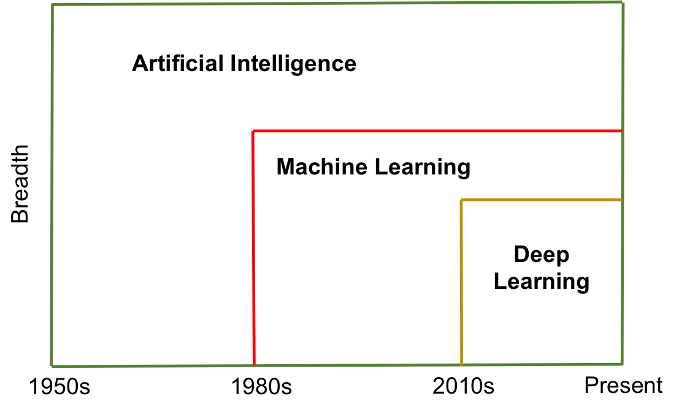
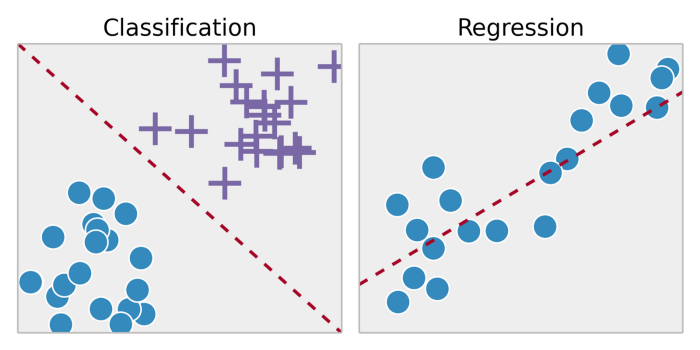
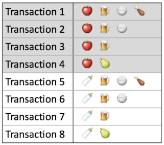
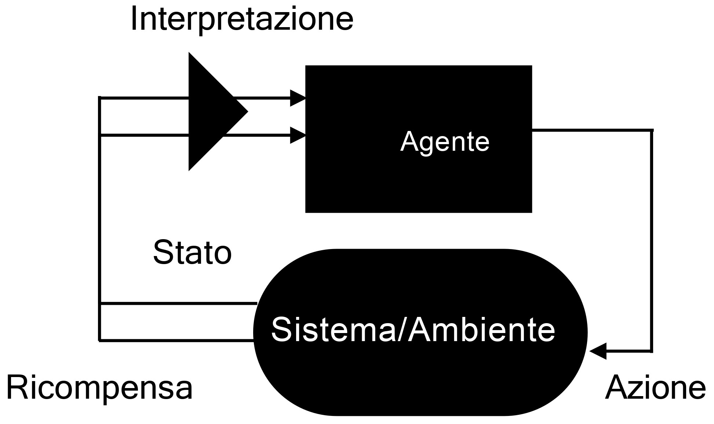
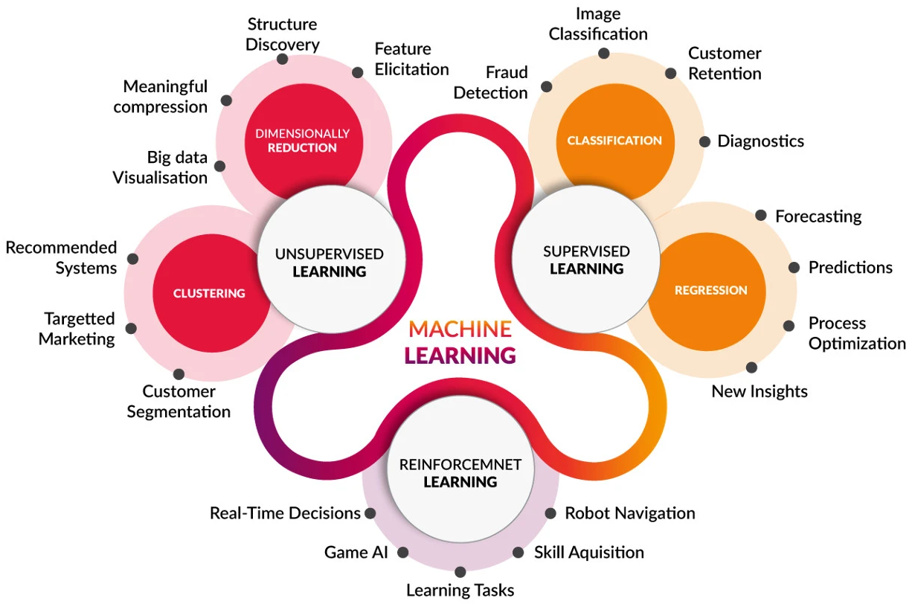
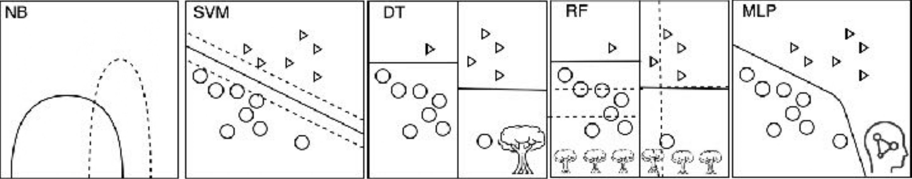

# Intelligenza Artificiale
## Acquisizione dei contenuti
Abbiamo visto che uno dei punti critici del processo di produzione editoriale è rappresentato dall’acquisizione dei contenuti
- Per permettere che il prodotto sia **percepito come utile** i contenuti devono raggiungere i **bisogni del target** e farlo con un **livello di qualità adeguato**
- Questo porta a elevati costi di produzione dei contenuti in quanto richiedono si deve passare da un **processo creativo** e di **elaborazione manuale**
- 


## Generazione automatica dei contenuti
In generale il processo di acquisizione dei contenuti comporta elevati costi di produzione in quanto richiedono si deve passare da un **processo creativo** e di **elaborazione manuale**.

In alcuni casi si possono raggiugnere delle fonti aperte ma questo può eliminare solo una parte del processo di produzione manuale perché si deve passare in ogni caso da **selezione** e **riorganizzazione** del contenuto.

Grazie a strumenti di Intelligenza Artificiale sempre più avanzati, negli ultimi anni si è provato a abbassare il costo di produzione inserendo alcune fasi di **generazione automatica dei contenuti,** che naturalmente non possono sostituire le fasi di selezione e organizzazione del contenuto.

Questa tendenza si è rafforzata recentemente grazie ai successi e alla diffusione di strumenti di **AI generativa**
- I modelli generativi apprendono la struttura e le caratteristiche di un insieme di dati e sono in grado di generare nuovi dati simili a quelli di partenza
- Due tipi comuni di generative models sono le Generative Adversarial Networks (GAN) e i Generative Pre-trained Transformer (GPT)

La diffusione dei Large Language Model (LLM) ha avuto un impatto significativo sull'editoria digitale, consentendo la generazione automatica di contenuti di vario genere
- **Automazione della scrittura di contenuti**: automazione di una parte della produzione di contenuti editoriali, generalmente i più semplici, come resoconti finanziari, sportivi, descrizioni di prodotti …
- Traduzione automatica di contenuti: tradurre testi in modo automatico e coerente, generalmente con la supervisione di un traduttore esperto
- **Revisione di testi**: dato un testo migliorare la fluidità espressiva, modificare lo stile, generare una versione sintetica del testo
- **Generazione di suggerimenti creativi**: generare suggerimenti creativi per scrivere titoli accattivanti, introdurre storie o creare contenuti coinvolgenti
- **Creazione di chatbot e assistenza virtuale**: sistemi per rispondere alle domande degli utenti, fornire informazioni e migliorare l'esperienza complessiva dell'utente
- **Analisi automatica dei contenuti**: alcuni large language model possono essere impiegati per analizzare automaticamente i contenuti digitali, rilevare tendenze, estrarre informazioni chiave e supportare attività di analisi dei dati editoriali

La diffusione dei sistemi generativi per immagini e i contenuti audio a portato alla sperimentazione di
- **Generazione di traccia audio da testo**: strumenti di sintesi vocale consento di convertire un testo nella sua riproduzione vocale
- **Generazione di illustrazioni per testo**: i sistemi generativi, come le reti neurali generative (GAN), sono stati impiegati con successo per tradurre descrizioni testuali in rappresentazioni visive.
- **Generazioni di video**: la capacità di generare simultaneamente illustrazioni e tracce audio e testo basate su testo di partenza offre un potenziale significativo per l'integrazione multimediale era generazione di video

## Evoluzione storica


Artificial Intelligence, Machine Learning e Deep Learning possono essere considerati termini in relazione di iperonimia

### Apprendimento automatico
Ci limiteremo all’aspetto dell’**apprendimento automatico** (Machine Learning - ML)

Non per adeguarci alla tendenza promossa dal marketing dei colossi dell’informatica ma per restringere il campo del discorso

L’obiettivo di un processo di AU è la costruzione di un **modello di risposta**.

**Una procedura che data un tupla X produce una risposta**
```
y:
X -> y
```


## Retroazione
I processi retroattivi o retroregolati possono essere considerati la forma più semplice di AU.

In un controllo retroattivo il valore di una **variabile in uscita** dal sistema viene letto dal controllore che agisce **modificando l'ingresso** del sistema (ad esempio il termostato, sistema di puntamento).

Il concetto è stato introdotto dal matematico americano Norbert Wiener negli anni quaranta, iniziatore della cibernetica. La teoria dei sistemi retroazionati è utilizzata in molti campi delle scienze pure, delle scienze applicate (tra cui i controlli automatici) e della biologia.

In questo caso il modello è definito inizialmente da un insieme di procedure ma i valori dei punti di decisione sono aggiornati attraverso aggiustamenti progressivi


## Procedure di apprendimento
Il progettista non sempre conosce tutte le regole di decisione.

Procedure di apprendimento:
- Supervisionato
- Non-supervisionato
- Per rinforzo

### Apprendimento supervisionato
I processi retroattivi si adattano a segnali che provengono dall’ambiente (spesso si assume siano in relazione con gli output del sistema).

Quando i segnali in grado di indirizzare l’adattamento (feedback) non provengono direttamente dall’ambiente è possibile ottenere dei feedback attraverso un processo di valutazione nel quale i risultati prodotti dalla macchina siano valutati confrontandoli con risultati che si conosce essere corretti.

Questa nozione è alla base dei processi di **apprendimento supervisionato**.

- Induzione
- Transduzione


#### Funzioni dell'apprendimento supervisionato
Classificazione: 
- Riconoscere un insieme di esempi accumunati da stesse proprietà
- Predire dati categorici
Regressione
- Individuare la tendenza di evoluzione di una distribuzione
- Predire dati numerici


### Apprendimento non supervisionato
- Induzione
- Deduzione


#### Funzioni dell'apprendimento non supervisionato
Clustering:
- Raggruppare esempi accumunati da stesse proprietà
- Dati categorici / dati numerici


Dimension Reduction: 
- Individuare la dimensioni di maggior importanza in un dataset
- Dati categorici / dati numerici


Association:
- Individuare correlazioni e probabilità condizionate di un dataset



### Apprendimento per rinforzo
- Azione
- Stato
- Ricompensa




### Apprendimento auto-supervisionato
Nell’apprendimento auto-superivisionato self-supervised learning, l'obiettivo è sfruttare informazioni intrinseche presenti nei dati stessi per addestrare un modello, senza l'utilizzo di etichette fornite esternamente.

Un esempio di self-supervised learning è la predizione di parte di un'istanza a partire dalle altre parti di quella stessa istanza.

Supponiamo di avere immagini di cani e gatti, possiamo suddividere ogni immagine in due parti: la testa e il corpo dell’animale.

Quindi, creiamo un compito di predizione dove il modello deve imparare a predire la parte mancante a partire dalla parte visibile.

Approccio molto usato molto nei modelli linguistici per predire la parola successiva dato una sequenza di parole.




### Altri approcci
- **Active Learning**: l'apprendimento attivo è una tecnica in cui il modello è in grado di interrogare un operatore umano durante il processo di apprendimento al fine di risolvere possibili ambiguità. È utile quando non ci sono molti dati disponibili o i dati sono costosi da raccogliere o etichettare
- **Multi-Task Learning**: si riferisce a un processo di apprendimento che può essere condiviso da più agenti. Per esempio, la codifica della distribuzione di parole nel testo può essere condivisa tra più compiti NLP
- **Online Learning**: si riferisce ad algoritmi che sono in grado di apprendere da flussi continui di dati. Questi algoritmi apprendono in modo incrementale, senza la necessità di conoscere l’intero insieme dei dati, quindi con la possibilità di cancellare i dati qualora non ci fosse più spazio in memoria
- **Transfer Learning**: l'apprendimento per trasferimento è un tipo di apprendimento in cui un modello viene prima addestrato su un compito, poi una parte o tutto il modello viene usato come punto di partenza per un compito correlato
- **Ensemble Learning**: un approccio in cui due o più modalità sono adattate agli stessi dati e le previsioni di ogni modello sono combinate. L'obiettivo è quello di migliorare le prestazioni rispetto all'uso di un singolo modello

## Algoritmi di ML (Machine Learning)
- Naive Bayes
- Support Vector Machine
- Decision Tree
- Random Forest
- Multi-Layer Perceptron



### Percettrone

### Algoritmo di apprendimento standard

## Reti neurali

### Apprendimento non supervisionato

## Una tassonomia del AU

## Validazione

### Precision e recall

### Overfitting

### Confronto

### Validazione stativa vs dinamica

### Qualità del campione

## Aggiornamenro della conoscenza

## Large Language Models

## Fine-Tuning

### Metodi di Fine-Tuning

### Librerie di Fine-Tuning
