# Intelligenza Artificiale
## Acquisizione dei contenuti
Abbiamo visto che uno dei punti critici del processo di produzione editoriale è rappresentato dall’acquisizione dei contenuti
- Per permettere che il prodotto sia **percepito come utile** i contenuti devono raggiungere i **bisogni del target** e farlo con un **livello di qualità adeguato**
- Questo porta a elevati costi di produzione dei contenuti in quanto richiedono si deve passare da un **processo creativo** e di **elaborazione manuale**


## Generazione automatica dei contenuti
In generale il processo di acquisizione dei contenuti comporta elevati costi di produzione in quanto richiedono si deve passare da un **processo creativo** e di **elaborazione manuale**.

In alcuni casi si possono raggiungere delle fonti aperte ma questo può eliminare solo una parte del processo di produzione manuale perché si deve passare in ogni caso da **selezione** e **riorganizzazione** del contenuto.

Grazie a strumenti di Intelligenza Artificiale sempre più avanzati, negli ultimi anni si è provato a abbassare il costo di produzione inserendo alcune fasi di **generazione automatica dei contenuti,** che naturalmente non possono sostituire le fasi di selezione e organizzazione del contenuto.

Questa tendenza si è rafforzata recentemente grazie ai successi e alla diffusione di strumenti di **AI generativa**
- I modelli generativi apprendono la struttura e le caratteristiche di un insieme di dati e sono in grado di generare nuovi dati simili a quelli di partenza
- Due tipi comuni di generative models sono le Generative Adversarial Networks (GAN) e i Generative Pre-trained Transformer (GPT)

La diffusione dei Large Language Model (LLM) ha avuto un impatto significativo sull'editoria digitale, consentendo la generazione automatica di contenuti di vario genere
- **Automazione della scrittura di contenuti**: automazione di una parte della produzione di contenuti editoriali, generalmente i più semplici, come resoconti finanziari, sportivi, descrizioni di prodotti …
- **Traduzione automatica di contenuti**: tradurre testi in modo automatico e coerente, generalmente con la supervisione di un traduttore esperto
- **Revisione di testi**: dato un testo migliorare la fluidità espressiva, modificare lo stile, generare una versione sintetica del testo
- **Generazione di suggerimenti creativi**: generare suggerimenti creativi per scrivere titoli accattivanti, introdurre storie o creare contenuti coinvolgenti
- **Creazione di chatbot e assistenza virtuale**: sistemi per rispondere alle domande degli utenti, fornire informazioni e migliorare l'esperienza complessiva dell'utente
- **Analisi automatica dei contenuti**: alcuni large language model possono essere impiegati per analizzare automaticamente i contenuti digitali, rilevare tendenze, estrarre informazioni chiave e supportare attività di analisi dei dati editoriali

La diffusione dei sistemi generativi per immagini e i contenuti audio a portato alla sperimentazione di
- **Generazione di traccia audio da testo**: strumenti di sintesi vocale consento di convertire un testo nella sua riproduzione vocale
- **Generazione di illustrazioni per testo**: i sistemi generativi, come le reti neurali generative (GAN), sono stati impiegati con successo per tradurre descrizioni testuali in rappresentazioni visive.
- **Generazioni di video**: la capacità di generare simultaneamente illustrazioni e tracce audio e testo basate su testo di partenza offre un potenziale significativo per l'integrazione multimediale era generazione di video

## Evoluzione storica


Artificial Intelligence, Machine Learning e Deep Learning possono essere considerati termini in relazione di iperonimia

### Apprendimento automatico
Ci limiteremo all’aspetto dell’**apprendimento automatico** (Machine Learning - ML)

Non per adeguarci alla tendenza promossa dal marketing dei colossi dell’informatica ma per restringere il campo del discorso

L’obiettivo di un processo di AU è la costruzione di un **modello di risposta**.

**Una procedura che data un tupla X produce una risposta**
```
y:
X -> y
```
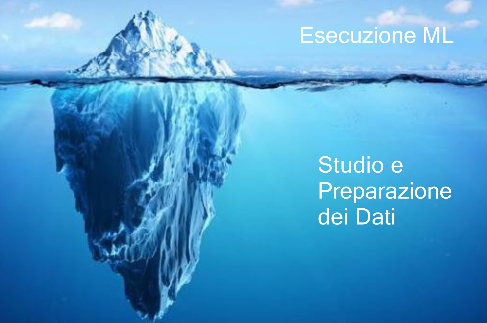

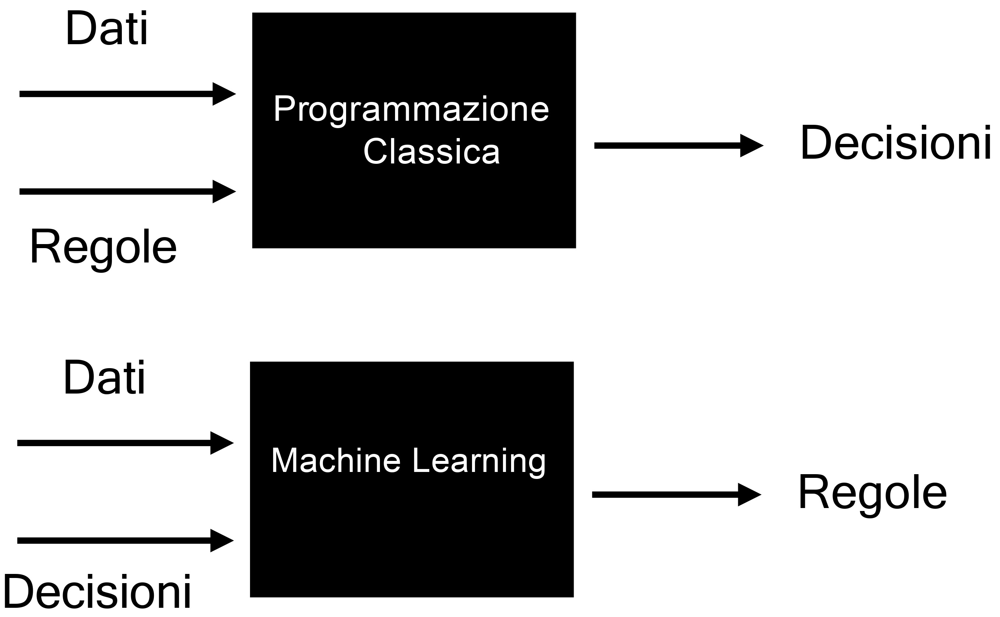

## Retroazione
I processi retroattivi o retroregolati possono essere considerati la forma più semplice di AU.

In un controllo retroattivo il valore di una **variabile in uscita** dal sistema viene letto dal controllore che agisce **modificando l'ingresso** del sistema (ad esempio il termostato, sistema di puntamento).

Il concetto è stato introdotto dal matematico americano Norbert Wiener negli anni Quaranta, iniziatore della cibernetica. La teoria dei sistemi retroazionati è utilizzata in molti campi delle scienze pure, delle scienze applicate (tra cui i controlli automatici) e della biologia.

In questo caso il modello è definito inizialmente da un insieme di procedure ma i valori dei punti di decisione sono aggiornati attraverso aggiustamenti progressivi

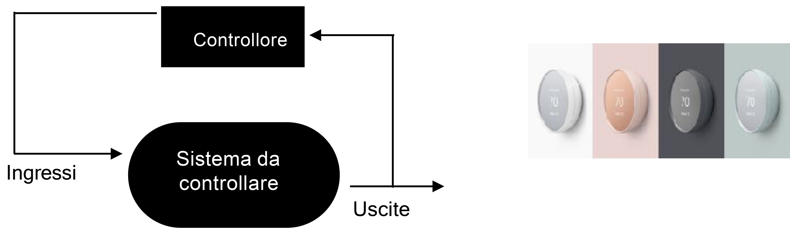

## Procedure di apprendimento
Il progettista non sempre conosce tutte le regole di decisione.

Procedure di apprendimento:
- Supervisionato
- Non-supervisionato
- Per rinforzo

### Apprendimento supervisionato
I processi retroattivi si adattano a segnali che provengono dall’ambiente (spesso si assume siano in relazione con gli output del sistema).

Quando i segnali in grado di indirizzare l’adattamento (feedback) non provengono direttamente dall’ambiente è possibile ottenere dei feedback attraverso un processo di valutazione nel quale i risultati prodotti dalla macchina siano valutati confrontandoli con risultati che si conosce essere corretti.

Questa nozione è alla base dei processi di **apprendimento supervisionato**.

- Induzione
- Transduzione

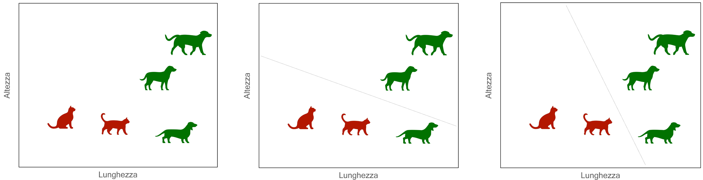

#### Funzioni dell'apprendimento supervisionato
Classificazione: 
- Riconoscere un insieme di esempi accumunati da stesse proprietà
- Predire dati categorici
Regressione
- Individuare la tendenza di evoluzione di una distribuzione
- Predire dati numerici


### Apprendimento non supervisionato
- Induzione
- Deduzione

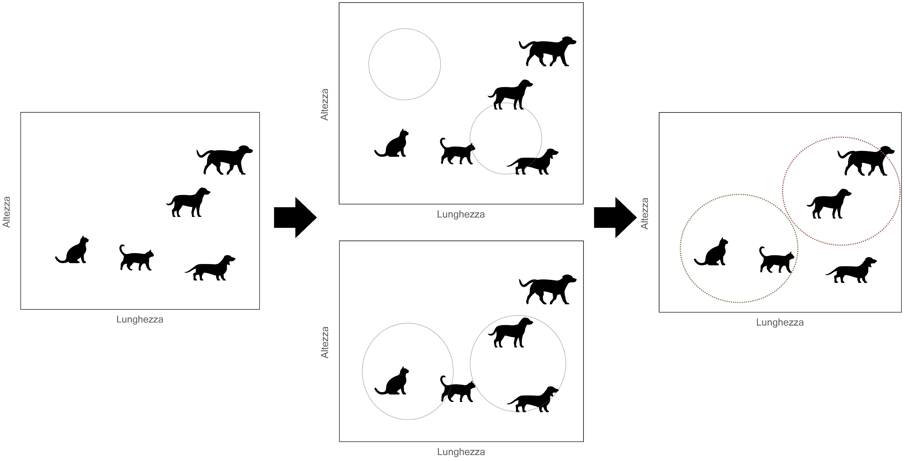

#### Funzioni dell'apprendimento non supervisionato
Clustering:
- Raggruppare esempi accumunati da stesse proprietà
- Dati categorici / dati numerici

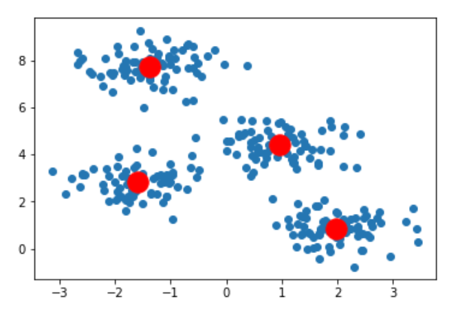

Dimension Reduction: 
- Individuare la dimensioni di maggior importanza in un dataset
- Dati categorici / dati numerici

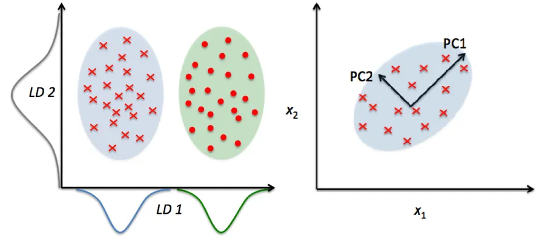

Association:
- Individuare correlazioni e probabilità condizionate di un dataset


### Apprendimento per rinforzo
- Azione
- Stato
- Ricompensa


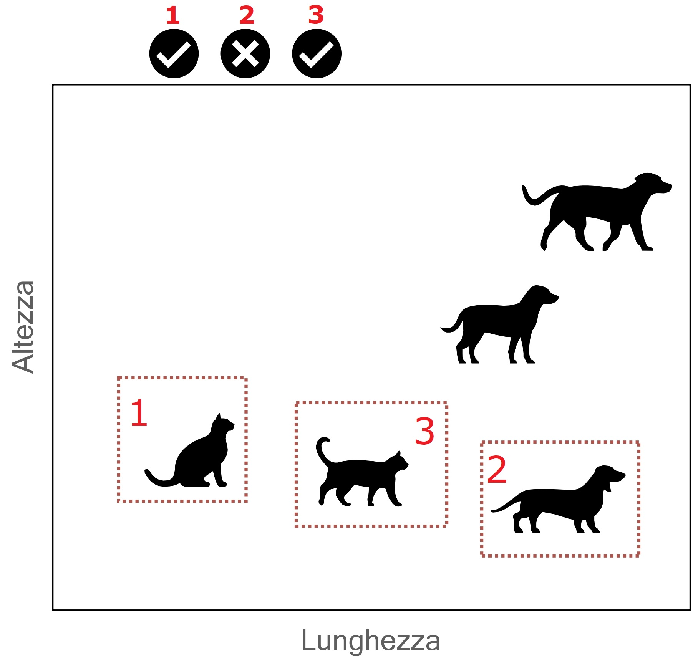


### Apprendimento auto-supervisionato
Nell’apprendimento auto-supervisionato self-supervised learning, l'obiettivo è sfruttare informazioni intrinseche presenti nei dati stessi per addestrare un modello, senza l'utilizzo di etichette fornite esternamente.

Un esempio di self-supervised learning è la predizione di parte di un'istanza a partire dalle altre parti di quella stessa istanza.

Supponiamo di avere immagini di cani e gatti, possiamo suddividere ogni immagine in due parti: la testa e il corpo dell’animale.

Quindi, creiamo un compito di predizione dove il modello deve imparare a predire la parte mancante a partire dalla parte visibile.

Approccio molto usato molto nei modelli linguistici per predire la parola successiva dato una sequenza di parole.

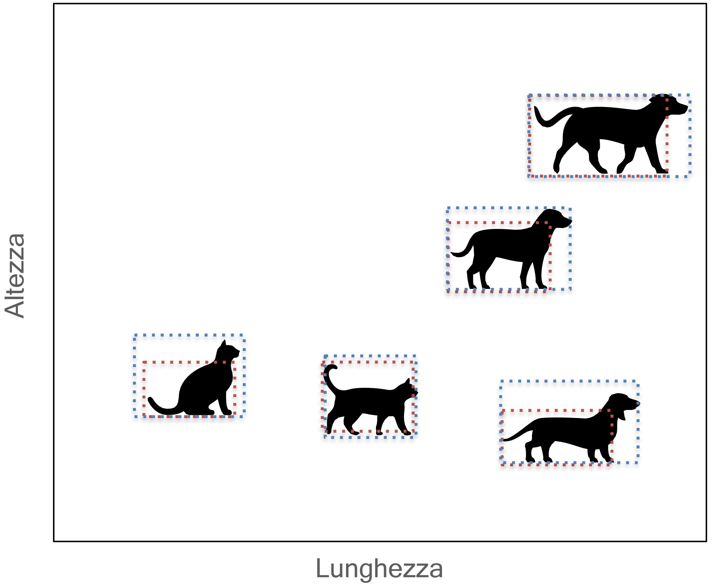


### Altri approcci
- **Active Learning**: l'apprendimento attivo è una tecnica in cui il modello è in grado di interrogare un operatore umano durante il processo di apprendimento al fine di risolvere possibili ambiguità. È utile quando non ci sono molti dati disponibili o i dati sono costosi da raccogliere o etichettare
- **Multi-Task Learning**: si riferisce a un processo di apprendimento che può essere condiviso da più agenti. Per esempio, la codifica della distribuzione di parole nel testo può essere condivisa tra più compiti NLP
- **Online Learning**: si riferisce ad algoritmi che sono in grado di apprendere da flussi continui di dati. Questi algoritmi apprendono in modo incrementale, senza la necessità di conoscere l’intero insieme dei dati; quindi, con la possibilità di cancellare i dati qualora non ci fosse più spazio in memoria
- **Transfer Learning**: l'apprendimento per trasferimento è un tipo di apprendimento in cui un modello viene prima addestrato su un compito, poi una parte o tutto il modello viene usato come punto di partenza per un compito correlato
- **Ensemble Learning**: un approccio in cui due o più modalità sono adattate agli stessi dati e le previsioni di ogni modello sono combinate. L'obiettivo è quello di migliorare le prestazioni rispetto all'uso di un singolo modello

## Algoritmi di ML (Machine Learning)
- Naive Bayes
- Support Vector Machine
- Decision Tree
- Random Forest
- Multi-Layer Perceptron


### Percettrone
Nel 1958 Frank Rosenblatt propose un algoritmo ispirato al comportamento delle sinapsi che chiamò **percettrone**.

Si tratta di entità con uno strato di ingresso ed uno di uscita ed una regola di apprendimento basata sulla minimizzazione dell’errore che in base alla valutazione sull'uscita effettiva della rete rispetto ad un dato ingresso altera i pesi delle connessioni (sinapsi) come differenza tra l'uscita effettiva e quella desiderata.

Ci fu un iniziale entusiasmo ma poco dopo Marvin Minsky e Seymour Papert dimostrarono i limiti del percettrone e cioè la sua capacità di riconoscere **solamente funzioni linearmente separabili** (ad esempio la funzione logica XOR non può essere implementata da un percettrone).

Seguì quindi una fase nella quale questo approccio fu poco studiato.

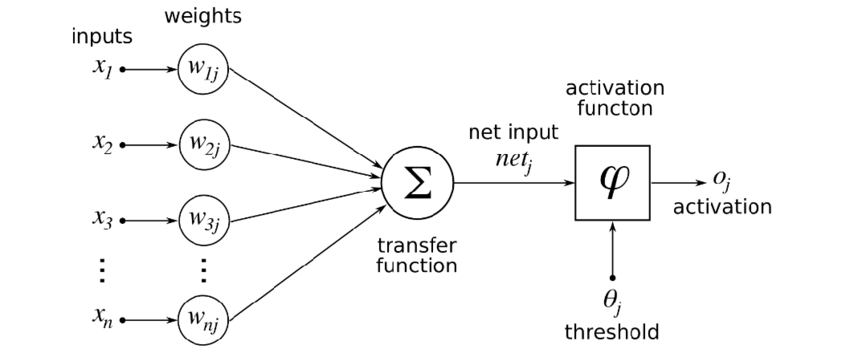


### Algoritmo di apprendimento standard
L'algoritmo di apprendimento standard è un algoritmo iterativo che ad ogni iterazione calcola l’output del percettrone e lo confronta con il risultato desiderato quindi, il vettore dei pesi viene aggiornato come segue:

$`w^{t+1}=w^t + \alpha(g(x^t)-f(x^t)) x^t`$

Dove g(x) è il risultato desiderato, f(x) è il risultato ottenuto e α è una costante che regola la velocità dell’apprendimento

## Reti neurali
Organizzando i percettroni in una rete a più strati (strati nascosti) è possibile fornire funzioni di risposta non lineari

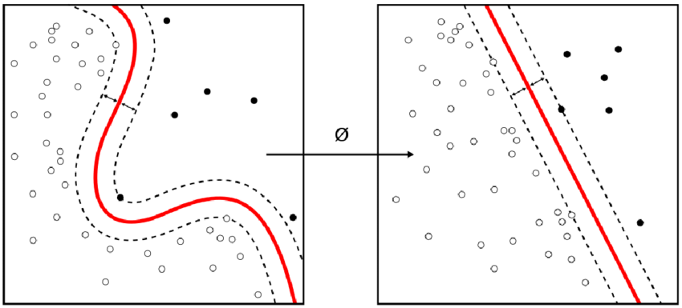


- L’apprendimento dei pesi di una rete neuronale è un processo lungo e stupido
- Ogni esempio corretto aggiusta un po’ i pesi finché non raggiungiamo un’accuratezza accettabile

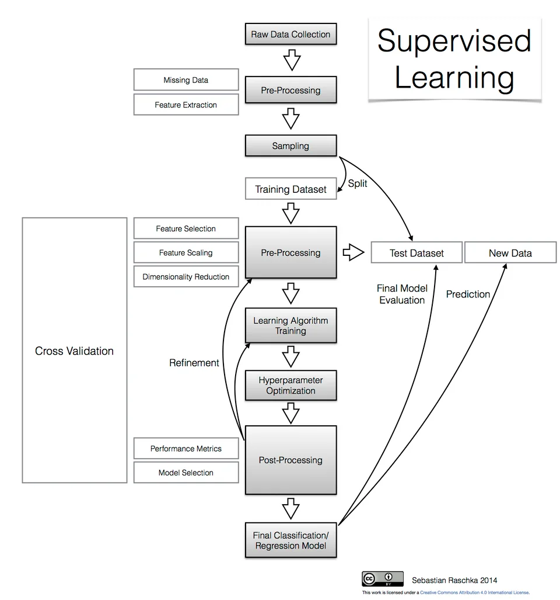

### Apprendimento non supervisionato
Fin qui abbiamo visto esempi di apprendimento supervisionato: le risposte da fornire per i diversi dati in ingresso sono validate utilizzando la risposta attesa (ground truth)

> Si dice che nella fase di addestramento gli esempi sono annotati

Esistono algoritmi che lavorano attraverso **procedure non supervisionate**: obiettivo dell’algoritmo è suddividere, **segmentare** i dati in ingresso in gruppi omogenei (cluster)

> Una volta annotati i cluster possono essere visti come delle classi

Le tecniche di apprendimento non supervisionato lavorano confrontando i dati e ricercando **similarità** o **differenze**

Un esempio tipico è l’algoritmo di clustering **K-means**: permette di suddividere un insieme di osservazioni in k gruppi, dove k è un valore deciso a priori.

L'algoritmo segue una procedura iterativa. Inizialmente crea _k_ partizioni ognuna associata a dei punti chiamati centroidi e assegna ad ogni partizione i dati osservati, o casualmente oppure calcolando la distanza dai centroidi.
Quindi ri-calcola il centroide di ogni gruppo costituendo una nuova partizione. Vengono ricalcolati i centroidi per i nuovi cluster finché la distanza media intra-cluster non è minima.

_Un esempio di animazione:_
[](https://www.youtube.com/watch?v=BVFG7fd1H30)

Questo algoritmo è poco robusto rispetto all’aggiornamento dei dati in quanto all’introduzione di nuove osservazioni dobbiamo eseguire nuovamente il procedimento 

Algoritmi di clustering più robusti all’aggiornamento identificano i gruppi sulla base di una soglia di densità 

## Una tassonomia del AU
Se aggiungiamo dati al contesto molte soluzioni prodotte non sono più valide
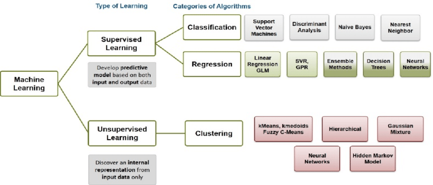

## Validazione
Precision (precisione) e Recall (recupero o richiamo), sono due comuni metriche di qualità di un sistema predittivo.
La precisione può essere vista come una misura di esattezza o fedeltà, mentre il recupero è una misura di completezza.

$`Precision=\frac{veroPositivo}{veroPositivo+falsoPositivo}`$

$`Recall=\frac{veroPositivo}{veroPositivo+falsoNegativo}`$
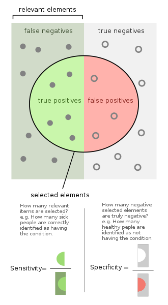

### Overfitting
Nel valutare il grado di generalità del modello appreso:
- Il modello si dice **sotto specificato (underfitting)** se Precision e/o Recall sono basse
- Il modello si dice **sovraspecificato (overfitting)** se è troppo legato agli esempi osservati; quindi, non funzionerà correttamente con dati di test diversi dai dati usati nella fase di addestramento 

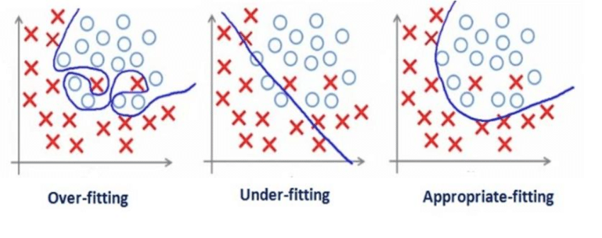

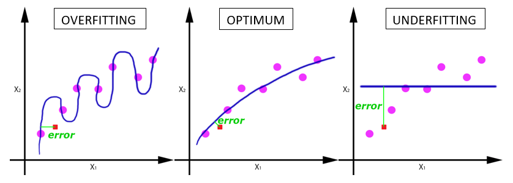

Due fattori che influenzano
l’overfitting o underfitting sono:
- **Distorsione del modello (bias)**: abbiamo usato alcune assunzioni errate
- **Variabilità del dominio (variance)**: che produce un modello molto sensibile alle fluttuazioni

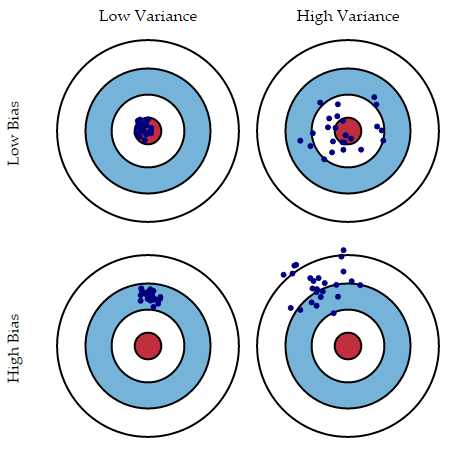

### Confronto
Per valutare la qualità del modello è sempre necessario identificare un termine di paragone, un baseline model
- Il modello sarà di qualità se la sua accuratezza sarà superiore alla baseline
- La **Zero Rule** o ZeroR è una procedura di riferimento per gli algoritmi di
classificazione il cui risultato è semplicemente la frequenza della classe più frequente nei dati.
<br/> Se il 65% degli elementi di un dataset appartiene a una classe, ZeroR predice pere tutti gli elementi del dataset quella classe. 
<br/> La precision sarà quindi del 65%

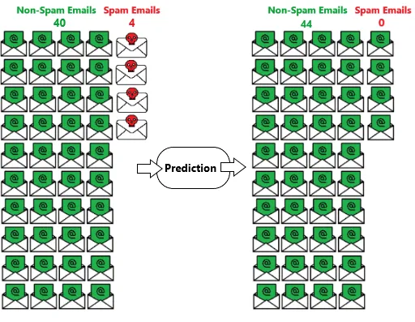

### Validazione statica vs dinamica
Precision e Recall offrono una misura statica della qualità del processo di apprendimento ma questo è largamente insufficiente.

> Sono rari i contesti nei quali un algoritmo addestrato si trova a lavorare sempre con gli stessi dati

Una prima contromisura è quella di valutare il modello appreso dall’algoritmo attraverso diversi dati di test.

In questo modo sarà possibile valutare il **grado di generalità del modello** appreso

### Qualità del campione
Il training set deve quindi essere rappresentativo e non introdurre bias.

Un classico criterio di imparzialità è la sezione casuale dei dati, ma quanti dati servono per rappresentare le istanze?

Dipende dalla complessità del problema (lineare - non lineare) e dell’algoritmo (numero di dimensioni, features, parametri)

> Alcuni dicono: la numerosità migliore è quella massima che si può raccogliere

Un criterio è dato dall’identificazioni di fattori moltiplicatori.

> 50-100-1000 per ogni classe del problema
10-30 il numero di feature modellate
10-30 il numero di parametri dell’algoritmo

## Aggiornamento della conoscenza
Il tema dell’aggiornamento della conoscenza è altresì critico:
- Quanto è costoso per un algoritmo aggiornare il modello?
  - in termini di dimensione dei dati di addestramento (training set) o in termini di tempo
- Il dominio che sto trattando presenta evoluzioni diacroniche (dominio stazionario o non stazionario - presenza di concept drift)
  - L’evoluzione può essere: improvvisa (sudden), graduale (gradual), incrementale (incremental) oppure ricorrente (recurrent)

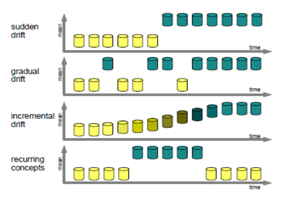

## Large Language Models
I Large Language Models sono modelli di linguaggio avanzati addestrati su vasti corpus di testo per comprendere e generare linguaggio naturale.

Questi modelli sono ottenuti attraverso reti neurale addestrate utilizzando metodi di self-supervised learning
- Al modello vengono presentate sequenze di parole parzialmente mascherate, alcuni token sono intenzionalmente nascosti, e deve prevedere i token mancanti

Sono caratterizzati da dimensioni massicce, spesso con miliardi di parametri, che consentono loro di catturare complessità linguistiche e semantiche

Tra i più noti si trovano
- BERT di Google (340M)
- GPT-3 (175B) e GPT-4 (8x220B ~ 1.8T) di OpenAI
- LLaMA (65B) di Meta
- Mistral AI (7B, 8x7B, 8x30B)

I Large Language Models hanno rivoluzionato il Natural Language Processing (NLP), consentendo comprensione del contesto, generazione di testi coerenti e traduzione automatica più accurata.

Possono essere impiegati per aiutare nella creazione di contenuti, generando testi, risposte e persino codice in modo automatico.

Per ottenere i risultati migliori è importante:
1. Contestualizzare bene la richiesta attraverso opportune tecniche di **prompt engineering**:
<br/> metodi di interrogazione del modello che favoriscono la corretta contestualizzazione del dominio d’interesse e della tipologia di output richiesto
2. Adattare i modelli attraverso il **fine-tuning**:
<br/> una fase aggiuntiva di addestramento per adattare il modello a uno specifico compito o a a contenuti di uno specifico dominio

### Prompt engineering
Qualsiasi interrogazione a un LLM

Alcuni si spingono a definirlo un modo di programmare i LLM o addirittura un nuovo modo di programmare i computer

Si tratta in gran parte di una competenza empirica di comporre e formattare il prompt per massimizzare le prestazioni del modello su un compito desiderato

È importante ricordare che i LLM sono modelli addestrati per completare testi e che si organizzano attraverso un numero molto elevato di parametri.

Quindi:
- L’obiettivo del prompt engineering è quello di configurali in coerenza con il compito desiderato
- È possibile “ingannarli” spingendo per l’esecuzione di un compito a cui normalmente non rispondono

Vediamo 7 strategie per un buon prompt engineering:
1. Essere descrittivi: più informazioni si riescono a fornire meglio è
2. Usare esempi: sono ottimi per contestualizzare un dominio
3. Richiedere risposte strutturate: in questo modo è possibile definire meglio il compito e ottenere il formato più adatto
4. Descrivere una catena di elementi con un crescente livello di dettaglio
5. Assegnare al modello un ruolo definendo il suo livello di competenza e di esperienza
6. Tenete aperto il “dialogo”: lasciate che il modello vi faccia delle domande o chiarite cosa non vi soddisfa delle sue risposte
7. Riflettere, rivedere e perfezionare

Non dimentichiamo che il prompt engineering ha limiti intrinseci
1. Lo spazio di configurazione è limitato: non tutte le informazioni pertinenti possono essere inserite nella finestra dei contenuti
2. Le strategie da utilizzare dipendono dal modello: ogni LLM ha sue peculiarità che devono essere verificate prima di considerare un prompt efficace
3. Un modello generico può essere inefficiente sia dal punto di vista della accuratezza che dei costi: un modello specializzato più piccolo può superare un modello generale più grande

#### Esempio Prompt engineering
**Task:** identifying the label and category of hateful tweets
**Prompt:**
```
Think you are a linguistic and law expert, and your job is to identify the best match of
language type of the sentences below based on the provided list of labels which is:
{Hate Speech, Offensive Language, Abusive Language, Discriminative, Irony, cyberbullying,
Slur, Aggressiveness, Stereotypes, Body Shame}.

Also detect the category of each sentence based on this list:
{Gender, Sexual orientation, Religion, Disability, Nationality, Race, Ethnicity}.

Please add some explanation and specify the tokens that lead you to the specified label.

Give me the JSON format by fields text, label, tokens, category and explanation.

Here is the list of sentences that are separated by newlines: {list_of_comments} 
```
**Output:**
Possiamo usare questo output per creare un set di dati per l'addestramento di un modello specializzato

Per un esempio più completo: [outomatic grader](https://github.com/ShawhinT/YouTube-Blog/blob/main/LLMs/langchain-example/automatic_grader-example.ipynb)

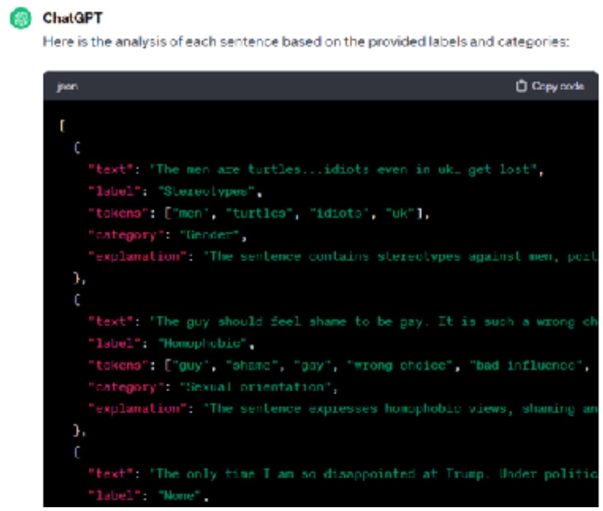

### Fine-Tuning
Il fine-tuning del modello è un processo in cui un modello preallenato, che ha già appreso alcuni schemi e caratteristiche su un ampio set di dati, viene ulteriormente addestrato (o "raffinato") su un set di dati più piccolo e specifico, noto come dominio
- Evita il costo elevato di addestrare un grande modello da zero in termini di risorse computazionali e tempo
- Consente di adattare il modello a dati più aggiornati
- Consente di adattare il modello allo specifico task che dovrà eseguire
- Consente di ridurre i rischi di distorsione
- Può consentire di aumentare il livello di privacy della conoscenza inclusa nel modello

#### Le fasi del fine-tuning:
1. **Preparazione del dataset**
  <br/> Si prepara il dataset per la messa a punto pulendolo, dividendolo in set di addestramento, validazione e test e assicurandosi che sia compatibile con il modello
2. **Scelta del metodo di fine-tunig** 
  <br/> Si definisce una metodologia di fine-tunig che è adeguata al task che si vuole realizzare
3. **Inizializzazione del modello** 
  <br/> Si inizia con un LLM pre-addestrato, come GPT-3 o LLaMA, e lo si inizializza con i suoi pesi pre-addestrati
4. **Adattamento** 
  <br/> Il modello viene addestrato su un set di dati specifico per l'attività. Durante l'addestramento, i pesi del modello vengono aggiornati tramite backpropagation e discesa del gradiente in base ai dati forniti. È possibile implementare meccanismi di arresto anticipato per evitare l'overfitting
5. **Regolazione degli iperparametri**
  <br/>  La messa a punto consiste nel regolare iperparametri come il tasso di apprendimento, la dimensione del batch e la forza di regolarizzazione per ottimizzare le prestazioni del modello
6. **Validazione**
  <br/>  Si monitorano le prestazioni del modello su un set di dati di convalida separato durante il processo di addestramento. Questa fase aiuta a valutare il grado di apprendimento del modello e l'eventuale overfitting rispetto ai dati di addestramento. Se i risultati non sono soddisfacenti si procede a rieseguire le fasi precedenti
7. **Test**
  <br/>  Una volta completato l'addestramento, si valuta il modello su un set di dati di prova separato che non ha mai visto prima. Questa fase fornisce una misura imparziale delle prestazioni del modello e della sua capacità di gestire dati nuovi e sconosciuti. 

### Metodi di Fine-Tuning
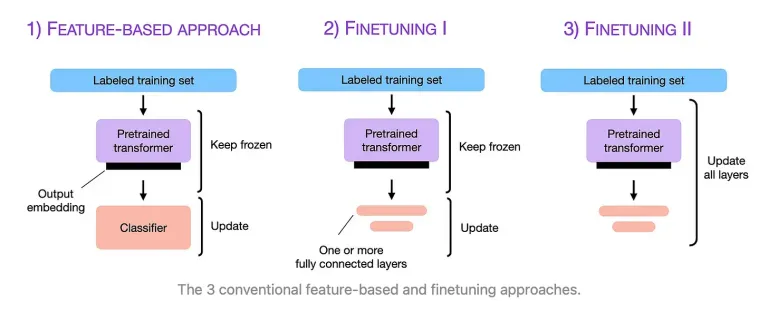

- **Feature-based**
  <br/> Utilizza un LLM pre-addestrato come estrattore di caratteristiche, trasformando il testo in ingresso in un vettore di dimensioni fisse. Un classificatore predice la probabilità di attribuire una classe ai vettori generati dal LLM. Durante l'addestramento, cambiano solo i pesi del classificatore, il che rende il sistema poco dispendioso in termini di risorse ma potenzialmente meno performante
- **Finetuning I**
  <br/> Migliora il LLM pre-addestrato aggiungendo ulteriori strati di neuroni. Durante l'addestramento, vengono regolati solo i pesi dei nuovi strati, mantenendo congelati i pesi dell'LLM pre-addestrato. Negli esperimenti ha mostrato prestazioni leggermente migliori rispetto all'approccio feature-based
- **Finetuning II**
  <br/> L'intero modello, compreso il LLM, viene riaddestrato, consentendo l'aggiornamento di tutti i pesi del modello. Questo metodo richiede molte risorse, ma può offrire le prestazioni migliori. Un rischio è il catastrophic forgetting, una situazione in cui le nuove caratteristiche sovrascrivono le vecchie conoscenze

### Librerie di Fine-Tuning
- **Low Ranking Adaptation (LoRA)** 
  <br/> LoRA Utilizza metodi di approssimazione a basso rango per ridurre i costi computazionali e finanziari dell'adattamento di modelli con miliardi di parametri, a compiti o domini specifici
- **Quantized LoRA (QLoRA)** 
  <br/> QLoRA riduce significativamente l'utilizzo della memoria, pur mantenendo le prestazioni del fine-tuning completo a 16 bit. Questo risultato si ottiene retropropagando i gradienti attraverso un modello linguistico pre-addestrato congelato e quantizzato a 4 bit in adattatori di basso rango
- **Parameter Efficient Fine Tuning (PEFT)**
  <br/> PEFT è una tecnica che adatta in modo efficiente i modelli regolando solo un piccolo insieme di parametri, riducendo i costi di calcolo e di archiviazione. Combatte l'oblio catastrofico, regolando i parametri chiave per compiti specifici, e offre prestazioni paragonabili a quelle di una messa a punto completa
- **DeepSpeed**
  <br/> DeepSpeed è una libreria software di deep learning che accelera l'addestramento di modelli parallelizzando l’uso della memoria
- **ZeRO**
  <br/> ZeRO è una forma di parallelismo dei dati efficiente dal punto di vista della memoria che consente di accedere alla memoria aggregata della GPU di tutti i dispositivi disponibili, senza l'inefficienza causata dalla replica dei dati nel parallelismo dei dati

La libreria [transformers](https://huggingface.co/docs/transformers/index) di Hugging Face offre molteplici metodi per il training di algoritmi
- Qui un [esempio](https://colab.research.google.com/drive/1tG9eqttfnqHoQqmsiacywUG9ilUhoiCk?usp=sharing#scrollTo=0Y99UKM_RGgu) di flusso per il fine-tuning di LLaMA

Un framework piuttosto completo per il fine-tuning di LLM è [Axolotl](https://github.com/OpenAccess-AI-Collective/axolotl#axolotl)

Tutti richiedono disponibilità di GPU.


### Dataset
L’approccio più adatto a un progetto di editoria digitale è probabilmente il Finetuning di tipo I

In questo caso il dataset deve essere preparato fornendo una serie di esempi di risposte attese che il LLM userà per contestualizzare il suo modello di risposta

_Esempio_ con OpenAI il formato è il seguente:
```
messages: [
 {
   role: "system",
   content:
     "Shooketh is an AI bot that answers in the style of Shakespeare's literary works.",
   },
   { role: "user", content: "What counsel hath thy father imparted?" },
   {
     role: "assistant",
     content:
       "Arise with rectitude, young warrior, and stiffen thine upper lip forthwith.",
   },
]
```
_Esempio_ con LLaMa il formato è il seguente:
```
<s>[INST] Me gradué hace poco de la carrera de medicina
¿Me podrías aconsejar para conseguir rápidamente un puesto de trabajo? [/INST]
Esto vale tanto para médicos como para cualquier otra profesión tras finalizar los
estudios aniversarios y mi consejo sería preguntar a cuántas personas haya conocido
mejor. En este caso, mi primera opción sería hablar con otros profesionales médicos,
echar currículos en hospitales y cualquier centro de salud. En paralelo, trabajaría
por mejorar mi marca personal como médico mediante un blog o formas digitales de
comunicación como los vídeos. Y, para mejorar las posibilidades de encontrar trabajo,
también participaría en congresos y encuentros para conseguir más contactos. Y,
además de todo lo anterior, seguiría estudiando para presentarme a las oposiciones y
ejercer la medicina en el sector público de mi país. </s>
```
