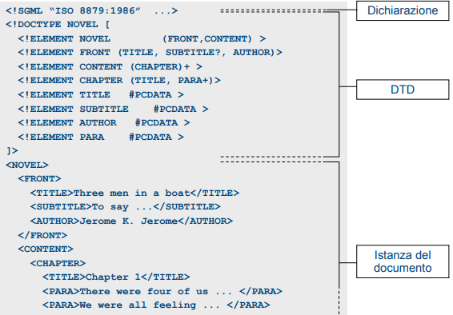
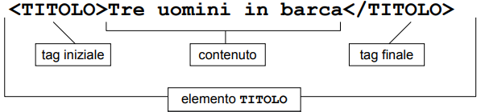
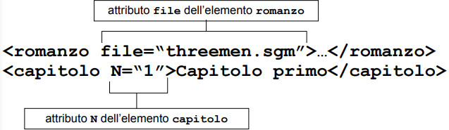
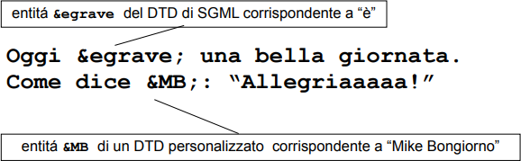
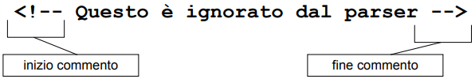
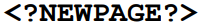

# Formati di Marcatura
## Linguaggi di marcatura
I linguaggi di markup sono i linguaggi più opportuni per strutturare e marcare i documenti in maniera indipendente dall’applicazione, favorendo la riusabilità, la flessibilità e la apertura ad applicazioni complesse
- I TAG (etichette) sono marcatori che identificano porzioni di testo
- Si ha così un modo per identificare e processare le porzioni di testo contrassegnate da una certa marcatura

```html
<h2>Linguaggi di marcatura</h2>
<ul>
  <li>I linguaggi di markup sono i linguaggi più opportuni per
    strutturare e <a>marcare i documenti</a> in maniera
    <a>indipendente dall’applicazione</a>, favorendo la riusabilità,
    la flessibilità e la apertura ad applicazioni complesse</li>
  <li>I TAG (etichette) sono <a>marcatori che identificano
    porzioni di testo</a></li>
  <li>Si ha così un modo per <a>identificare e processare le
    porzioni di testo </a> contrassegnate da una certa marcatura</li>
</ul>
```
Definiamo **markup** ogni mezzo per rendere esplicita una particolare interpretazione di un testo.

Per *esempio*, tutte quelle aggiunte al testo scritto che permettono di renderlo più fruibile.

Oltre a rendere il testo più leggibile, il markup permette anche di specificare ulteriori usi del testo.

Con il markup per sistemi informatici, specifichiamo le modalità esatte di utilizzo del testo nel sistema stesso.

# SGML
**Standard Generalized Markup Language**: concepito già negli anni ‘60 divenne standard ISO nel ‘86
- SGML è un meta-linguaggio dichiarativo e non proprietario
- Consente di definire markup leggibili, generici, strutturali, gerarchici
- HTML e una classe di SGML, XML è una derivazione

Generico: permette di definire vocabolari di markup per tutte le funzioni d’uso
- Puntazionale
- Presentazionale
- Procedurale
- Descrittivo
- Referenziale

## Documenti SGML
Un documento in un linguaggio di markup definito sulla base di SGML è sempre composto delle seguenti tre parti:
- Dichiarazione SGML
- DTD (*Document Type Declaration*)
- Istanza del documento



### SGML Declaration
La dichiarazione SGML contiene le istruzioni di partenza delle applicazioni SGML: 
``` <!SGML “ISO 8879:1986” ...> ```

Essa permette di specificare valori fondamentali come la lunghezza dei nomi degli elementi, il set di caratteri usati, ecc...

Non è obbligatoria. Se è assente, viene usata una dichiarazione di default detta “Reference Concrete Syntax”.

La RCS definisce lunghezze e sintassi standard (come l'uso del carattere "<" per indicare l'inzio del tag).

### Document Type Declaration
DTD: ```<!DOCTYPE nome TIPO [markup] >```

La dichiarazione del tipo del documento serve a specificare le regole che permettono di verificare la correttezza strutturale di un documento.

Vengono cioè definiti gli elementi ammissibili, il contesto in cui possono apparire, ed altri eventuali vincoli strutturali.

Nella terminologia SGML, si parla di modellare una classe (cioè una collezione omogenea) di documenti attribuendogli una dichiarazione.

### Istanza del documento
L’istanza del documento è quella parte del documento che contiene il testo vero e proprio, dotato del markup appropriato.

Esso contiene una collezione di elementi (TAG), attributi, entità, PCDATA, commenti, ecc.

Le applicazioni SGML sono in grado di verificare se l’istanza del documento segue le regole specificate nel DTD, e di identificare le violazioni.

## Componenti del Markup
Un documento di derivazione SGML è formato da una combinazione dei seguenti componenti:
- Elementi
- Attributi
- Entità
- Testo (detto anche #PCDATA)
- Commenti
- Processing Instructions

### Elementi
Gli elementi sono le parti di documento dotate di un senso proprio.

*Esempio*: Il titolo, l’autore, i paragrafi del documento sono tutti elementi.

Un elemento è individuato da un tag iniziale, un contenuto ed un tag finale.



### Attributi
Gli attributi sono informazioni aggiuntive sull’elemento che non fanno effettivamente parte del contenuto (metainformazioni).

Essi sono posti dentro al tag iniziale dell’elemento e tipicamente hanno la forma nome=“valore”.



### Entità
Le entità sono frammenti di documento memorizzati separatamente e richiamabili all’interno del documento.

Esse permettono di riutilizzare lo stesso frammento in molte posizioni garantendo sempre l’esatta corrispondenza dei dati, e permettendo una loro modifica semplificata.



### #PCDATA
**#PCDATA** (*Processed Character DATA*): rappresenta il contenuto vero e proprio del documento.

Esso corrisponde alle parole, gli spazi e la punteggiatura che costituiscono il testo. Eventuali entità vengono processate per ottenerne il testo corrispondente.

**#CDATA**: I linguaggi di markup definiscono anche Character Data.

Un contenuto testuale puro senza alcuna sostituzione o espansione di testo. Serve ad esempio per codice sorgente che non deve essere interpretato dal parser SGML.

### Commenti
I documenti di markup possono contenere commenti, ovvero note di commento al testo.

Queste note non fanno parte del contenuto del documento, e le applicazioni di markup le ignorano.



### Processing Instructions
Sono elementi particolari (spesso di senso esplicitamente procedurale) posti dall’autore o dall’applicazione per dare ulteriori indicazioni su come gestire il documento SGML.

Per *esempio*, in generale è l’applicazione a decidere quando cambiare pagina. Ma in alcuni casi può essere importante specificare un comando di cambio pagina.



### *Esempio*
```html
<!DOCTYPE HTML PUBLIC "-//W3C//DTD HTML 3.2 Final//EN">
<HTML>
  <HEAD>
    <TITLE>Programma del Corso di Tecnologie Web</TITLE>
  </HEAD>
  <BODY>
    <H1>Corso di Tecnologie di Tecnologie Web</H1>
    <P>Questa &egrave; una pagina di <B>esempio</B>.</P>
    <P>
    <A href="altraPagina.html">
      Questo e’un collegamento ad un’altra pagina
    </A>
</BODY>
</HTML>
```
