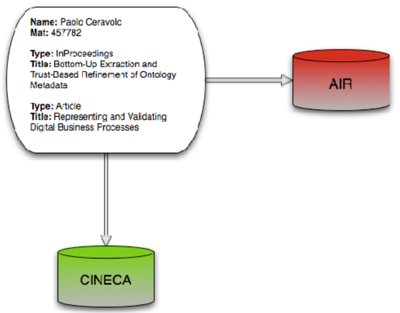
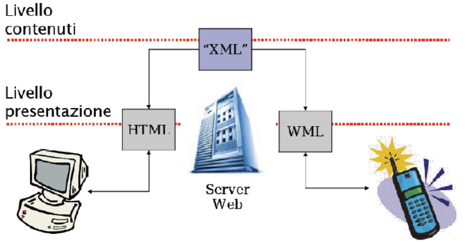
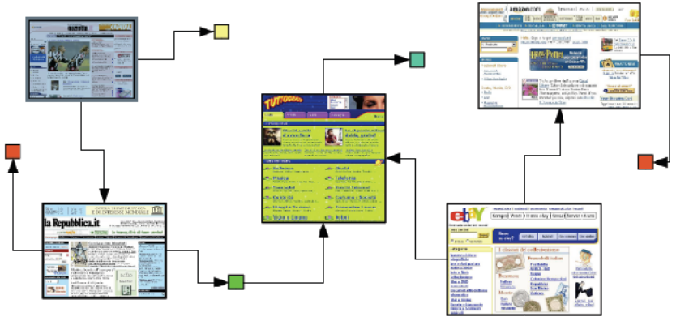

# XML (Extended Markup Language)
Raccomandazione del W3C dal 1998
- pensato originariamente come sostituto di HTML per il Web
- inizialmente si insisteva sulla sua capacità di descrivere la semantica dei dati, proponendo molti esempi in ambiente distribuito
- fu subito accolto con entusiasmo ed ebbe una rapida diffusione

## Il ruolo di XML
In realtà si è imposto come formato di interscambio tra applicazioni
- interoperabilità
- portabilità
- semantica dei dati

Nelle applicazioni distribuite è oggi spesso sostituito da JSON
- Migliore integrazione nel codice
- Minore leggibilità per l’uomo

## Javascript Object Notation
JavaScript Object Notation (JSON) è un formato standard di testo per la rappresentazione di dati strutturati basato sulla sintassi degli oggetti JavaScript.

Viene comunemente utilizzato per la trasmissione di dati nelle applicazioni distribuite (ad esempio, l'invio di alcuni dati dal server al client, in modo che possano essere visualizzati su una pagina web, o viceversa).

JSON è una stringa il cui formato assomiglia molto al formato degli oggetti JavaScript. All'interno di JSON si possono includere gli stessi tipi di dati di base presenti in un oggetto JavaScript standard: stringhe, numeri, array, booleani e altri letterali di oggetti.

***Esempio JSON***
Questo permette di costruire una gerarchia di dati, come ad esempio:

```json
{
 "book": [
 {
 "id":"01",
 "language": "Java",
 "edition": "third",
 "author": [“Herbert Schildt”, “John Doe”]
 },
 {
 "id":"07",
 "language": "C++",
 "edition": "second",
 "author": "E.Balagurusamy"
 }
 ]
}
```

## Marcatura estensibile
XML è un linguaggio di marcatura ispirato da SGML
- ha una minore complessità
- utilizza le URI per lo spazio dei nomi degli elementi

È stato progettato per descrivere dati, prescindendo completamente dalla loro presentazione.

È estensibile, i tag non sono predefiniti, ed è quindi generico.

Un documento XML quando è associato ad un DTD o uno Schema è progettato per essere auto-descrittivo.

Nel mondo reale diversi sistemi contengono dati in formato non uniforme era quindi necessario uno standard per i formati di interscambio.

**XML è uno strumento per trasmettere informazioni, indipendente dalla piattaforma, dal software e dall’hardware**

## Differenze con HTML
- Linguaggio di markup per la presentazione
- Progettato per la visualizzazione di un ipertesto
- Elementi predefiniti nella DTD HTML
- Blandamente definito e interpretato
- Linguaggio di markup per i contenuti
- Progettato per lo scambio di dati fra applicazioni software
- Consente elementi definiti da utente
- Strettamente definito e interpretato

### Esempi di applicazioni
** Modelli B2B (Business-to-Business) **, ovvero interazioni tra sistemi di diversi operatori economici, non interazioni con clienti finali sono. Uno dei settori maggiormente
interessato ad XML

**EAI (Enterprise Application Integration)**, ovvero l’integrazione tra applicazioni all’interno di un’azienda 



Con XML semplici file di testo possono essere usati per condividere dati o per configurare applicazioni (leggibilità per macchina e utente): RSS, Calendar, Apache

**TEI (Text Encoding Initiative)**, per codifica di testi letterari .

## Multicanale


### Web 2.0

Ora sostituito da JSON

## Inforset XML
XML Infoset è un modello astratto dei dati XML
- descrive le relazioni valide tra gli elementi di un XML
- è un modo alternativo di definire la sintassi che risulta più adeguato all’uso di applicazioni come parser, strumenti di query, API di vari linguaggi


Source: https://www.ukoln.ac.uk/metadata/dcmi/dc-elem-prop/

## Sintassi
Sintassi semplice ma rigida:
- dichiarazione XML
- la dichiarazione di schema è opzionale
- è richesto un nodo radice
- chiusura degli elementi
- corretto annidamento (albero)
- rispettare il vincolo di “case sensitive”
- elemento - attributo - valore
- il ritorno a capo è sempre memorizzato con un LF
- caratteri riservati < > ‘ “ &
- commenti e CDATA


```xml
<?xml version-"1.0" encoding-"UTF-8"?»
<poem type="elegy">
 <author>Rupert Brooke</author>
 <date>1912</date>
 <!-- The title is not original but imposed to the scope of this collection-->
 <title>Song</title>
 <stanza>
  <line> And suddenly the wind comes soft, </line>
  <line> And Spring is here again; </line>
  <line> And the hawthorn quickens with buds of green </line>
  <line> And my heart with buds of pain. </line>
 </stanza>
 <stanza>
  <line> My heart all Winter lay son numb, </line>
  <line> The earth so dead and frore, </line>
  <line> That I never thought the Spring would come again </line>
  <line> Or my heart wake any more. </line>
 </stanza>
 <stanza>
  <line> But Winter`s broken and earth has woken, </line>
  <line> And the small birds cry again; </line>
  <line> And the hawthorn hedge puts forth its buds, </line>
  <line> And my heart puts forth its pain. </line>
 </stanza>
 <source>
  <![CDATA[ http://www.example.org/docbook/xml/4.1.2/repository.xml&poem ]]>
 </source>
</poem>
```

### Documenti ben formati
Se la sintassi è rispettata il documento **è ben formato**
- Un programma che definisce se un documento è ben formato è detto parser
- Seguendo le regole sintattiche il **parser** analizza il documento seguendo la sua struttura ad albero se non riesce a costruire l’albero il documento non è valido
- Alcuni parser costruiscono una rappresentazione in memoria del documento, da sfruttare ai fini di interrogazione

### Documenti validi
**È valido** un documento conforme a uno schema DTD o XML Schema (xsd)
- Lo schema descrive la struttura di un documento XML e alcuni vincoli di integrità sui dati
- La struttura (albero XML) è conforme allo schema ovvero è un’istanza dello schema

### Dichiarazione
Parte dello standard XML 1.0
Nodo DOCTYPE
- riporta il riferimento all’URI del DTD <br/>
 es:  
``` <!DOCTYPE archivioDomande SYSTEM "pdd_0_2.dtd"> ```
- SYSTEM indica uno schema locale. Alcuni DTD molto utilizzati hanno un “nome” pubblico (PUBLIC); come il DTD di XHTML, <br/>
   es:  ``` <!DOCTYPE html PUBLIC "-//W3C//DTD XHTML 1.0 Strict//EN“ "http://www.w3.org/TR/xhtml1/DTD/xhtml1-strict.dtd"> ```

### Nodi di un DTD
- Nodi ordinari: documento ed elementi
- Nodi per attributi: vincoli sugli attributi (nome e tipo)
- Nodi per i valori (#PCDATA)
- Nodi speciali
 - nodi che descrivono l’ordine degli elementi sequenza o alternativa
 - indicatori di cardinalità

#### Elementi
**Dichiarazioni di elementi**
Ogni dichiarazione di elemento contiene il nome dell’elemento e il tipo di dati definito da uno tra i seguenti quattro tipi:
- Altri elementi
- Contenuto di testo PCDATA
- Qualunque altro elemento (parola chiave ANY)
- Elemento vuoto (parola chiave EMPTY)

```<!ELEMENT EMAIL (TO, FROM, CC, SUBJECT, BODY)>```

Le specifiche di contenuto possono essere costituite da un insieme di alternative separate da pipe (|):
```<!ELEMENT EXAMPLE (#PCDATA|x|y|z)*>```
Indicatori di cardinalità:
- una o più occorrenze – 1..* oppure +
- zero o una occorrenza – 0..1 oppure ?
- zero o più occorrenze – 0..* oppure *

Se una dichiarazione di elemento utilizza la parola chiave ANY, l’elemento potrà avere qualsiasi tipo di contenuto disposto in un qualsiasi ordine:
``` <!ELEMENT TEST ANY>```

Per dichiarare che un elemento non può avere alcun contenuto, si utilizza la parola chiave EMPTY
```<!ELEMENT soluzione EMPTY>```
Un elemento dichiarato come elemento vuoto può avere attributi:
```<soluzione lettera="b" />```

#### Attributi
In un DTD, gli attributi vengono dichiarati utilizzando:

```<!ATTLIST ElementName AttributeName Type Default>```
- _ElementName_ rappresenta il nome dell’elemento a cui vengono associati gli attributi
- _AttributeName_ rappresenta il nome dell’attributo
- _Type_ identifica il tipo di attributo dichiarato
- _Default_ specifica le impostazioni predefinite relative all’attributo

##### Tipi di attributo
- **CDDATA** : Un attributo di tipo CDATA utilizza dati generici in formato carattere.
- **ENTITY** : Il valore dell'attributo fa riferimento a un'entità dichiarata nel DTD (argomento spiegato successivamente).
- **ENTITIES** : è equivalente all'attributo ENTITY, ma consente l'utilizzo di valori separati da spazi.
- **ID** : Il valore dell’attributo deve essere un **identificatore univoco**. In un documento XML, un solo attributo di tipo ID può essere definito. Viceversa, il parser produce un errore.
- **IDREF** : Il valore deve essere un riferimento a un ID associato ad un altro elemento del documento XML. Se l’attributo non corrisponde ad un valore esistente, il parser produrrà un errore.
- **IDREFS** : È equivalente all’attributo IDREF, ma consente l’utilizzo di più valori separati da spazi.
- **NMTOKEN** : Il valore dell’attributo può contenere caratteri alfanumerici (numeri e lettere) e i caratteri "." (punto), "-" (trattino), "_" (underscore), ":" (due punti). Permette un controllo più fine su ciò che verrà specificato come valore dell'attributo. 
- **NMTOKENS** : È equivalente all’attributo NMTOKEN, ma consente l’utilizzo di più valori separati da spazi. 
- **Enumerated** : Il valore dell’attributo deve corrispondere a uno dei valori inclusi. Ad esempio: ```<!ATTLIST MyAttribute (valore1 | valore2)>```.  

#### Entità
Un'entità è un modo per definire singoli blocchi di informazioni.
Faccio riferimento ad entità esterne o interne per includerle in documenti. Possono essere file diversi o risorse accessibili via URL

XML usa un meccanismo di riferimenti per includere un’entità in un’altra (ad esempio includere una parte di codice XML contenuto in un certo file, all’interno di un documento XML)

***Esempio di entità***
Dichiarazione di entità generale interna (in DTD)
```xml
 <!ENTITY digits “0123456789”>
```
``` xml
 <!ENTITY LR1 "light requirement: mostly shade“>
```

Uso di entità generale interna (in documento XML)
```xml 
 <numeri>&digits;</numeri>
```
```xml 
 <dicitura>&LR1;</dicitura>
```

***Esempio DTD***
```xml
<?xml version="1.0" encoding="UTF-8"?>

<!ELEMENT poem (author+, date, title, stanza+, source?)>

<!ATTLIST poem type (elegy|ballad|song) #IMPLIED>

<!ELEMENT author (#PCDATA)>
<!ELEMENT date (#PCDATA)>
<!ELEMENT title (#PCDATA)>
<!ELEMENT stanza (line+)>
<!ELEMENT source (#PCDATA)>
<!ELEMENT line (#PCDATA)>
```

# XML schema
## Cos'è uno schema XML
Gli Schemi XML sono un miglioramento dei DTD.

Sono documenti XML e descrivono la struttura di un documento XML
- Definisce gli elementi che possono apparire in un documento
- Definisce le relazioni tra elementi (padre-figlio)
- Definisce l’ordine degli elementi
- Definisce il numero degli elementi
- Definisce quando un elemento può contenere testo o essere vuoto
- Definisce il tipo di elementi ed attributi
- Definisce valori fissi o di default per elementi ed attributi

## XML schema vs DTD
I DTD sono ancora molto diffusi, ma vengono via via sostituiti
dagli Schemi XML.

XML Schema ha dei vantaggi rispetto DTD:
- Sono adatti per futuri ampliamenti
- Sono più completi e dettagliati dei DTD
- Sono documenti XML
- Supportano i tipi di dati (datatypes)
- Supportano i namespace

Gli schemi XML sono stati proposti da Microsoft. Sono diventati una raccomandazione del W3C nel Maggio 2001.

## Supporto dei tipi di dati
Uno dei maggiori punti di forza di XML Schema è quello di
supportare i tipi di dati (datatypes)

Grazie a questo supporto
- È più facile descrivere la struttura di un documento
- È più facile controllare la correttezza dei dati
- È più facile lavorare con dati provenienti da database
- È più facile definire restrizioni sui dati
- È più facile definire il formato dei dati
- È più facile convertire dati da un tipo all’altro

## Estendibilità
Come XML anche gli schemi sono estendibili.

Con uno schema è possibile:
- Riusare uno schema all’interno di altri
- Creare dei propri tipi di dati derivandoli da quelli standard
- Fare riferimento a più schemi dallo stesso documento

***Esempio: documento XML***
```xml
<EMAIL>
 <TO>mrossi@rossi.it</TO>
 <FROM>pbianchi@bianchi.it</FROM>
 <CC>gverdi@verdi.it</CC>
 <SUBJECT>Primo DTD</SUBJECT>
 <BODY>Doc XML con un DTD</BODY>
</EMAIL> 
```
***Esempio: DTD***
Quello che segue è il DTD corrispondente
```xml
<!ELEMENT EMAIL (TO, FROM, CC, SUBJECT, BODY)>
 <!ELEMENT TO (#PCDATA)>
 <!ELEMENT FROM (#PCDATA)>
 <!ELEMENT CC (#PCDATA)>
 <!ELEMENT SUBJECT (#PCDATA)>
 <!ELEMENT BODY (#PCDATA)>
```
***Esempio: XSD***
```xml
<?xml version=“1.0” encoding=“ISO-8859-1”?>
<xs:schema xmlns:xs=“http://www.w3c.org/2001/XMLSchema”
 targetNamespace=“http://www.mioindirizzo.org”
  elementFormDefault=“qualified”>
 <xs:element name=“EMAIL”>
  <xs:complexType>
   <xs:sequence>
    <xs:element name=“TO” type=“xs:string”/>
    <xs:element name=“FROM” type=“xs:string”/>
    <xs:element name=“CC” type=“xs:string”/>
     <xs:element name=“SUBJECT” type=“xs:string”/>
    <xs:element name=“BODY” type=“xs:string”/>
   </xs:sequence>
  </xs:complexType>
 </xs:element>
</xs:schema>
```

## L'elemento schema
È l’elemento radice di ogni XML schema.

Può contenere alcuni attributi. _Esempio_:
```
 <xs:schema xmlns:xs=“http://www.w3c.org/2001/XMLSchema”
  targetNamespace=“http://www.mioindirizzo.org”
  elementFormDefault=“qualified”>
```
Il seguente frammento indica che gli elementi e i datatype usati nello schema (schema, element, complexType, sequence) appartengono al namespace ```http://www.w3c.org/2001/XMLSchema```

```xmlns:xs=“http://www.w3c.org/2001/XMLSchema”```

Indica inoltre che gli elementi appartenenti a questo namespace devono essere preceduti da xs:
- Il frammento ```targetNamespace=“http://miapagina.org”``` indica che gli elementi definiti dallo schema ```(EMAIL, TO, FROM, CC, SUBJECT e BODY)``` appartengono al namespace ```“http://miapagina.org”```
- Il frammento ```elementFormDefault=“qualified”``` indica che gli elementi usati nei documenti XML conformi a questo schema, hanno nomi qualificati

### Spazio dei nomi
Il prefisso dello spazio dei nomi, a meno che si tratti di xml o di **xmlns**, DEVE essere dichiarato:
- In un attributo di dichiarazione dello spazio dei nomi
```xml
<?xml version="1.0" encoding="UTF-8"?>
<?xml-stylesheet type="text/css" href="/stylesheets/rss.css"?>
<rss version="2.0" xmlns:dc="http://purl.org/dc/elements/1.1/"
 xmlns:trackback="http://madskills.com/public/xml/rss/module/
 trackback/">
```

- Nel tag iniziale dell’elemento in cui il prefisso è usato o in un elemento antenato
 ```xml
<!-- il spazio dei nomi dell’elemento 'price' è http://ecommerce.example.org/schema -->
<edi:price xmlns:edi='http://ecommerce.example.org/schema'
 units='Euro'>32.18</edi:price>
```

### Elementi di XSD
Un elemento può essere dichiarato come
- Semplice
 - Un elemento semplice è un elemento che potrà contenere solo tipi di dati standard (string, date, boolean, ecc.) o tipi di dati definiti dall’utente purchè siano derivati da tipi standard
 - Non potrà contenere altri elementi o attributi
 - È anche possibile aggiungere restrizioni (facets) al tipo di dato al fine di limitare il suo possibile contenuto
- Complesso
 - Un elemento complesso contiene altri elementi e/o attributi
  - Elementi vuoti, elementi che contengono solo altri elementi elementi che contengono solo testo, elementi che contengono altri elementi e testo

### Elemento semplice
La sintassi per definire un tipo semplice è: ```<xs:element name=“xxxx” type=“yyyy”/>```

Dove xxxx è il nome dell’elemento e yyyy è il tipo

Ad esempio nel documento XML
```xml
<cognome>Rossi</cognome>
<eta>33</eta>
<datanascita>1972-03-27</datanascita>
```

Le rispettive definizioni saranno
```xml
<xs:element name=“cognome” type=“xs:string”/>
<xs:element name=“eta” type=“xs:integer”/>
<xs:element name=“datanascita” type=“xs:data”/>
```

### Tipi di dati comuni
XML Schema ha 41 tipi di dati predefiniti, i più comuni ed usati sono:
- xs:string
- xs:decimal
- xs:integer
- xs:boolean
- xs:data
- xs:time

### Valori di default e fissi
Gli elementi semplici possono avere un valore di default oppure
un valore fisso
- Un **valore di default** è automaticamente assegnato all’elemento nel caso non ne siano assegnati altri: <br/>
```xml
 <xs:element name=“color” type=“xs:string” default=“red”/>
```
- Un **valore fisso** viene automaticamente assegnato all’elemento:
```xml
<xs:element name=“color” type=“xs:string” fixed=“red”/>
```

## Restrizioni sul contenuto
Le restrizioni (facet) sono usate per specificare condizioni restrittive sui possibili valori degli elementi.

*Esempio*: Il codice seguente definisce un elemento età il cui valore dovrà essere compreso tra 0 e 100.
```xml
<xs:element name=“eta”>
 <xs:simpleType>
  <xs:restriction base=“xs:integer”>
   <xs:minInclusive value=“0”/>
   <xs:maxInclusive value=“100” />
  </xs:restriction>
 </xs:simpleType>
</xs:element>
```
### Insiemi di valori: lista
Il seguente codice limita i possibili valori ad un insieme definito
```xml
<xs:element name=“marca”>
 <xs:simpleType>
  <xs:restriction base=“xs:string”>
   <xs:enumeration value=“Audi”/>
   <xs:enumeration value=“Volkswagen”/>
   <xs:enumeration value=“BMW”/>
  <xs:restriction/>
 </xs:simpleType>
</xs:element>
```
### Pattern
Per limitare il contenuto di un elemento XML ad un serie di
lettere, si usa un vincolo di pattern.

_Esempio 1_: una sola lettera minuscola tra a e z.
```xml
<xs:element name=“lettera”>
 <xs:simpleType>
  <xs:restriction base=“xs:string”>
   <xs:pattern value=“[a-z]”/>
  </xs:restriction>
 </xs:simpleType>
</xs:element>
```

_Esempio 2_: prima lettera maiuscola seguita da 1 o più lettere minuscole.
```xml
<xs:element name=“lettera”>
 <xs:simpleType>
  <xs:restriction base=“xs:string”>
   <xs:pattern value=“[A-Z][a-z]+”/>
  </xs:restriction>
 </xs:simpleType>
</xs:element>
```

_Esempio 3_: una sola lettera x oppure la sola lettera y oppure la sola lettera z (tutte minuscole).
```xml
<xs:element name=“scelta”>
 <xs:simpleType>
  <xs:restriction base=“xs:string”>
   <xs:pattern value=“[xyz]”/>
  </xs:restriction>
 </xs:simpleType>
</xs:element>
```

_Esempio 4_: la sola stringa "maschio" oppure "femmina".
```xml
<xs:element name=“sesso”>
 <xs:simpleType>
  <xs:restriction base=“xs:string”>
   <xs:pattern value=“maschio|femmina”/>
  </xs:restriction>
 </xs:simpleType>
</xs:element>
```

_Esempio 5_: 8 caratteri composti da:
- lettere minuscole OR
- lettere maiuscole OR
- cifre da 0 a 9.
```xml
<xs:element name=“password”>
 <xs:simpleType>
  <xs:restriction base=“xs:string”>
   <xs:pattern value=“[a-z][A-Z][0-9]{8}”/>
  </xs:restriction>
 </xs:simpleType>
</xs:element>
```

### Restrizioni sulla lunghezza
Per limitare la lunghezza dei valori degli elementi si usano ivincoli **minLength**, **maxLength**.

Definiamo l’elemento password con una lunghezza minima di 5 caratteri e massima di 8
```xml
<xs:element name=“password”>
 <xs:simpleType>
  <xs:restriction base=“xs:string”>
   <xs:minLength=“5”/>
   <xs:maxLength=“8”/>
  </xs:restriction>
 </xs:simpleType>
</xs:element>
```

## Attributi
Tutti gli attributi sono dichiarati come tipi semplici (simple type), ma solo elementi complessi (complex element) possono avere attributi

La sintassi per la definizione di un attributo è la seguente: ``` <xs:attribute name=“xxxx” type=“yyyy”/> ``` dove xxxx è il nome dell’attributo e yyyy è il tipo.

### Definire un attributo
Se ad esempio ho un documento XML:
```<cognome lingua=”eng”>Rossi</cognome>```

Corrisponde alla dichiarazione di attributo:
```xml
<xs:attribute name=“lingua” type=“xs:string”/>
```

Sintassi per dichiarare attributi fissi, di **default**, **obbligatori** e **opzionali**
```xml
<xs:attribute name=“cognome” type=“xs:string fixed=“eng”/>
<xs:attribute name=“cognome” type=“xs:string default=“eng”/>
<xs:attribute name=“lang” type=“xs:string” use=“required”/>
<xs:attribute name=“lang” type=“xs:string” use=“optional”/>
```

#### Tipi complessi
Un elemento complesso contiene altri elementi e/o attributi

Ci sono quattro tipi di elementi complessi:
- Elementi vuoti
- Elementi che contengono solo altri elementi
- Elementi che contengono solo testo
- Elementi che contengono altri elementi e testo

***Esempi***
Elemento complesso vuoto:
```xml
<prodotto id=“23223”/>
```

Elemento che contiene solo altri elementi:
```xml
<impiegato>
<nome>Mario</name>
<cognome>Rossi</cognome>
</impiegato>
```

Elemento che contiene solo testo:
```xml
<cibo tipo=“dessert”>Gelato</cibo>
```

Elemento che contiene sia testo che altri elementi:
```xml
<descrizione>
 Accaduto il
 <data lang=“italian”>
  31-01-1999
 </data>
</descrizione>
```

## Indicatori
**Indicatori d’ordine**:
- Sequence
- Choice
- All
**Indicatori di occorrenza**:
- maxOccours
- minOccours
**Indicatori di gruppo**:
- Group name
- attributeGroup name

### Indicatori d'ordine
Indicano quale deve essere l’ordine con cui devono apparire gli elementi.
**All**: Specifica, per default, che gli elementi possono comparire in qualsiasi ordine
**Choice**: Indica che potrà comparire solo uno degli elementi specificati
**Sequence**: Indica che gli elementi dovranno comparire nella sequenza indicata

### Indicatori di occorrenza
Sono utilizzati per indicare quanti elementi possono comparire nel documento.

Si noti che, se non viene indicato, viene applicato un valore di 1 sia per ```minOccurs``` che per ```maxOccurs```.

È possibile indicare che un elemento possa comparire infinite volte usando
```maxOccurs = “unbounded”```

### Complextype
La sitassi per i complex type è la seguente:
```xml
<xsd:element name="config">
 <xsd:complexType>
  <xsd:choice minOccurs="0" maxOccurs="unbounded">
   <xsd:element name="pdp" type="config:PDPType"/>
   <xsd:element name="Factory type="config:AttributeFactoryType"/>
  </xsd:choice>
 </xsd:complexType>
 <xsd:attribute name="defaultPDP" type="xsd:string" use="required"/>
</xsd:element>
<xsd:complexType name="PDPType">
 <xsd:choice minOccurs="0" maxOccurs="unbounded">
  <xsd:element name="attributeFinderModule" type="config:ClassType"/>
  <xsd:element name="resourceFinderModule" type="config:ClassType"/>
  <xsd:element name="policyFinderModule" type="config:ClassType"/>
 </xsd:choice>
 <xsd:attribute name="name" type="xsd:string" use="required"/>
</xsd:complexType>
```
#### Riferire un complextype
Esistono due modi per riferire un complex type:
```xml
<xsd:element name="Studenti">
<xsd:complexType>
<xsd:choice>
 <xsd:element name="studente" ref="StudentType"/>
 <xsd:element name="studente-diplomato" type="GraduateStudent"/>
</xsd:choice>
</xsd:complexType>
 </xsd:element>
```
La differenza è sottile:
- _ref_ riferisce un elemento e quindi anche il suo nome
- _type_ riferisce un tipo e quindi solo le sue componenti
- Dichiarazioni globali e locali possono essere fatte in base dove si piazza la dichiarazione di complextype, se sotto la radice (sxhema) oppure all’interno di un'altra dichiarazione
***Esempio XSD***
```xml
<xsd: complexType name="Student">
<xsd:choice>
 <xsd:element name="studente" type="StudentType"/>
 <xsd:element name="studente-diplomato" type="GraduatedStudent"/>
</xsd:choice>
</xsd:complexType>

<xsd:complexType name="StudentType">
 <xsd:sequence>
  <xsd:element name="cognome" type="xsd:string"/>
  <xsd:element name="nome" type="xsd:string"/>
  <xsd:element name="classe" type="ClassType"/>
  <xsd:element name="pagella">
   <xsd:complexType mixed="true">
    <xsd:sequence>
     <xsd:element name="matematica" type="ListOfMarks"/>
     <xsd:element name="italiano" type="ListOfMarks"/>
     <xsd:element name="edmusicale" type="ListOfMarks"/>
    </xsd:sequence>
   </xsd:complexType>
  </xsd:element>
 </xsd:sequence>
 <xsd:attribute name="matricola" type="xsd:integer"/>
</xsd:complexType>
```

```xml
<xsd:schema xmlns:xsd="https://www.w3.org/2001/XMLSchema" xmlns:xsi="http://www.w3.org/2001/XMLSchema-instance">
 <xsd:element name="Studenti">
 <xsd:complexType>
 <xsd:choice>
  <xsd:element name="studente" ref="StudentType"/>
  <xsd:element name="studente-diplomato" ref="GraduateStudent"/>
 </xsd:choice>
 </xsd:complexType>
 </xsd:element>

 <xsd:element name="StudentType">
 <xsd:complexType>
  <xsd:sequence>
   <xsd:element name="cognome" type="xsd:string"/>
   <xsd:element name="nome" type="xsd:string"/>
   <xsd:element name="classe" type="ClassType"/>
   <xsd:element name="pagella">
    <xsd:complexType mixed="true">
     <xsd:sequence>
      <xsd:element name="matematica" type="ListOfMarks"/>
      <xsd:element name="italiano" type="ListOfMarks"/>
      <xsd:element name="edmusicale" type="ListOfMarks"/>
     </xsd:sequence>
    </xsd:complexType>
   </xsd:element>
  </xsd:sequence>
  <xsd:attribute name="matricola" type="xsd:integer"/>
 </xsd:complexType>
 </xsd:element>

 <xsd:complextType name="GraduateStudent">
  <xsd:all>
   <xsd:element name="stuedente" ref="StudentType"/>
   <xsd:element name="Laurea" ref="xsd:string"/>
  </xsd:all>
 </xsd:complexType>
</xsd:schema>
```
### Indicatori di gruppo
Gli indicatori di gruppo sono usati per definire insiemi di elementi correlati.

**Gruppi di elementi**: Sono definiti con una dichiarazione come la seguente:
```xml
<xs:group name=“gruppopersona”>
 <xs:sequence>
  <xs:element name=“nome” type=“xs:string”>
  <xs:element name=“cognome” type=“xs:string”>
  <xs:element name=“datanascita” type=“xs:date”>
 </xs:sequence>
</xs:group>
```
Dopo aver definito un gruppo nel modo precedente, sarà possibile usarlo all’interno di altre definizioni più complesse:
```xml
<xs:element name=“person” type=“personinfo” />
<xs:complexType>
 <xs:sequence>
  <xs:group ref=“gruppopersona” />
  <xs:element name=“nazionalita” type=“xs:string” />
 </xs:sequence>
</xs:complexType>
```

#### Attributi di gruppo
Gli attributi di gruppo sono definiti come segue:
```xml
<xs:attributeGroup>
 ...
</xs:attributeGroup>
```
Anche in questo caso, dopo aver definito un gruppo di attributi, sarà possibile richiamarli in altre dichiarazioni
***Esempio***
```xml
<?xml version="1.0" encoding="UTF-8"?>
<xs:schema xmlns:xs="http://www.w3.org/2001/XMLSchema" elementFormDefault="qualified">
 <xs:element name="poem">
  <xs:complexType>
   <xs:sequence>
    <xs:element ref="author"/>
    <xs:element ref="date"/>
    <xs:element ref="title"/>
    <xs:element minOccurs="4" max0ccurs "4" ref="stanza"/>
    <xs:element ref="source"/>
   </xs:sequence>
   <xs:attribute name="type" use="required" type="xs:NCName"/>
  </xs:complexType>
 </xs:element>
 <xs:element name="author" type="xs:string"/>
 <xs:element name="date"_type="xs:date"/>
 <xs:element name-"title" type="xs:NCName"/>
 <xs:element name="stanza">
  <xs:complexType>
   <xs:sequence>
    <xs:element minOccurs="4" max0ccurs="4" ref="line"/>
   </xs:sequence>
  </xs:complexType>
 </xs:element>
 <xs: element name="line" type="xs:string"/>
 <xs: element name="source" type="xs:anyURI"/>
</xs:schema>
```

## Validatori per XML schema
[DecisionSoft XML Schema Validator](http://tools.decisionsoft.com/schemaValidate.html) – solo online

[XSV (XML Schema Validator)](http://www.ltg.ed.ac.uk/~ht/xsv-status.html) – tool da riga di comando

Editor XML: XMLSpy, oXygen, Exchenger XML
Eclipse + plugins (XML Buddy, XSD Infoset) – open source, installazione non semplicissima
http://www.eclipse.org

## Tecnologie XML
**XHTML, CSS**

**DTD** (Document Type Definition): può essere usato per definire modelli di documenti XML

**XSD** (XML Schema): come DTD, ma in sintassi XML, oltre che più potente e versatile

**Namespaces**: è un metodo per definire elementi ed attributi usato da XML per associarli ad un URI

**XSL** (eXtensible Stylesheet Language): simile a CSS

**XSLT** (XSL Transformation): è più potente di CSS. Può essere usato per trasformare i file XML in altri formati, non solamente HTML

**XQL** (XML Query Language): dà la possibilità, tramite query, di estrarre dati da documenti XML

**XPath** (XML Pattern Matching): è un linguaggio per identificare porzioni precise di file XML

**XLink** (XML Link Language): permette di inserire elementi all’interno di documenti XML in modo da creare collegamenti fra diverse risorse XML

**XPointer** (XML Pointer Language): supporta l’indirizzamento dentro la struttura interna di documenti XML

**DOM** (Document Object Model): definisce la rappresentazione in memoria (struttura ad albero), le interfacce e metodi per manipolare documenti XML
- [libxml2](https://gitlab.gnome.org/GNOME/libxml2/-/wikis/home)
  parser e toolkit per il linguaggio C
- [Saxon](https://saxon.sourceforge.net/)
   processore per Java, JavaScript, .NET
- [Xerces](https://xerces.apache.org/)
   progetto Apache per C++ Java e Perl
- [xslt-processor](https://www.npmjs.com/package/xslt-processor)
   pacchetto per Node.js
- [Lxml](https://lxml.de/)
   liberaria basata su libxml e libxslt per Python

**SAX** (Simple API for XML): è un’interfaccia per leggere e manipolare file XML attraverso eventi
- [SAX](https://www.ibm.com/docs/en/i/7.3?topic=codes-xml-sax-parse-xml-document)
  progetto IBM per manipolazione di documenti XML
- [Expat](https://libexpat.github.io/)
  libreria stream per il linguaggio C
