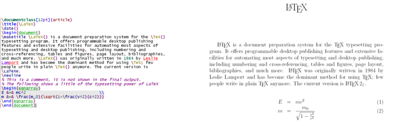
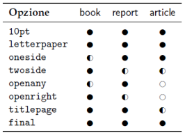
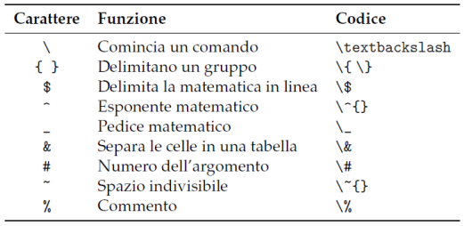
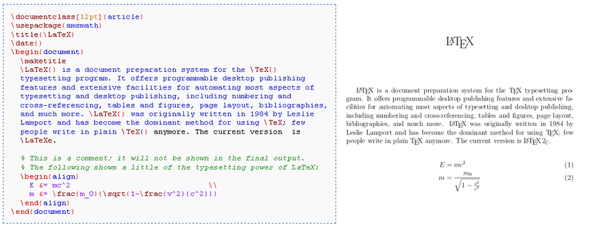
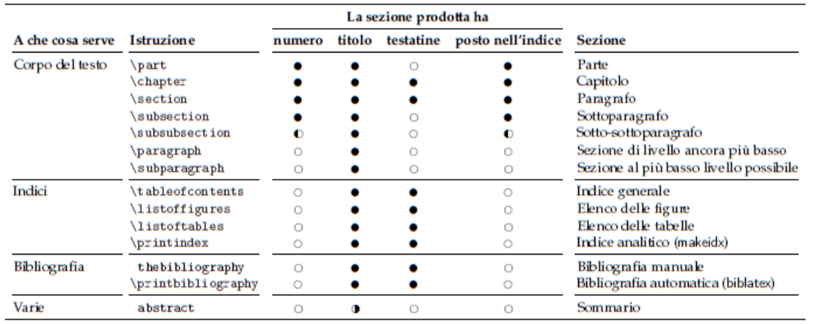
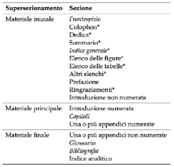

# LaTex
LaTeX è un sistema per la preparazione di testi.

Fornisce automazione per la maggior parte delle attività di composizione tipografica:
- numerazione, indici
- riferimenti incrociati, citazioni e note
- tabelle e figure,
- layout delle pagine, posizione figure e flusso del testo
- bibliografia
- formule e simboli

[Lorenzo Pantieri LaTex per l'impaziente](http://www.lorenzopantieri.net/LaTeX_files/LaTeXimpaziente.pdf)

## Storia di LaTex
- Creato all'inizio degli anni '80 da Leslie Lamport, per scrivere macro TeX per uso personale
- Peter Gordon, un redattore di Addison-Wesley, lo convinse a scrivere un manuale d'uso di LaTeX da pubblicare
- Lamport era inizialmente scettico sul fatto che qualcuno avrebbe pagato per averlo
- Il manuale uscì nel 1986 e vendette centinaia di migliaia di copie
- Il 21 agosto 1989, durante una riunione del TeX Users Group (TUG) a Stanford, Lamport accettò di cedere la manutenzione e lo sviluppo di LaTeX a Frank Mittelbach. Mittelbach, insieme a Chris Rowley e Rainer Schöpf, formò il team LaTeX3 e nel 1994 rilasciò LaTeX2e, l'attuale versione standard

## Caratteristiche LaTex
- Molto diffuso in ambito accademico ma apprezzato anche in altri ambiti per le caratteristiche di gestione dell’impaginazione.
- È un software libero che funziona sia su Windows che su Mac che su Linux.
- Non è WYSIWYG (What You See Is What You Get), ma WYSIWYM (What You See Is What You Mean)
- L’autore è anche tipografo
- Deve definire gli stili e le convenzioni, attraverso moduli e marcatori
- Attraverso un processo di compilazione LaTeX genera un output seguendo rigorose regole d'impaginazione, generando gli indici degli elementi, ottimizzando il posizionamento delle figure o delle tabelle, ecc.

## Output di LaTex
- Inizialmente solo formato DVI
- Oggi anche altri formati come PDF, Word, HTML
- Con la giusta estensione anche ePUB
  -  Usarlo non è facile ma il risultato è estremamente professionale



## Documento e classi
LaTeX prevede diverse classi standard per alcuni tipi di documento
```latex
 book, article, letter, report, slides.
```
Esistono molte classi ottenibili da pacchetti liberamente disponibili.

Ogni classe ha propri comandi
```latex 
\chapter{...}
```
per la classe book

Altri comandi sono trasversali e riguardano non la struttura ma testo o paragrafo
```latex
 \emph{...}
```
***Esempio***
```latex
\documentclass[a4paper,12pt]{article}
\usepackage[italian]{babel}
\usepackage[T1]{fontenc}
\usepackage[utf8]{inputenc}
\title{\LaTeX per esempi}
\author{Nome Cognome}
\date{2020}
% commento qua finisce il preambolo
\begin{document}
Ecco il mio primo documento con \LaTeX.
\end{document}
```
### Il preambolo
Si definisce:
- il tipo di documento
- i pacchetti da usare
- comandi e ambienti personalizzati
- opzioni generali sul documento
```latex
%% Template article for Elsevier's document class `elsarticle'
%% with harvard style bibliographic references

\documentclass[preprint,12pt]{elsarticle}

%% The amssymb package provides various useful mathematical symbols
\usepackage{amssymb}
%% The amsthm package provides extended theorem environments
\usepackage{amsthm}

\newtheorem{definition}{Definition}[section]
\newcolumntype{Y}{>{\centering\arraybackslash}m{3cm}}
```
### Documento e classi pt.2
Classe di documento dell’esempio: ```article```.

Le classi di documento usate più frequentemente sono poche:
- ```report```: simile alla classe article, tranne per il fatto che produce una pagina separata con il titolo e fa sì che ogni sezione inizi in una nuova pagina.
- ```letter```: include definizioni speciali per indirizzi, saluti e formule di chiusura.
- ```book```: contiene tutto quello che serve per la scrittura strutturata di un libro:
  - indice (anche delle tabelle e figure)
  - divisione del documento in parti
  - capitoli (Che iniziano sempre sulle pagine dispari), sezioni ecc.
La struttura della dichiarazione è
```latex
documentclass[<opzioni>]{<classe>}
```
Opzioni: impostazioni generali del documento
- I simboli indicano se l’opzione è predefinita, applicabile o non applicabile



Source:[Lorenzo Pantieri LaTex per l'impaziente](http://www.lorenzopantieri.net/LaTeX_files/LaTeXimpaziente.pdf)


### Packages
Source:[Lorenzo Pantieri LaTex per l'impaziente](http://www.lorenzopantieri.net/LaTeX_files/LaTeXimpaziente.pdf)

-```10pt, 11pt, 12pt```: impostano la dimensione del font principale del documento. Omettendo l’opzione, il valore predefinito è 10pt.
- ```a4paper, a5paper```: definiscono le dimensioni del foglio, che per impostazione predefinita è nel formato
letterpaper.
- ```oneside, twoside```: specificano se verrà composto un documento a singola o doppia facciata
rispettivamente.
- ```openany, openright```: l’opzione openany, predefinita nella classe report, fa cominciare un capitolo nella successiva pagina a disposizione; l’opzione openright, predefinita nella classe book, lo fa cominciare sempre in una pagina destra.
- ```twocolumn```: da a LaTeX le istruzioni per comporre l’intero documento su due colonne
- ```titlepage```, notitlepage: specificano se dopo il titolo del documento debba avere inizio una nuova pagina
- ```fleqn```: allinea le formule a sinistra rispetto a un margine rientrato.
- ```leqno```: mette la numerazione delle formule a sinistra anziché a destra.
- ```draft, final``` L’opzione draft evidenzia le righe composte in modo non ottimale con un rettangolino nero v accanto, facilitandone l’individuazione sulla pagina. Ciò non accade con final. 

Attraverso ```\usepackage[<opzionI>]{<pacchetto>}``` è possibile aggiungere funzionalità specifiche che il compilatore interpreterà in fase di costruzione dell’output, ad esempio:
- ```fontenc``` (font encoding, “codifica dei font”) si occupa dei font che si vedranno nel documento composto e fornisce a LaTeX i caratteri particolari di una certa lingua già disegnati
  - L’opzione ```T1``` è la codifica dei font usati per scrivere in italiano e in molte
altre lingue occidentali
- ```inputenc``` (input encoding, “codifica di input”) serve a LaTeX per interpretare correttamente i caratteri immessi nell’editor
  - L’opzione ```utf8``` è la codifica di input, in gergo, che permette di scrivere nell’editor i segni di numerosi alfabeti direttamente dalla tastiera, evitando di dover caricare ogni volta la codifica adatta alla lingua del documento
- ```babel```: gestisce convenzioni di organizzazione del testo che possono variare da lingua a lingua: regole di sillabazione, date, voci generate automaticamente dai comandi, convenzioni tipografiche. Come opzioni prende una o più lingue
- ```graphicx```: per l’inserimento di figure. Il comando ```includegrafica{<nomefile>}``` è quello che include effettivamente l'immagine nel documento. Il nome del file tipicamente è riferito senza estensione. Il nome del file dell'immagine non deve contenere spazi bianchi o punti multipli
- ```amsmath```: per la gestione di formule matematiche.

***Esempio***
```latex
\begin{document}
\maketitle
\begin{abstract}
Breve dimostrazione dell'uso di \LaTeX.
\end{abstract}
\tableofcontents
\section{Testo normale}
Il mio primo esempio di \LaTeX in cui uso anche \emph{enfasi} e \bold{bold}. Se volgio chiudere un paragrafo \dots basta lasciare una riga vuota.
\section{Formule}
La forza di \LaTeX sono però le formule, sia in linea (ad esempio $y=x^2$) che messe in bella mostra in un'area propria:
\[y=\sqrt{x+y}\]
\section{Poesia}
 L'ambiente ``verse'' è usato per comporre tipograficamente le poesie:
\begin{verse}
La vispa Teresa avea tra l'erbetta\\
al volo sorpresa gentil farfalletta.
\end{verse}
\end{document}
```
### Comandi
- ```\begin{document}``` segnala l’inizio del documento;
- ```\author``` e ```\title``` dati sopra nel preambolo ne specificano rispettivamente nome dell’autore e titolo;
- ```\maketitle``` produce il contenuto dei due comandi precedenti, dopo i quali deve essere dato;
- ```\tableofcontents``` produce l’indice generale dopo due composizioni;
- ```\section{<titolo>}``` produce un titolo di sezione
- ```\dots``` produce i puntini di sospensione . . . ;
- ```\end{document}``` segnala la fine del documento.

## Caratteri speciali


Source:[Lorenzo Pantieri LaTex per l'impaziente](http://www.lorenzopantieri.net/LaTeX_files/LaTeXimpaziente.pdf)

## Spazi e righe vuote
Regole particolari
- una tabulazione è considerata come uno spazio;
- più spazi consecutivi sono considerati come un solo spazio;
- spazi o tabulazioni all’inizio di una riga vengono ignorati;
- una sola interruzione di riga è trattata come uno spazio;
- una riga vuota tra due righe di testo separa due capoversi;
- più righe vuote consecutive sono trattate come una sola riga vuota.
  
## Commenti
Un carattere di percento ```%``` (tranne che nella forma ```\%```) per LaTeX significa ignora il resto della riga, l’interruzione di riga, e tutti gli spazi bianchi all’inizio della riga successiva.



## Margini e interlinea
- I margini e l’interlinea predefiniti da una classe seguono rigorose regole tipografiche
- Inoltre normalmente si utilizza uno stile definito dall’editore che ha stabilito questi aspetti
- Se voglio creare un documento con margini o interlinea personalizzati possiamo usare un pacchetto
```latex
\usepackage{geometry}
\geometry{a4paper,top=3cm,bottom=3cm,left=3.5cm,right=
3.5cm, heightrounded,bindingoffset=5mm}
\usepackage{setspace}
\begin{onehalfspace}...\end{onehalfspace}
```
## Struttura del documento
I simboli indicano se l’opzione è predefinita, applicabile o non applicabile.



Source:[Lorenzo Pantieri LaTex per l'impaziente](http://www.lorenzopantieri.net/LaTeX_files/LaTeXimpaziente.pdf)

### Struttura di una tesi di laurea
I simboli indicano se l’opzione è predefinita, applicabile o non applicabile.



Source:[Lorenzo Pantieri LaTex per l'impaziente](http://www.lorenzopantieri.net/LaTeX_files/LaTeXimpaziente.pdf)

- ```\frontmatter``` - “materiale iniziale”, non numera le sezioni e numera le pagine con numeri romani minuscoli (i, ii, iii, eccetera)
- ```\mainmatter``` - “materiale principale”, numera le sezioni e le pagine con numeri arabi (la numerazione delle pagine riprende da 1)
- ```\backmatter``` - “materiale finale”, non numera le sezioni e continua la numerazione araba delle pagine dal materiale principale
- ```\appendix``` - appendici

## Stile di pagina
È possibile definire uno stile di pagina attraverso il pacchetto \pagestyle{<stile>}
- ```Plain```: mette i numeri di pagina nel piede, lasciando vuota la testatina. È lo stile predefinito nelle classi article e report
- ```Empty```: lascia testatina e piede vuoti
- ```Headings```: lascia il piede vuoto e compone le testatine come segue: il numero di pagina è sempre posto nel margine esterno, seguito dal titolo del capitolo corrente nella testatina di sinistra e preceduto dal titolo del paragrafo corrente in quella di destra
  - È lo stile predefinito nella classe book e agisce nello stesso modo nelle classi report e article
- ```myheadings``` è simile a headings nel risultato e va usato quando non si vuole che le testatine dipendano dai titoli delle sezioni (capitolo e paragrafo) correnti. L’utente deve specificarne il contenuto a ogni nuovo capitolo (o paragrafo, se la classe è article), dando ```\markboth``` per comporle entrambe oppure ```\markright``` per comporre soltanto quella di destra

## Riferimenti incrociati
Nei documenti si trovano spesso riferimenti incrociati a sezioni, figure, tabelle, teoremi e altri elementi.

Per realizzarli si usano i comandi standard
- ```\label{<etichetta>}``` assegna agli elementi contrassegnati un’etichetta arbitraria e univoca
- ```\ref{<etichetta>}``` produce il numero dell’elemento messo in etichetta
- ```\pageref{<etichetta>}``` produce il numero di pagina in cui l’elemento compare

## Equazioni
Per scrivere un simbolo matematico o un'equazione lungo il
teso bisogna metterlo tra ```$ $```
_Esempio:_ ```$y=f(x)=x^{2}+\frac{1}{2}x$```

Per inserirla come una ambiente:
```latex
\begin{equation} o \[ (no number)
 y=f(x)=x^{2}+\frac{1}{2}x
 \end{equation} o \]
```
## Tabelle inline
Si possono ottenere in vario modo ecco un esempio
```latex
\begin{center}
 \begin{tabular}{ll}
 \toprule
 Alcaloide & Origine \\
 \midrule
 atropina & belladonna \\
 morfina & papavero \\
 \bottomrule
 \end{tabular}
 \end{center}
```
## Tabelle floating
La versione inline significa nel testo
- Se si vuole che sia floating (ovvero non ancorata ad un punto del testo) occorre usare un ambiente specifico per tabular ovvero _Table_
```latex
\begin{table}[<preferenze di collocazione>] …
\end{table}
```
- Tutti gli ambienti floating
- Possono essere etichettati (label) ed avere una caption e posso
specificare come debbano essere disposte nella pagina
``` \caption[<didascalia breve>]{<didascalia normale>}```

## Immagini
Anche le immagini sono gestite attraverso un ambiente floating denominato figure
```latex
\begin{figure}
 \begin{center}
 \includegraphics[width=xcm,height=ycm]
{figure.eps}
 \end{center}
\end{figure}
```
## Comandi di compilazione
- ```latex file.tex``` : produce file.dvi
- ```xdvi file.dvi &``` : visualizzare il file
- ```dvips file.dvi``` : converte il .dvi in .ps
- ```ps2pdf file.ps``` : converte il .ps in .pdf

## LaTex per produrre epub
Un uso interessante di LaTeX è quello per produrre direttamente un formato ePub al posto di PDF
- Per farlo si può usare il pacchetto _tex4ebook_
  - https://ctan.org/pkg/tex4ebook
- Si compila verso ebook, e se serve si possono usare comandi addizionali
del pacchetto tipici per materiale ebook
Prerequisiti
- installazione di un motore latex: [Texlive](https://www.tug.org/texlive/),
  [MacTeX](https://www.tug.org/mactex/),
  [MiKTeX](https://miktex.org/),
- Installazione del pacchetto [tex4ebook](https://github.com/michal-h21/tex4ebook/blob/master/INSTALL.md)
- Installazione del pacchetto [tex4ht](https://github.com/michal-h21/make4ht/blob/master/INSTALL.md)
- Installazione di [Pandoc](https://pandoc.org/)

## Grafica dichiarativa
TikZ e PGF sono pacchetti TeX per la creazione programmatica di grafica.

TikZ si basa su PGF e consente di creare grafica sofisticata in modo piuttosto intuitivo e semplice.

```latex
\begin{tikzpicture}[
 node distance=1cm and 1.2cm,
 thick,
 nodes={align=center},
 >={Latex[scale=.9]},
 …
```
[TikZ su GitHub](https://github.com/pgf-tikz/pgf)
[TikZ per esempi](https://tikz.net/)
