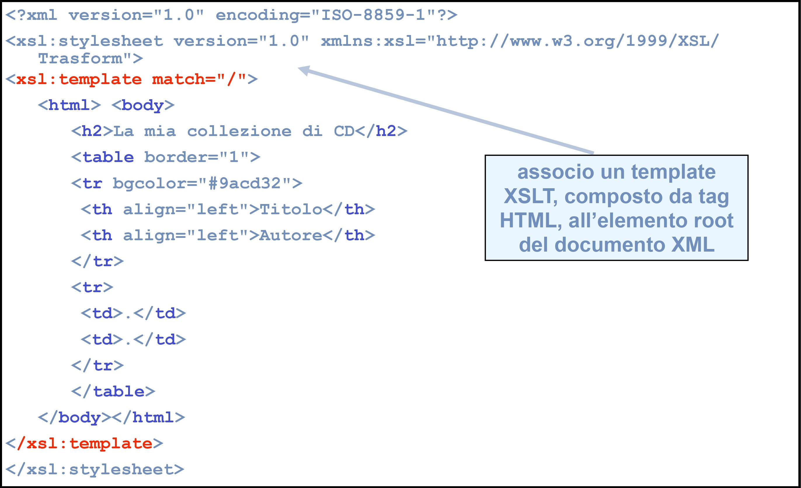
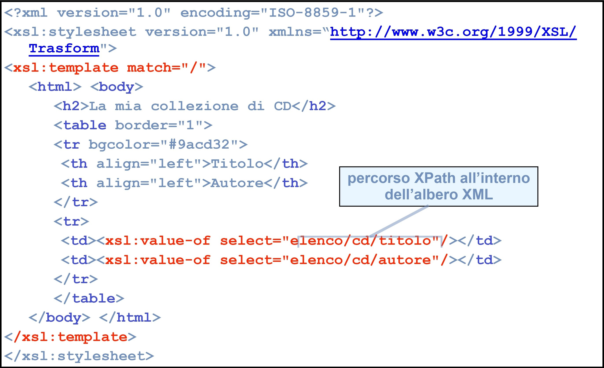
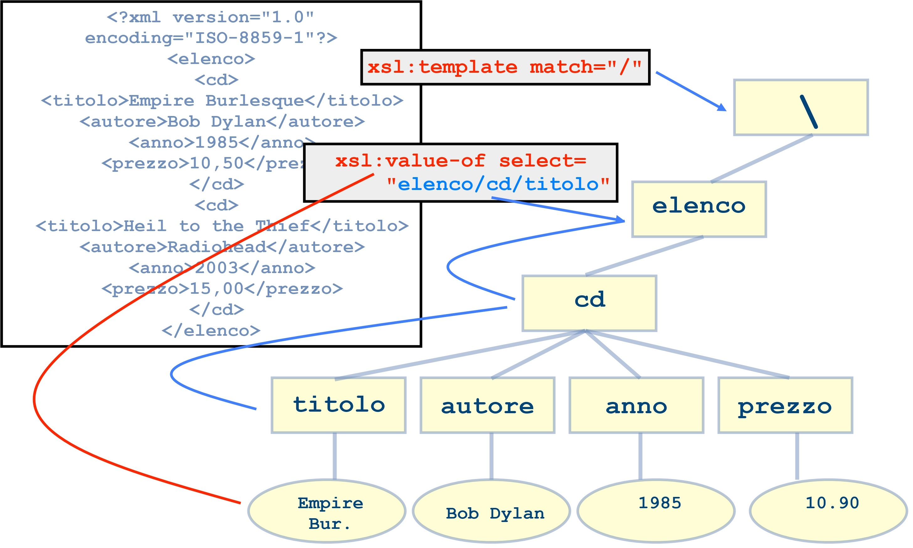
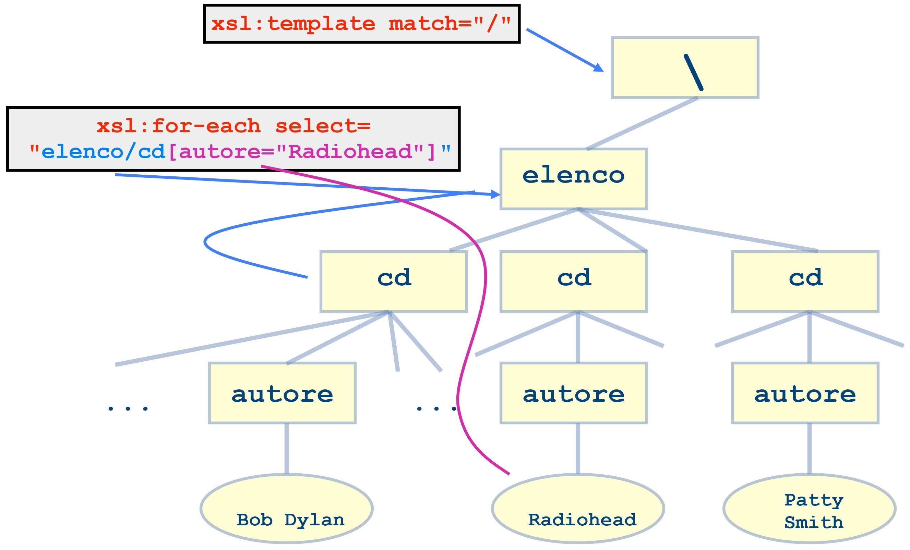
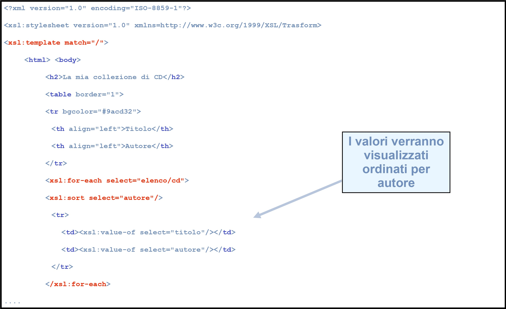
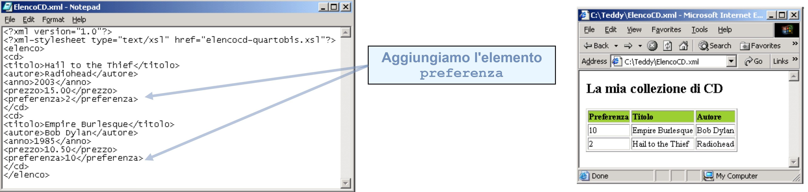
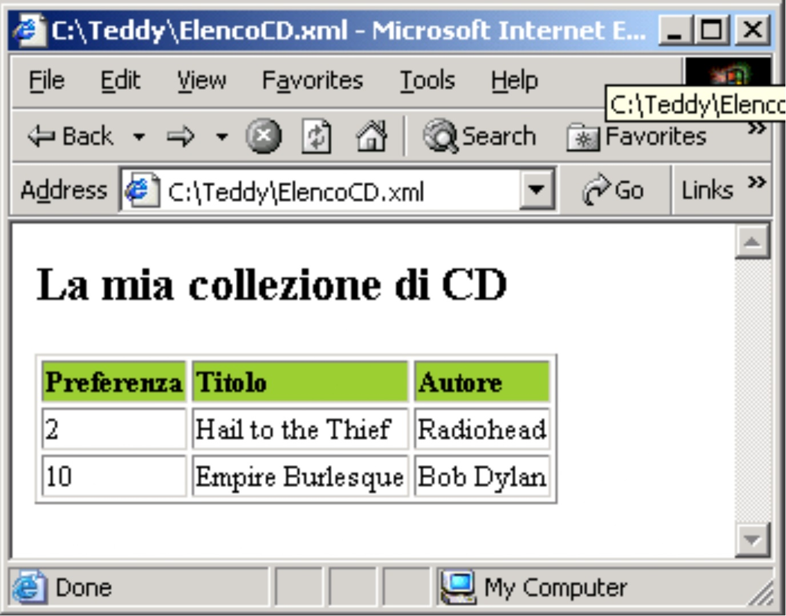
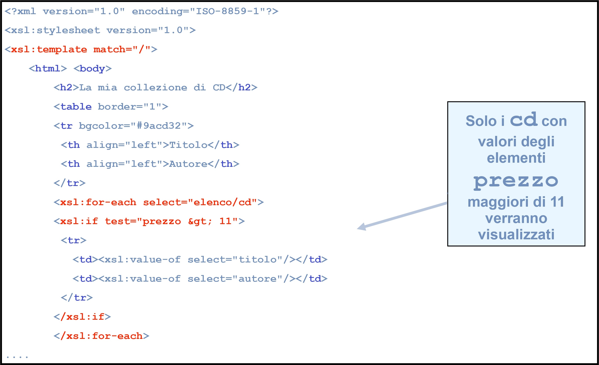

# XSLT (XML Stylesheet Language Transformation)
## XML Stylesheet Language
XSL è uno strandard per definire fogli di stile XML in modo da poter rappresentare i contenuti di un documento in altri formati.

XSL è uno standard dal 2006, si appoggia su altri tre standard.
- **XSLT 1.0** (un linguaggio per la trasformazione di documenti XML) Recommendation dal 1999
- **XPath** (un linguaggio per identificare parti di un documento XML) Versione 1.0 Recommendation dal 1999
- **XSL Formatting Objects** (un vocabolario per formattare documenti XML) Inserito nella Recommendation dal 1999 di XSLT

## Procedimento
Il processore XSLT segue la struttura gerarchica di un documento XML, individua ciascun nodo grazie alle istruzioni (eventualmente ricorsive) contenute nel foglio di stile XSLT e ai percorsi XPath.

Quando il processore trova una corrispondenza, matching, al contenuto dell'elemento XML vengono applicate le regole, template, contenute nel foglio di stile.

In pratica ci sono diversi usi:
- Filtrare ed ordinare dati XML
- Formattare i dati in base al loro valore
- Riorganizzare la struttura dei documenti
- Scrivere l’output verso differenti periferiche (carta, web, ebook, video, voce…)

## Funzioni
Si definiscono due funzioni di XSL:  Trasformazione e Formattazione


## Processori
Esistono due processori XML che sono orami standard de facto: SAX
(Simple API for XML) e DOM (Document Object Model)
- Differenze: modalità di interazione tra le API (Application Programming Interface) e l’applicazione che ne fa uso
- SAX invia all’applicazione eventi che descrivono il riconoscimento di un particolare elemento; in questo modo l’applicativo chiede solo gli elementi di cui ha bisogno
  * \- memoria,
  * \- tempo di caricamento,
  * \+ tempo per singolo accesso
- DOM fornisce direttamente all’applicazione una descrizione ad albero dell’intero documento in oggetto
  * \+ memoria,
  * \+ tempo di caricamento,
  * \- tempo per singolo accesso

## Tecnologie XML
**DOM** (Document Object Model): definisce la rappresentazione in memoria (struttura ad albero), le interfacce e metodi per manipolare documenti XML
- [libxml2](https://gitlab.gnome.org/GNOME/libxml2/-/wikis/home)
  parser e toolkit per il linguaggio C
- [Saxon](https://saxon.sourceforge.net/)
  processore per Java, JavaScript, .NET
- [Xerces](https://xerces.apache.org/)
  progetto Apache per C++ Java e Perl
- [xslt-processor](https://www.npmjs.com/package/xslt-processor)
   pacchetto per Node.js
- [Lxml](https://lxml.de/) liberaria basata su libxml e libxslt per Python
**SAX** (Simple API for XML): è un’interfaccia per leggere e manipolare file XML attraverso eventi
- [SAX](https://www.ibm.com/docs/en/i/7.3?topic=codes-xml-sax-parse-xml-document)
  progetto IBM per manipolazione di documenti XML
- [Expat](https://libexpat.github.io/)
  libreria stream per il linguaggio C
- [Cocoon](https://cocoon.apache.org/2.1/faq/faq-xslt.html)
  sever Apacher per gestione di XML, supporta pipeline XSLT
### Esempio di trasformazione
Partiamo da questo frammento
```xsl
<div type="recipe" n="34">
  <head>Pasta for beginners</head>
  <list>
    <item>Pasta</item>
    <item>Grated cheese</item>
  </list>
  <p>Cook the pasta and mix with the cheese</p>
</div>
```
Per ottenere questo frammento
```xsl
<html>
  <h1>34: Pasta for beginners</h1>
  <p>Ingredients: Pasta Grated cheese</p>
  <p>Cook the pasta and mix with the cheese</p>
</html> 
```
Usiamo un parser o processore XSLT
- Con la libreria C libxslt da linea di comando possiamo eseguire una trasformazione in questo modo:
```xsltproc simple.xsl origin.xml > dest.xml```
- Con Python possiamo importare l’opportuna libreria, i file richiesti e generare la trasformazione in questo modo:
```xsl
from lxml import etree
### load input
dom = etree.parse('origin.xml')
transform = etree.XSLT(etree.parse('simple.xsl'))
### apply XSLT on loaded dom
s = str(transform(dom))
print(s)
```
Nel nostro esempio le regole di trasformazione incluse nel file XSLT potranno essere espresse come:
```xsl
<xsl:stylesheet version="1.0" xmlns:xsl=“http://www.w3.org/1999/XSL/Transform">
<xsl:template match="div">
 <html>
  <h1><xsl:value-of select="@n"/>: <xsl:value-ofselect="head"/></h1>
  <p>Ingredients:<xsl:apply-templates select="list/item"/></p>
  <p><xsl:value-of select="p"/></p>
 </html>
</xsl:template>
</xsl:stylesheet>
```
Con XSLT è possibile definire anche dei parametri che modificheranno la trasformazione.

Con la libreria C _libxslt_ da linea di comando abbiamo:
- _stringparam_ per passare una copia nome del parametro e valore in formato stringa:
```xsl
xsltproc --stringparam someVariable Value template.xsl
example.xml > output.xml
```
- _param_ per passare una copia nome del parametro e identificatore di un nodo:
```xsl
xsltproc --param anotherVariable /foo/bar template.xsl
example.xml > output.xml
```
- nel nostro esempio andranno uniti in questo modo:
```xsl
xsltproc --stringparam someVariable Value --param
anotherVariable /foo/bar template.xsl example.xml >
output.xml
```
## Dichiarazione
L’elemento radice di un foglio di stile può essere ```<xsl:stylesheet>``` oppure ```<xsl:transform>```.

Secondo lo standard del W3C, la dichiarazione corretta dovrebbe essere:

``` <xsl:stylesheet version="1.0" xmlns:xsl="http://www.w3c.org/1999/XSL/Transform">```

Per la versione 2 di XSLT, tipicamente supportata da Saxon, richiede una diversa dichiarazione. Nella dichiarazione è possibile inserire ulteriori namespace da usare nel foglio di stile.
```xsl
<xsl:stylesheet xmlns:xsl="http://www.w3.org/1999/XSL/Transform" version=“2.0"
 xmlns:xsi="http://www.w3.org/2001/XMLSchema-instance"
 xmlns:dc="http://purl.org/dc/elements/1.1">
```
## Riferimento a XSL
Secondo lo standard sarebbe necessario indicare nel file XML a quale file XSL esso fa riferimento

``` <?xml-stylesheet type="text/xsl"href="elencocd-primo.xsl"?>```

Questa dichiarazione di fatto può essere omessa se l’applicazione su cui ci si basa riceve come parametri un XML di input, un XSL per la trasformazione e un output per il risultato.

## XSL:TEMPLATE
Un foglio di stile XSL è formato da un insieme di template.

Ogni elemento ```<xsl:template>``` contiene delle regole da applicare quando uno specifico nodo viene trovato

L’attributo match è usato per associare il template con un elemento XML utilizzando _XPath_:
- \/ l’elemento radice
- \* qualsiasi elemento
- _text()_ il testo contenuto in un elemento
- _name_ un elemento di nome name
- _@name_ un attributo di nome name

L’XSL che segue contiene un solo template e fornisce un output in HTML.

### Esempio


### Dettagli
I documenti XSL sono documenti XML, quindi iniziano con la dichiarazione tipica:
```xsl
<?xml version="1.0" encoding="ISO-8859-1"?>
```
- L’elemento ```<xsl:stylesheet>``` definisce l’inizio del documento
- L’elemento ```<xsl:template>``` definisce l’inizio di un template
- L’attributo ```match="/"``` definisce la corrispondenza con l’elemento radice / del documento XML sorgente
- L’elemento ```<xsl:value-of>``` può essere usato per estrarre un valore da un elemento XML e aggiungerlo al flusso di output della trasformazione

Nell’esempio che segue notiamo l’utilizzo di XPath al fine di identificare specifici elementi del file XML sorgente.
### Esempio


### Nozione di nodo corrente


Il risultato della valutazione di un’espressione XPath è un insieme di elementi, quindi zero, uno o più d’uno.
- L’output è ancora un po’ deludente in quanto viene visualizzato solo il primo cd
- PERCHE' VIENE VISUALIZZATO SOLO IL PRIMO CD?

## XSL:FOR-EACH
L’elemento ```<xsl:for-each>``` può essere usato per selezionare ogni elemento XML corrispondente ad un dato XPath
- Quello che segue è il listato corretto relativo al nostro esempio
- A questo punto tutti gli elementi essenziali sono stati aggiunti e l’output dovrebbe essere soddisfacente

### Esempio


## Filtrare l'output
Aggiungiamo qualche criterio di controllo (ancora come espressione XPath)
```xsl
 <xsl:for-each select='elenco/ cd[autore="Radiohead"]'>
```
Con questa condizione otteniamo in output solo i cd dei Radiohead



## XSL:SORT
- L’elemento ```<xsl:sort>``` serve per ordinare l’output
- L’output e l’ordinamento si ottenere in un unico passo inserendo l’elemento ```<xsl:sort>```
Quella che segue è la versione modificata del file XSL

### Esempio


**Problema**

L'output html ordina gli elementi **cd** secondo il valore dell'elemento **preferenza** interpretato come stringa di caratteri.

### Soluzione: Data-Type
```xsl
<xsl:for-each select="elenco/cd">
 <xsl:sort data-type="number" select="preferenza"/>
 <tr>
 <td><xsl:value-of select="titolo"/></td>
 <td><xsl:value-of select="autore"/></td>
 </tr>
</xsl:for-each>
```

Ora l’ordinamento è corretto.

## XSL:IF
L’elemento ```<xsl:if>``` contiene una serie di istruzioni che verranno eseguite solo se la condizione specificata è vera

La condizione viene messa sotto forma di attributo e funziona come segue:
```xsl
<xsl:if test="prezzo &gt; 10">
 qualche istruzione
</xsl:if>
```
Otterremo in output i soli cd il cui prezzo è maggiore di 10.


## XSL:CHOOSE

### Esempio

## Valori di un attributo

## XSL:APPLY-TEMPLATES

## Pushing e Pulling

### Esempio

## XLS:CALL-TEMPLATE

## XSL:COPY-OF & XSL:VARIABLE

## Riferimenti incrociati

## Chiavi XSL

## Funzione Key

## XSLT 2.0
Nel Gennaio 2007 XSLT 2.0 è stato promosso a recommendation W3C.

Le principali novità introdotte sono:
- istruzioni per raggruppare gli elementi
- istruzioni per gestire il testo tramite espressioni regolari
- istruzioni per gestire la formattazione di numeri e date
- istruzioni per generare documenti

## XSL:FOR-EACH-GROUP
```xsl
<files>
  <file nome=”tanto.xml” versi=”16” autore=”Dante-Alighieri” />
  <file nome=”voidonne.xml” versi=”16” autore=”Dante-Alighieri” />
  <file nome=”lapo.xml” versi=”16” autore=”Dante-Alighieri” />
  <file nome=”canz1.xml” versi=”68” autore=”Ariosto” />
  <file nome=”son3.xml” versi=”16” autore=”Ariosto” />
  <file nome=”canz1.xml” versi=”14” autore=”Lorenzo-DeMedici” />
</files>
```
``` xsl
<xsl:template match="files">
 <xsl:for-each-group select="file" group-by="@autore">

 <xsl:for-each select="current-group()">
   <xsl:value-of select="@name"/>, <xsl:value-of select="@versi"/>
   <xsl:text></xsl:text>
 </xsl:for-each>
 <xsl:text>Media di versi per </xsl:text>
 <xsl:value-of select="current-grouping-key()"/>
 <xsl:text> uguale: </xsl:text>
 <xsl:value-of select="avg(current-group()/@size)"/>
 <xsl:text>
</xsl:text>
 </xsl:for-each-group>
</xsl:template>
```
```xsl
tanto.xml, 16
voidonne.xml, 16
lapo.xml, 16
Media di versi per Dante-Alighieri uguale: 16

can1.xml, 68
son3.xml, 16
Media di versi per Ariosto uguale: 42

canz1.xml, 14
Media di versi per Ariosto uguale: 14 
```

## XSL:DOCUMENT
```xsl
<xsl:template match="/">
<xsl:document method="html" encoding="UTF-8" href="index.html">
 <html>
 <head>
 <title><xsl:value-of select="/poesia/verso[1]"/></title>
 </head>
 <body>
 <h1 align="center"><xsl:value-of select="/poesia/verso[1]"/></h1>
 <div class=”/poesia”>
<xsl:for-each select="/poesia">
<xsl:copy-of select="."></xsl:copy-of>
</xsl:for-each>
 </div>
 <hr/>
 </body>
 </html>
 </xsl:document>
</xsl:template>
```

## Progetti legati a XSLT
**TEI XSL Stylesheets**: una famiglia di fogli di stile XSLT 2.0 per trasformare i documenti XML TEI in vari formati, tra cui
XHTML, LaTeX, XSL Formatting Objects, ePub, testo semplice, RDF, JSON; e da/verso Word OOXML
(docx) e OpenOfice (odt)
- https://github.com/TEIC/Stylesheets
- https://github.com/TEIC/Jenkins

**TEIGarage**: un servizio web e RESTful per trasformare, convertire e validare vari formati, con particolare attenzione al formato TEI
- https://teigarage.tei-c.org/
- https://github.com/TEIC/TEIGarage

**XSLTJSON**: per trasformare XML in JSON
- https://github.com/bramstein/xsltjson

**DocBook XSL**:  è una raccolta di standard e strumenti per la pubblicazione tecnica
- http://www.sagehill.net/docbookxsl/preface.html#WhatIsDocbook
